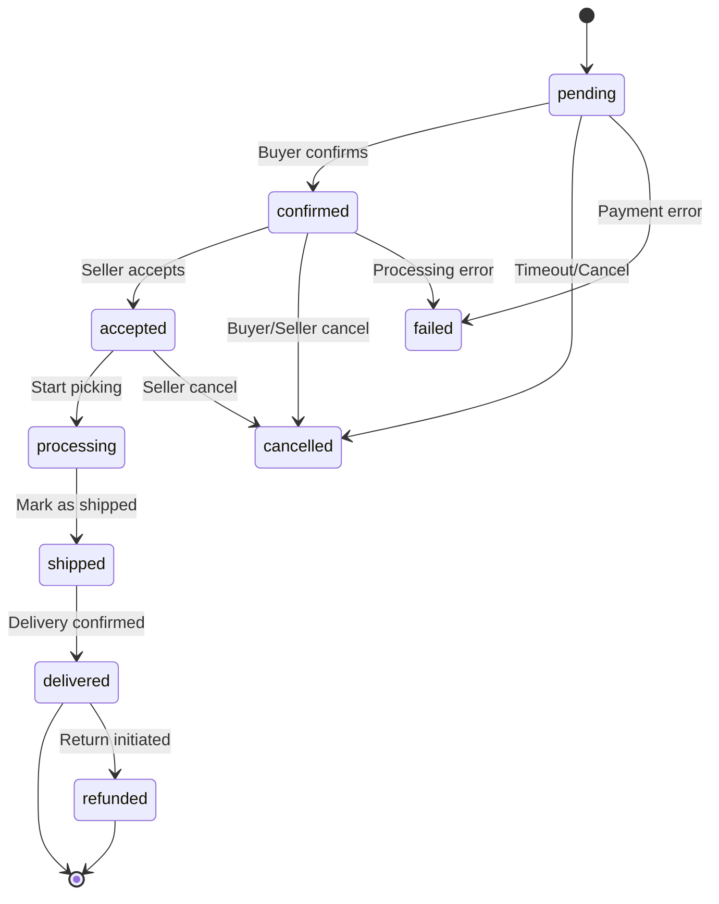

# Domain: Listings (Объявления)

**Версия:** 1.0  
**Последнее обновление:** 2025-12-21  
**Статус:** Production Ready

---

## 📋 Обзор домена

**Listings** - унифицированная доменная модель для управления объявлениями (товарами и услугами) на маркетплейсе Vondi. Поддерживает два режима работы:

- **C2C (Consumer-to-Consumer):** Частные объявления от физических лиц
- **B2C (Business-to-Consumer):** Товары от магазинов (Storefronts)

### Ключевые особенности

✅ **Унифицированная модель:** Одна таблица `listings` для C2C и B2C (discriminator: `source_type`)  
✅ **Многоязычность:** JSONB колонки для переводов (sr, en, ru)  
✅ **UUID категории:** Материализованный путь для иерархии  
✅ **Product Variants V2:** UUID-based варианты с вычисляемым `available_quantity`  
✅ **Полиморфные атрибуты:** 8 типов значений (text, number, select, date, etc.)  
✅ **Инвентаризация FIFO:** С резервированием и вычисляемыми полями  
✅ **OpenSearch интеграция:** Полнотекстовый поиск с фильтрацией  
✅ **Escrow механизм:** Безопасные сделки с автоматическим возвратом  

---

## 🏗️ Domain Entities

### 1. Listing (Объявление)

**Таблица:** `listings`  
**Описание:** Унифицированная сущность для C2C и B2C объявлений

```go
type Listing struct {
    // Идентификация
    ID             int64      `json:"id" db:"id"`
    UUID           string     `json:"uuid" db:"uuid"`
    Slug           string     `json:"slug" db:"slug"` // SEO-friendly URL
    
    // Владение
    UserID         int64      `json:"user_id" db:"user_id"`
    StorefrontID   *int64     `json:"storefront_id" db:"storefront_id"` // NULL для C2C
    
    // Контент
    Title          string     `json:"title" db:"title"`
    Description    *string    `json:"description" db:"description"`
    
    // Ценообразование
    Price          float64    `json:"price" db:"price"`
    Currency       string     `json:"currency" db:"currency"` // RSD, EUR, USD
    
    // Категоризация
    CategoryID     string     `json:"category_id" db:"category_id"` // UUID
    CategorySlug   *string    `json:"category_slug" db:"category_slug"`
    
    // Статус
    Status         string     `json:"status" db:"status"`
    Visibility     string     `json:"visibility" db:"visibility"`
    
    // Инвентарь
    Quantity       int32      `json:"quantity" db:"quantity"`
    SKU            *string    `json:"sku" db:"sku"`
    StockStatus    *string    `json:"stock_status" db:"stock_status"`
    
    // Тип источника
    SourceType     string     `json:"source_type" db:"source_type"` // c2c | b2c
    
    // Атрибуты (JSONB)
    AttributesJSON *string    `json:"attributes_json" db:"attributes"`
    
    // Статистика
    ViewsCount     int32      `json:"views_count" db:"view_count"`
    FavoritesCount int32      `json:"favorites_count" db:"favorites_count"`
    
    // Временные метки
    ExpiresAt      *time.Time `json:"expires_at" db:"expires_at"`
    CreatedAt      time.Time  `json:"created_at" db:"created_at"`
    UpdatedAt      time.Time  `json:"updated_at" db:"updated_at"`
    PublishedAt    *time.Time `json:"published_at" db:"published_at"`
    DeletedAt      *time.Time `json:"deleted_at" db:"deleted_at"`
    IsDeleted      bool       `json:"is_deleted" db:"is_deleted"`
    
    // Локация
    ShowOnMap             *bool   `json:"show_on_map" db:"show_on_map"`
    LocationPrivacy       *string `json:"location_privacy" db:"location_privacy"` // exact, approximate, hidden
    HasIndividualLocation *bool   `json:"has_individual_location" db:"has_individual_location"`
    
    // Переводы (JSONB)
    TitleTranslations       map[string]string `json:"title_translations" db:"title_translations"`
    DescriptionTranslations map[string]string `json:"description_translations" db:"description_translations"`
    LocationTranslations    map[string]string `json:"location_translations" db:"location_translations"`
    CityTranslations        map[string]string `json:"city_translations" db:"city_translations"`
    CountryTranslations     map[string]string `json:"country_translations" db:"country_translations"`
    OriginalLanguage        string            `json:"original_language" db:"original_language"`
    
    // Relations (загружаются по требованию)
    Attributes []*ListingAttribute `json:"attributes" db:"-"`
    Images     []*ListingImage     `json:"images" db:"-"`
    Tags       []string            `json:"tags" db:"-"`
    Location   *ListingLocation    `json:"location" db:"-"`
}
```

**Индексы:**
- `idx_listings_user_id` - Поиск по владельцу
- `idx_listings_storefront_id` - Фильтрация по магазину
- `idx_listings_category_id` - Фильтрация по категории
- `idx_listings_status` - Фильтрация по статусу
- `idx_listings_source_type` - C2C/B2C разделение
- `idx_listings_created_at` - Сортировка по дате
- `idx_listings_slug` - SEO URLs (UNIQUE)
- `gin_listings_title_translations` - Полнотекстовый поиск

---

### 2. ListingImage (Изображение)

**Таблица:** `listing_images`  
**Описание:** Изображения объявления с упорядочиванием

```go
type ListingImage struct {
    ID           int64     `json:"id" db:"id"`
    ListingID    int64     `json:"listing_id" db:"listing_id"`
    URL          string    `json:"url" db:"url"` // MinIO S3 URL
    StoragePath  *string   `json:"storage_path" db:"storage_path"`
    ThumbnailURL *string   `json:"thumbnail_url" db:"thumbnail_url"`
    DisplayOrder int32     `json:"display_order" db:"display_order"` // 0-based
    IsPrimary    bool      `json:"is_primary" db:"is_primary"` // Главное изображение
    
    // Метаданные
    Width        *int32    `json:"width" db:"width"`
    Height       *int32    `json:"height" db:"height"`
    FileSize     *int64    `json:"file_size" db:"file_size"`
    MimeType     *string   `json:"mime_type" db:"mime_type"`
    
    CreatedAt    time.Time `json:"created_at" db:"created_at"`
    UpdatedAt    time.Time `json:"updated_at" db:"updated_at"`
}
```

**Constraints:**
- FOREIGN KEY `listing_id` REFERENCES `listings(id)` ON DELETE CASCADE
- UNIQUE INDEX `idx_listing_images_primary` на `(listing_id, is_primary)` WHERE `is_primary = true`

---

### 3. ListingLocation (Геолокация)

**Таблица:** `listing_locations`  
**Описание:** Географические координаты объявления

```go
type ListingLocation struct {
    ID           int64     `json:"id" db:"id"`
    ListingID    int64     `json:"listing_id" db:"listing_id"`
    
    // Адрес
    Country      *string   `json:"country" db:"country"`
    City         *string   `json:"city" db:"city"`
    PostalCode   *string   `json:"postal_code" db:"postal_code"`
    AddressLine1 *string   `json:"address_line1" db:"address_line1"`
    AddressLine2 *string   `json:"address_line2" db:"address_line2"`
    
    // Координаты
    Latitude     *float64  `json:"latitude" db:"latitude"`
    Longitude    *float64  `json:"longitude" db:"longitude"`
    
    CreatedAt    time.Time `json:"created_at" db:"created_at"`
    UpdatedAt    time.Time `json:"updated_at" db:"updated_at"`
}
```

**Индексы:**
- `idx_listing_locations_listing_id` - Поиск локации по объявлению
- `idx_listing_locations_coords` - Геопространственные запросы

---

### 4. Category (Категория)

**Таблица:** `categories`  
**Описание:** UUID-based иерархия категорий с JSONB локализацией

```go
type Category struct {
    // Идентификация (UUID)
    ID                string    `json:"id" db:"id"` // UUID v4
    Name              string    `json:"name" db:"name"` // Default fallback
    Slug              string    `json:"slug" db:"slug"` // SEO URL
    
    // Иерархия
    ParentID          *string   `json:"parent_id" db:"parent_id"` // NULL для корневых
    Level             int32     `json:"level" db:"level"` // 0 = root, 1 = child, etc.
    
    // UI
    Icon              *string   `json:"icon" db:"icon"` // lucide-react icon name
    Description       *string   `json:"description" db:"description"`
    
    // Статус
    IsActive          bool      `json:"is_active" db:"is_active"`
    ListingCount      int32     `json:"listing_count" db:"listing_count"`
    SortOrder         int32     `json:"sort_order" db:"sort_order"`
    
    // Custom UI
    HasCustomUI       bool      `json:"has_custom_ui" db:"has_custom_ui"`
    CustomUIComponent *string   `json:"custom_ui_component" db:"custom_ui_component"`
    
    // External ID (синхронизация с монолитом)
    ExternalID        *string   `json:"external_id" db:"external_id"`
    
    CreatedAt         time.Time `json:"created_at" db:"created_at"`
    
    // SEO
    SEOTitle       *string `json:"seo_title" db:"seo_title"`
    SEODescription *string `json:"seo_description" db:"seo_description"`
    SEOKeywords    *string `json:"seo_keywords" db:"seo_keywords"`
    
    // Localized titles (JSONB)
    TitleEn *string `json:"title_en" db:"title_en"`
    TitleRu *string `json:"title_ru" db:"title_ru"`
    TitleSr *string `json:"title_sr" db:"title_sr"`
}
```

**Индексы:**
- `idx_categories_parent_id` - Построение дерева
- `idx_categories_slug` - SEO URLs (UNIQUE)
- `idx_categories_external_id` - Синхронизация (UNIQUE)

---

### 5. Attribute (Атрибут)

**Таблица:** `attributes`  
**Описание:** Полиморфные атрибуты категорий с 8 типами значений

```go
type Attribute struct {
    ID          int32     `json:"id" db:"id"`
    Code        string    `json:"code" db:"code"` // UNIQUE, snake_case
    
    // Локализованные названия (JSONB)
    Name        map[string]string `json:"name" db:"name"`
    DisplayName map[string]string `json:"display_name" db:"display_name"`
    
    // Тип значения
    Type        string    `json:"type" db:"type"`
    // Поддерживаемые типы:
    // - text       : Текстовое поле (VARCHAR)
    // - textarea   : Многострочный текст (TEXT)
    // - number     : Числовое значение (DECIMAL)
    // - boolean    : Да/Нет (BOOLEAN)
    // - select     : Выбор из списка (single)
    // - multiselect: Множественный выбор (array)
    // - date       : Дата (DATE)
    // - color      : Цвет (HEX)
    // - size       : Размер (enum: XS, S, M, L, XL, XXL)
    
    // Опции для select/multiselect (JSONB)
    Options     []AttributeOption `json:"options" db:"options"`
    
    // Назначение
    Purpose     string    `json:"purpose" db:"purpose"` // regular, variant, both
    
    // Валидация
    IsRequired  bool      `json:"is_required" db:"is_required"`
    MinValue    *float64  `json:"min_value" db:"min_value"`
    MaxValue    *float64  `json:"max_value" db:"max_value"`
    MaxLength   *int32    `json:"max_length" db:"max_length"`
    Pattern     *string   `json:"pattern" db:"pattern"` // Regex
    
    // UI
    DisplayOrder int32    `json:"display_order" db:"display_order"`
    Placeholder  *string  `json:"placeholder" db:"placeholder"`
    HelpText     *string  `json:"help_text" db:"help_text"`
    
    // Поиск
    IsSearchable bool     `json:"is_searchable" db:"is_searchable"`
    IsFilterable bool     `json:"is_filterable" db:"is_filterable"`
    
    CreatedAt   time.Time `json:"created_at" db:"created_at"`
    UpdatedAt   time.Time `json:"updated_at" db:"updated_at"`
}

type AttributeOption struct {
    Value string            `json:"value"`
    Label map[string]string `json:"label"` // Локализованные названия
}
```

**Индексы:**
- `idx_attributes_code` - Поиск по коду (UNIQUE)
- `idx_attributes_type` - Фильтрация по типу

---

### 6. CategoryAttribute (Связь категория-атрибут)

**Таблица:** `category_attributes`  
**Описание:** Many-to-Many связь с nullable overrides

```go
type CategoryAttribute struct {
    CategoryID   string    `json:"category_id" db:"category_id"` // UUID
    AttributeID  int32     `json:"attribute_id" db:"attribute_id"`
    
    // Overrides (nullable - наследуются из Attribute)
    IsRequired   *bool     `json:"is_required" db:"is_required"`
    DisplayOrder *int32    `json:"display_order" db:"display_order"`
    
    CreatedAt    time.Time `json:"created_at" db:"created_at"`
}
```

**Primary Key:** `(category_id, attribute_id)`

---

### 7. ProductVariantV2 (Вариант товара)

**Таблица:** `product_variants`  
**Описание:** UUID-based варианты с вычисляемым available_quantity

```go
type ProductVariantV2 struct {
    ID              uuid.UUID `json:"id" db:"id"` // UUID v4
    ProductID       uuid.UUID `json:"product_id" db:"product_id"` // listings.uuid
    
    SKU             string    `json:"sku" db:"sku"` // UNIQUE
    
    // Ценообразование
    Price           *float64  `json:"price" db:"price"` // NULL = use listing.price
    CompareAtPrice  *float64  `json:"compare_at_price" db:"compare_at_price"`
    
    // Инвентарь (вычисляемое поле)
    StockQuantity    int32    `json:"stock_quantity" db:"stock_quantity"`
    ReservedQuantity int32    `json:"reserved_quantity" db:"reserved_quantity"`
    AvailableQuantity int32   `json:"available_quantity" db:"available_quantity"` // GENERATED ALWAYS AS (stock_quantity - reserved_quantity)
    LowStockAlert    int32    `json:"low_stock_alert" db:"low_stock_alert"`
    
    // Физические параметры
    WeightGrams     *float64  `json:"weight_grams" db:"weight_grams"`
    Barcode         *string   `json:"barcode" db:"barcode"`
    
    // Статус
    IsDefault       bool      `json:"is_default" db:"is_default"`
    Position        int32     `json:"position" db:"position"`
    Status          string    `json:"status" db:"status"` // active, out_of_stock, discontinued
    
    CreatedAt       time.Time `json:"created_at" db:"created_at"`
    UpdatedAt       time.Time `json:"updated_at" db:"updated_at"`
    
    // Relations
    Attributes []*VariantAttributeValueV2 `json:"attributes" db:"-"`
}

// Методы домена
func (v *ProductVariantV2) GetAvailableQuantity() int32 {
    return v.StockQuantity - v.ReservedQuantity
}

func (v *ProductVariantV2) IsAvailable() bool {
    return v.Status == VariantStatusActive && v.GetAvailableQuantity() > 0
}

func (v *ProductVariantV2) IsLowStock() bool {
    return v.GetAvailableQuantity() <= v.LowStockAlert && v.GetAvailableQuantity() > 0
}
```

**Constraints:**
- UNIQUE `product_variants_sku_key` на `sku`
- UNIQUE INDEX `idx_product_variants_default` на `(product_id, is_default)` WHERE `is_default = true`
- CHECK `stock_quantity >= 0`
- CHECK `reserved_quantity >= 0`
- CHECK `reserved_quantity <= stock_quantity`

---

### 8. VariantAttributeValueV2 (Значение атрибута варианта)

**Таблица:** `variant_attribute_values`  
**Описание:** Полиморфные значения атрибутов (nullable columns)

```go
type VariantAttributeValueV2 struct {
    ID          uuid.UUID  `json:"id" db:"id"`
    VariantID   uuid.UUID  `json:"variant_id" db:"variant_id"`
    AttributeID int32      `json:"attribute_id" db:"attribute_id"`
    
    // Полиморфные значения (только одно не NULL)
    ValueText    *string    `json:"value_text" db:"value_text"`
    ValueNumber  *float64   `json:"value_number" db:"value_number"`
    ValueBoolean *bool      `json:"value_boolean" db:"value_boolean"`
    ValueDate    *time.Time `json:"value_date" db:"value_date"`
    ValueJSON    []byte     `json:"value_json" db:"value_json"` // JSONB для multiselect
    
    CreatedAt   time.Time  `json:"created_at" db:"created_at"`
    UpdatedAt   time.Time  `json:"updated_at" db:"updated_at"`
    
    // Loaded metadata
    Attribute *Attribute `json:"attribute" db:"-"`
}
```

**Индексы:**
- `idx_variant_attr_values_variant_id` - Поиск по варианту
- `idx_variant_attr_values_attribute_id` - Поиск по атрибуту

---

### 9. Order (Заказ)

**Таблица:** `orders`  
**Описание:** Полный lifecycle заказа с escrow механизмом

```go
type Order struct {
    ID                int64      `json:"id" db:"id"`
    UUID              string     `json:"uuid" db:"uuid"`
    OrderNumber       string     `json:"order_number" db:"order_number"` // UNIQUE, user-facing
    
    // Участники
    BuyerID           int64      `json:"buyer_id" db:"buyer_id"`
    SellerID          int64      `json:"seller_id" db:"seller_id"`
    StorefrontID      *int64     `json:"storefront_id" db:"storefront_id"` // NULL для C2C
    
    // Ценообразование
    TotalAmount       float64    `json:"total_amount" db:"total_amount"`
    Currency          string     `json:"currency" db:"currency"`
    
    // Статусы
    Status            string     `json:"status" db:"status"`
    // Возможные статусы:
    // - pending      : Создан, ожидает подтверждения
    // - confirmed    : Подтверждён покупателем
    // - accepted     : Принят продавцом
    // - processing   : В обработке (picking)
    // - shipped      : Отправлен
    // - delivered    : Доставлен
    // - cancelled    : Отменён
    // - refunded     : Возвращён
    // - failed       : Ошибка
    
    PaymentStatus     string     `json:"payment_status" db:"payment_status"`
    // - pending      : Ожидает оплаты
    // - processing   : Обрабатывается
    // - completed    : Оплачен
    // - cod_pending  : Наложенный платёж
    // - failed       : Ошибка оплаты
    // - refunded     : Возврат
    
    // Escrow (защита сделки)
    EscrowReleaseDate *time.Time `json:"escrow_release_date" db:"escrow_release_date"`
    EscrowDays        int32      `json:"escrow_days" db:"escrow_days"` // Default: 14 дней
    
    // Адрес доставки
    ShippingAddress   *string    `json:"shipping_address" db:"shipping_address"`
    
    // Примечания
    BuyerNotes        *string    `json:"buyer_notes" db:"buyer_notes"`
    SellerNotes       *string    `json:"seller_notes" db:"seller_notes"`
    
    // Метаданные
    Metadata          *string    `json:"metadata" db:"metadata"` // JSONB
    
    CreatedAt         time.Time  `json:"created_at" db:"created_at"`
    UpdatedAt         time.Time  `json:"updated_at" db:"updated_at"`
    
    // Relations
    Items []*OrderItem `json:"items" db:"-"`
}
```

**Индексы:**
- `idx_orders_buyer_id` - История покупок
- `idx_orders_seller_id` - Продажи продавца
- `idx_orders_status` - Фильтрация по статусу
- `idx_orders_created_at` - Сортировка

---

### 10. OrderItem (Позиция заказа)

**Таблица:** `order_items`  
**Описание:** Позиции заказа с snapshot архитектурой

```go
type OrderItem struct {
    ID             int64     `json:"id" db:"id"`
    OrderID        int64     `json:"order_id" db:"order_id"`
    ListingID      int64     `json:"listing_id" db:"listing_id"`
    VariantID      *string   `json:"variant_id" db:"variant_id"` // UUID, nullable
    
    // Snapshot (сохранение на момент покупки)
    ItemSnapshot   *string   `json:"item_snapshot" db:"item_snapshot"` // JSONB
    // Содержит: title, description, price, sku, attributes
    
    Quantity       int32     `json:"quantity" db:"quantity"`
    UnitPrice      float64   `json:"unit_price" db:"unit_price"`
    TotalPrice     float64   `json:"total_price" db:"total_price"`
    Currency       string    `json:"currency" db:"currency"`
    
    CreatedAt      time.Time `json:"created_at" db:"created_at"`
    UpdatedAt      time.Time `json:"updated_at" db:"updated_at"`
}
```

**Constraints:**
- FOREIGN KEY `order_id` REFERENCES `orders(id)` ON DELETE CASCADE
- CHECK `quantity > 0`
- CHECK `unit_price >= 0`

---

## 📊 Статусы и состояния

### Listing.Status (Статус объявления)

| Статус | Описание | Видимость | Переходы |
|--------|----------|-----------|----------|
| `draft` | Черновик (не опубликован) | Только владелец | → `active` (публикация) |
| `active` | Активное (опубликовано) | Публичное | → `inactive`, `sold`, `archived` |
| `inactive` | Неактивное (снято с публикации) | Только владелец | → `active` (повторная публикация) |
| `sold` | Продано (для C2C) | Архив | → `archived` |
| `archived` | Архивировано | Архив | — |

### Listing.Visibility (Видимость)

| Значение | Описание |
|----------|----------|
| `public` | Доступно всем (по умолчанию) |
| `private` | Только для владельца |
| `unlisted` | По прямой ссылке (не в поиске) |

### Listing.SourceType (Тип источника)

| Значение | Описание |
|----------|----------|
| `c2c` | Consumer-to-Consumer (частное объявление) |
| `b2c` | Business-to-Consumer (магазин) |

### Listing.StockStatus (Статус склада)

| Значение | Описание | Условие |
|----------|----------|---------|
| `in_stock` | В наличии | `quantity > low_stock_alert` |
| `low_stock` | Заканчивается | `quantity <= low_stock_alert AND quantity > 0` |
| `out_of_stock` | Нет в наличии | `quantity = 0` |
| `discontinued` | Снято с производства | Установлено вручную |

### ProductVariantV2.Status (Статус варианта)

| Статус | Описание |
|--------|----------|
| `active` | Активен и доступен для покупки |
| `out_of_stock` | Нет в наличии (`available_quantity = 0`) |
| `discontinued` | Снят с производства |

### Order.Status (Статус заказа)



### Order.PaymentStatus (Статус оплаты)

| Статус | Описание |
|--------|----------|
| `pending` | Ожидает оплаты |
| `processing` | Обрабатывается платёжной системой |
| `completed` | Успешно оплачен |
| `cod_pending` | Наложенный платёж (оплата при получении) |
| `failed` | Ошибка оплаты |
| `refunded` | Возврат средств |

---

## 🎯 Use Cases (Бизнес-процессы)

### UC-1: Создание объявления

**Актёр:** User (C2C) или Storefront Owner (B2C)  
**Триггер:** POST `/api/v1/listings`

**Шаги:**

1. **Валидация входных данных**
   - Title (required, min=3, max=255)
   - Price >= 0
   - CategoryID (exists in `categories`)
   - SourceType (c2c | b2c)

2. **Генерация метаданных**
   - UUID v4
   - Slug (slugify + uniqueness check)
   - Status = `draft`
   - Visibility = `public`
   - OriginalLanguage (detected from request)

3. **Многоязычный перевод** (async)
   - Перевод `title` → `title_translations` (sr, en, ru)
   - Перевод `description` → `description_translations`

4. **Создание записи**
   - INSERT INTO `listings`
   - INSERT INTO `listing_locations` (если указана локация)

5. **Возврат результата**
   - HTTP 201 Created
   - Body: `{ "id": 123, "uuid": "...", "slug": "..." }`

**Код (упрощённо):**

```go
// internal/application/listing_service.go
func (s *ListingService) CreateListing(ctx context.Context, input CreateListingInput) (*Listing, error) {
    // 1. Validate category exists
    category, err := s.categoryRepo.GetByID(ctx, input.CategoryID)
    if err != nil {
        return nil, ErrCategoryNotFound
    }
    
    // 2. Generate metadata
    listing := &Listing{
        UUID:       uuid.New().String(),
        Slug:       s.generateUniqueSlug(ctx, input.Title),
        UserID:     input.UserID,
        Title:      input.Title,
        Status:     StatusDraft,
        Visibility: VisibilityPublic,
        OriginalLanguage: detectLanguage(input.Title),
    }
    
    // 3. Save to DB
    err = s.listingRepo.Create(ctx, listing)
    if err != nil {
        return nil, err
    }
    
    // 4. Async translation (publish to queue)
    s.eventBus.Publish(EventListingCreated{ListingID: listing.ID})
    
    return listing, nil
}
```

---

### UC-2: Загрузка изображений

**Актёр:** User  
**Триггер:** POST `/api/v1/listings/{id}/images`

**Шаги:**

1. **Валидация прав доступа**
   - User должен быть владельцем listing

2. **Валидация файла**
   - MimeType ∈ {image/jpeg, image/png, image/webp}
   - FileSize <= 10MB

3. **Загрузка в MinIO S3**
   - Bucket: `listings`
   - Path: `{year}/{month}/{listing_uuid}/{filename}.{ext}`

4. **Создание thumbnail**
   - Resize to 400x400
   - Upload to `{path}_thumb.{ext}`

5. **Сохранение метаданных**
   - INSERT INTO `listing_images`
   - IsPrimary = true (если первое изображение)
   - DisplayOrder = MAX(display_order) + 1

6. **Возврат URL**
   - URL: `https://s3.vondi.rs/listings/{path}`
   - ThumbnailURL: `https://s3.vondi.rs/listings/{path}_thumb`

---

### UC-3: Создание вариантов товара

**Актёр:** Storefront Owner  
**Триггер:** POST `/api/v1/listings/{id}/variants`

**Шаги:**

1. **Валидация категории**
   - Получить атрибуты категории с `purpose ∈ {variant, both}`

2. **Валидация комбинации атрибутов**
   - Проверить уникальность комбинации (по SKU или атрибутам)

3. **Создание варианта**
   - INSERT INTO `product_variants`
   - `available_quantity` вычисляется автоматически (generated column)

4. **Создание значений атрибутов**
   - INSERT INTO `variant_attribute_values` для каждого атрибута

5. **Обновление дефолтного варианта**
   - Если `is_default = true` → снять флаг с предыдущего

6. **Индексация в OpenSearch**
   - Publish event `VariantCreated`

**Пример запроса:**

```json
{
  "sku": "SHIRT-RED-M",
  "price": 2999.00,
  "stock_quantity": 50,
  "low_stock_alert": 5,
  "is_default": false,
  "attributes": [
    {"attribute_id": 1, "value_text": "Red"},
    {"attribute_id": 2, "value_text": "M"}
  ]
}
```

---

### UC-4: Резервирование инвентаря (FIFO)

**Актёр:** Order Service (через gRPC)  
**Триггер:** Создание заказа

**Шаги:**

1. **Проверка доступности**
   ```sql
   SELECT available_quantity FROM product_variants WHERE id = ?
   ```

2. **Атомарное резервирование**
   ```sql
   UPDATE product_variants
   SET reserved_quantity = reserved_quantity + ?
   WHERE id = ? AND available_quantity >= ?
   ```

3. **Если insufficient stock**
   - Вернуть gRPC ошибку `RESOURCE_EXHAUSTED`

4. **Создание reservation record**
   - Для отслеживания и TTL (автоматическое освобождение через 15 минут)

5. **При подтверждении оплаты**
   ```sql
   UPDATE product_variants
   SET stock_quantity = stock_quantity - ?,
       reserved_quantity = reserved_quantity - ?
   WHERE id = ?
   ```

---

### UC-5: Поиск и фильтрация

**Актёр:** User  
**Триггер:** GET `/api/v1/listings/search`

**OpenSearch Query:**

```json
{
  "query": {
    "bool": {
      "must": [
        {"multi_match": {
          "query": "ноутбук",
          "fields": ["title^3", "description", "title_translations.*", "description_translations.*"]
        }}
      ],
      "filter": [
        {"term": {"status": "active"}},
        {"term": {"category_id": "uuid-electronics"}},
        {"range": {"price": {"gte": 50000, "lte": 100000}}},
        {"term": {"attributes.brand": "Dell"}}
      ]
    }
  },
  "sort": [
    {"created_at": {"order": "desc"}}
  ],
  "from": 0,
  "size": 20
}
```

**Фильтрация по атрибутам:**

```go
// Для каждого фильтра добавляем term query
for _, filter := range input.AttributeFilters {
    switch filter.Type {
    case "text":
        query.Filter = append(query.Filter, elastic.NewTermQuery(
            fmt.Sprintf("attributes.%s", filter.Code), filter.ValueText))
    
    case "number":
        if filter.MinNumber != nil && filter.MaxNumber != nil {
            query.Filter = append(query.Filter, elastic.NewRangeQuery(
                fmt.Sprintf("attributes.%s", filter.Code)).
                Gte(*filter.MinNumber).
                Lte(*filter.MaxNumber))
        }
    
    case "boolean":
        query.Filter = append(query.Filter, elastic.NewTermQuery(
            fmt.Sprintf("attributes.%s", filter.Code), filter.ValueBool))
    }
}
```

---

### UC-6: Модерация и публикация

**Актёр:** Admin  
**Триггер:** PATCH `/api/v1/admin/listings/{id}/status`

**Процесс:**

1. **Проверка прав**
   - Role = `admin` или `moderator`

2. **Валидация перехода статуса**
   ```go
   allowedTransitions := map[string][]string{
       "draft":    {"active"},
       "active":   {"inactive", "archived"},
       "inactive": {"active", "archived"},
       "sold":     {"archived"},
   }
   ```

3. **Обновление статуса**
   ```sql
   UPDATE listings
   SET status = ?, published_at = NOW()
   WHERE id = ? AND status = ?
   ```

4. **Индексация в OpenSearch**
   - Если `active` → добавить в индекс
   - Если `inactive`/`archived` → удалить из индекса

5. **Отправка уведомлений**
   - Email владельцу: "Ваше объявление одобрено"

---

## 🔌 gRPC API

**Proto файл:** `/p/github.com/vondi-global/listings/api/proto/listings/v1/listings.proto`

### Сервисы

#### 1. ListingService

```protobuf
service ListingService {
  rpc CreateListing(CreateListingRequest) returns (ListingResponse);
  rpc GetListing(GetListingRequest) returns (ListingResponse);
  rpc UpdateListing(UpdateListingRequest) returns (ListingResponse);
  rpc DeleteListing(DeleteListingRequest) returns (google.protobuf.Empty);
  rpc ListListings(ListListingsRequest) returns (ListListingsResponse);
  rpc PublishListing(PublishListingRequest) returns (ListingResponse);
}
```

#### 2. ImageService

```protobuf
service ImageService {
  rpc UploadImage(stream UploadImageRequest) returns (ImageResponse);
  rpc DeleteImage(DeleteImageRequest) returns (google.protobuf.Empty);
  rpc ReorderImages(ReorderImagesRequest) returns (google.protobuf.Empty);
  rpc SetPrimaryImage(SetPrimaryImageRequest) returns (ImageResponse);
}
```

#### 3. VariantService

```protobuf
service VariantService {
  rpc CreateVariant(CreateVariantRequest) returns (VariantResponse);
  rpc GetVariant(GetVariantRequest) returns (VariantResponse);
  rpc UpdateVariant(UpdateVariantRequest) returns (VariantResponse);
  rpc DeleteVariant(DeleteVariantRequest) returns (google.protobuf.Empty);
  rpc ListVariants(ListVariantsRequest) returns (ListVariantsResponse);
  rpc FindVariantByAttributes(FindVariantByAttributesRequest) returns (VariantResponse);
}
```

#### 4. InventoryService

```protobuf
service InventoryService {
  rpc ReserveStock(ReserveStockRequest) returns (ReservationResponse);
  rpc ReleaseReservation(ReleaseReservationRequest) returns (google.protobuf.Empty);
  rpc ConfirmReservation(ConfirmReservationRequest) returns (google.protobuf.Empty);
  rpc GetStockLevel(GetStockLevelRequest) returns (StockLevelResponse);
  rpc AdjustStock(AdjustStockRequest) returns (StockLevelResponse);
}
```

#### 5. CategoryService

```protobuf
service CategoryService {
  rpc GetCategory(GetCategoryRequest) returns (CategoryResponse);
  rpc ListCategories(ListCategoriesRequest) returns (ListCategoriesResponse);
  rpc GetCategoryTree(GetCategoryTreeRequest) returns (CategoryTreeResponse);
  rpc GetCategoryAttributes(GetCategoryAttributesRequest) returns (CategoryAttributesResponse);
}
```

---

## 🌐 REST API Endpoints

**Base URL:** `http://localhost:3000/api/v1` (монолит, BFF proxy)  
**gRPC:** `localhost:50053` (Listings Microservice)

### Public Endpoints (без авторизации)

| Method | Endpoint | Описание |
|--------|----------|----------|
| GET | `/listings` | Список объявлений (только active) |
| GET | `/listings/{id}` | Получить объявление по ID |
| GET | `/listings/slug/{slug}` | Получить по slug |
| GET | `/categories` | Список категорий |
| GET | `/categories/{id}` | Категория по ID |
| GET | `/categories/{id}/attributes` | Атрибуты категории |
| POST | `/listings/search` | Поиск объявлений (OpenSearch) |

### Protected Endpoints (требуется JWT)

| Method | Endpoint | Описание |
|--------|----------|----------|
| POST | `/listings` | Создать объявление |
| PATCH | `/listings/{id}` | Обновить объявление |
| DELETE | `/listings/{id}` | Удалить объявление (soft delete) |
| POST | `/listings/{id}/images` | Загрузить изображение |
| DELETE | `/listings/{id}/images/{image_id}` | Удалить изображение |
| POST | `/listings/{id}/variants` | Создать вариант товара |
| PATCH | `/listings/{id}/variants/{variant_id}` | Обновить вариант |
| DELETE | `/listings/{id}/variants/{variant_id}` | Удалить вариант |
| POST | `/listings/{id}/publish` | Опубликовать объявление |

### Admin Endpoints (role: admin)

| Method | Endpoint | Описание |
|--------|----------|----------|
| PATCH | `/admin/listings/{id}/status` | Модерация статуса |
| GET | `/admin/listings/pending` | Объявления на модерации |
| DELETE | `/admin/listings/{id}/hard-delete` | Жёсткое удаление |

---

## 🔍 Поиск и фильтрация

### OpenSearch Index Structure

**Index:** `marketplace_listings`

```json
{
  "mappings": {
    "properties": {
      "id": {"type": "long"},
      "uuid": {"type": "keyword"},
      "slug": {"type": "keyword"},
      "title": {"type": "text", "analyzer": "standard"},
      "description": {"type": "text"},
      "price": {"type": "double"},
      "currency": {"type": "keyword"},
      "category_id": {"type": "keyword"},
      "category_slug": {"type": "keyword"},
      "status": {"type": "keyword"},
      "source_type": {"type": "keyword"},
      "created_at": {"type": "date"},
      
      "title_translations": {
        "properties": {
          "sr": {"type": "text", "analyzer": "serbian"},
          "en": {"type": "text", "analyzer": "english"},
          "ru": {"type": "text", "analyzer": "russian"}
        }
      },
      
      "attributes": {
        "type": "object",
        "dynamic": true
      },
      
      "location": {
        "properties": {
          "city": {"type": "keyword"},
          "country": {"type": "keyword"},
          "coordinates": {"type": "geo_point"}
        }
      }
    }
  }
}
```

### Поисковые запросы

#### 1. Полнотекстовый поиск

```bash
POST /api/v1/listings/search
{
  "query": "iPhone 15 Pro",
  "limit": 20,
  "offset": 0
}
```

#### 2. Фильтрация по категории

```bash
POST /api/v1/listings/search
{
  "query": "*",
  "category_id": "uuid-electronics",
  "limit": 20
}
```

#### 3. Диапазон цен

```bash
POST /api/v1/listings/search
{
  "query": "ноутбук",
  "min_price": 50000,
  "max_price": 150000
}
```

#### 4. Фильтрация по атрибутам

```bash
POST /api/v1/listings/search
{
  "query": "кроссовки",
  "attribute_filters": [
    {"code": "brand", "value_text": "Nike"},
    {"code": "size", "value_text": "42"},
    {"code": "color", "value_text": "Black"}
  ]
}
```

#### 5. Сортировка

```bash
POST /api/v1/listings/search
{
  "query": "смартфон",
  "sort_by": "price",
  "sort_order": "asc"
}
```

**Поддерживаемые поля сортировки:**
- `created_at` (по умолчанию, desc)
- `price` (asc/desc)
- `views_count` (desc)
- `favorites_count` (desc)

---

## 📦 Database Schema

**Всего таблиц:** 37

### Основные таблицы

| Таблица | Строк (avg) | Описание |
|---------|-------------|----------|
| `listings` | 10,000+ | Унифицированная таблица объявлений |
| `listing_images` | 30,000+ | Изображения (avg 3 на listing) |
| `listing_locations` | 10,000+ | Геолокация (1:1 с listings) |
| `listing_attributes` | 50,000+ | Атрибуты (avg 5 на listing) |
| `categories` | 500 | UUID категории |
| `attributes` | 200 | Глобальные атрибуты |
| `category_attributes` | 1,000 | M2M связи |
| `product_variants` | 5,000 | Варианты товаров (B2C) |
| `variant_attribute_values` | 15,000 | Значения атрибутов (avg 3 на variant) |
| `orders` | 50,000+ | Заказы |
| `order_items` | 100,000+ | Позиции заказов (avg 2 на order) |
| `listing_favorites` | 30,000+ | Избранное пользователей |
| `cart_items` | 5,000+ | Корзина |
| `chats` | 20,000+ | Чаты по объявлениям |
| `messages` | 200,000+ | Сообщения в чатах |

### Индексы

**Критичные для производительности:**

```sql
-- Listings
CREATE INDEX idx_listings_user_id ON listings(user_id);
CREATE INDEX idx_listings_category_id ON listings(category_id);
CREATE INDEX idx_listings_status ON listings(status) WHERE is_deleted = false;
CREATE INDEX idx_listings_created_at ON listings(created_at DESC);
CREATE UNIQUE INDEX idx_listings_slug ON listings(slug) WHERE is_deleted = false;

-- Product Variants
CREATE UNIQUE INDEX product_variants_sku_key ON product_variants(sku);
CREATE INDEX idx_product_variants_product_id ON product_variants(product_id);
CREATE INDEX idx_product_variants_available_qty ON product_variants(available_quantity) WHERE status = 'active';

-- Orders
CREATE INDEX idx_orders_buyer_id ON orders(buyer_id);
CREATE INDEX idx_orders_seller_id ON orders(seller_id);
CREATE INDEX idx_orders_status ON orders(status);
CREATE INDEX idx_orders_created_at ON orders(created_at DESC);

-- Full-text search (GIN indexes)
CREATE INDEX gin_listings_title_translations ON listings USING GIN(title_translations);
CREATE INDEX gin_listings_description_translations ON listings USING GIN(description_translations);
```

---

## 🚀 Интеграции

### 1. Auth Service

**Назначение:** Аутентификация и авторизация  
**Протокол:** gRPC (порт 20053)

**Методы:**

- `ValidateToken(token string) → UserClaims`
- `GetUserProfile(user_id int64) → User`
- `CheckPermission(user_id int64, permission string) → bool`

**Использование в Listings:**

```go
// Middleware для проверки прав на редактирование объявления
func (s *ListingService) UpdateListing(ctx context.Context, id int64, input UpdateListingInput) error {
    userID := middleware.GetUserID(ctx)
    
    listing, _ := s.listingRepo.GetByID(ctx, id)
    if listing.UserID != userID {
        return ErrForbidden
    }
    
    // ...
}
```

---

### 2. Delivery Service

**Назначение:** Расчёт доставки и создание накладных  
**Протокол:** gRPC (порт 50055)

**Методы:**

- `CalculateShippingCost(order_id int64) → float64`
- `CreateShipment(order_id int64) → Shipment`
- `TrackShipment(tracking_number string) → ShipmentStatus`

**Триггер:** При переходе Order в статус `accepted`

---

### 3. Payment Service

**Назначение:** Обработка платежей и escrow  
**Протокол:** gRPC (порт 50056)

**Методы:**

- `CreatePayment(order_id int64, amount float64) → Payment`
- `HoldFunds(payment_id string) → EscrowStatus`
- `ReleaseFunds(payment_id string) → bool`

**Escrow механизм:**

1. При создании заказа → `HoldFunds()` на сумму заказа
2. При доставке → старт таймера (14 дней)
3. По истечении `escrow_release_date` → `ReleaseFunds()` продавцу

---

### 4. Notification Service

**Назначение:** Отправка уведомлений (email, Telegram)  
**Протокол:** Events (Redis Pub/Sub)

**События:**

- `ListingCreated` → Email владельцу: "Объявление создано"
- `ListingPublished` → Email: "Объявление опубликовано"
- `OrderCreated` → Email продавцу: "Новый заказ #123"
- `OrderDelivered` → Email покупателю: "Заказ доставлен"

---

### 5. MinIO S3 (Storage)

**Назначение:** Хранение изображений  
**Endpoint:** `https://s3.vondi.rs`

**Buckets:**

- `listings` - Изображения объявлений
- `listings-thumbnails` - Миниатюры (400x400)

**Пример URL:**

```
https://s3.vondi.rs/listings/2025/12/uuid-abc123/image.jpg
https://s3.vondi.rs/listings/2025/12/uuid-abc123/image_thumb.jpg
```

---

## 📈 Analytics & Monitoring

### Ключевые метрики

```sql
-- Количество активных объявлений
SELECT COUNT(*) FROM listings WHERE status = 'active' AND is_deleted = false;

-- Количество объявлений по категориям
SELECT c.name, COUNT(l.id) AS listing_count
FROM categories c
LEFT JOIN listings l ON l.category_id = c.id AND l.status = 'active'
GROUP BY c.id, c.name
ORDER BY listing_count DESC;

-- Топ-10 самых просматриваемых объявлений
SELECT id, title, view_count
FROM listings
WHERE status = 'active'
ORDER BY view_count DESC
LIMIT 10;

-- Средняя цена по категориям
SELECT c.name, AVG(l.price) AS avg_price, l.currency
FROM listings l
JOIN categories c ON c.id = l.category_id
WHERE l.status = 'active'
GROUP BY c.id, c.name, l.currency;

-- Количество резервирований (active stock)
SELECT SUM(reserved_quantity) AS total_reserved
FROM product_variants
WHERE status = 'active';
```

### Мониторинг производительности

**Prometheus метрики:**

- `listings_total` - Общее количество объявлений
- `listings_by_status{status="active"}` - Количество по статусам
- `listings_search_latency_seconds` - Задержка поиска OpenSearch
- `listings_image_upload_duration_seconds` - Время загрузки изображений
- `variant_stock_reservations_total` - Количество резервирований

**Алерты:**

- `AvailableQuantity < LowStockAlert` → Telegram алерт владельцу
- `Search latency > 500ms` → Slack алерт DevOps
- `Upload failure rate > 5%` → Email администратору

---

## 🔧 Миграции

**Директория:** `/p/github.com/vondi-global/listings/migrations/`

**Всего миграций:** 120+ файлов

**Ключевые миграции:**

| Файл | Описание |
|------|----------|
| `000001_initial_schema.up.sql` | Базовая схема (listings, images, locations) |
| `20251216000003_categories_ddl.up.sql` | UUID категории с JSONB локализацией |
| `20251217200005_create_product_variants.up.sql` | ProductVariantV2 с computed columns |
| `20251218100007_add_escrow_to_orders.up.sql` | Escrow механизм для заказов |
| `20251219120010_add_gin_indexes.up.sql` | GIN индексы для полнотекстового поиска |

**Применение миграций:**

```bash
cd /p/github.com/vondi-global/listings
./migrator up                 # Применить все миграции
./migrator up 5               # Применить следующие 5
./migrator down 1             # Откатить последнюю
./migrator version            # Текущая версия
```

---

## 🛡️ Best Practices

### 1. Работа с инвентарём

**ВСЕГДА используй computed column `available_quantity`:**

```sql
-- ✅ ПРАВИЛЬНО
SELECT available_quantity FROM product_variants WHERE id = ?;

-- ❌ НЕПРАВИЛЬНО (manual calculation)
SELECT stock_quantity - reserved_quantity FROM product_variants WHERE id = ?;
```

### 2. Резервирование товаров

**Используй атомарные UPDATE для FIFO:**

```sql
-- Атомарное резервирование
UPDATE product_variants
SET reserved_quantity = reserved_quantity + ?
WHERE id = ? AND available_quantity >= ?
RETURNING available_quantity;
```

### 3. Многоязычность

**ВСЕГДА сохраняй переводы в JSONB:**

```go
// ✅ ПРАВИЛЬНО
listing.TitleTranslations = map[string]string{
    "sr": "Ноутбук Dell XPS 15",
    "en": "Dell XPS 15 Laptop",
    "ru": "Ноутбук Dell XPS 15",
}

// ❌ НЕПРАВИЛЬНО (hardcoded language)
listing.Title = "Dell XPS 15 Laptop"
```

### 4. Поиск по slug vs ID

**Используй slug для SEO URLs:**

```bash
# ✅ ПРАВИЛЬНО (SEO-friendly)
GET /api/v1/listings/slug/dell-xps-15-novosadska

# ❌ НЕПРАВИЛЬНО (не SEO)
GET /api/v1/listings/123
```

### 5. Soft Delete

**НИКОГДА не удаляй записи физически:**

```sql
-- ✅ ПРАВИЛЬНО (soft delete)
UPDATE listings
SET is_deleted = true, deleted_at = NOW()
WHERE id = ?;

-- ❌ НЕПРАВИЛЬНО (hard delete)
DELETE FROM listings WHERE id = ?;
```

### 6. Snapshot для заказов

**ВСЕГДА сохраняй snapshot при создании OrderItem:**

```go
item := &OrderItem{
    ListingID: listing.ID,
    ItemSnapshot: json.Marshal(map[string]interface{}{
        "title": listing.Title,
        "price": listing.Price,
        "sku":   variant.SKU,
        "attributes": variant.Attributes,
    }),
}
```

---

## 📚 Связанные документы

- **Service Passport:** `/p/github.com/vondi-global/.passport/services/listings.md`
- **Database Passport:** `/p/github.com/vondi-global/.passport/databases/listings_db.md`
- **Proto Definition:** `/p/github.com/vondi-global/listings/api/proto/listings/v1/listings.proto`
- **OpenSearch Integration:** `/p/github.com/vondi-global/.passport/search/opensearch.md`
- **Order Lifecycle:** `/p/github.com/vondi-global/.passport/flows/order-lifecycle.md`
- **Categories Domain:** `/p/github.com/vondi-global/.passport/domains/categories.md`

---

**Дата создания:** 2025-12-21  
**Автор:** Claude Code (Vondi Engineering Team)  
**Версия:** 1.0
