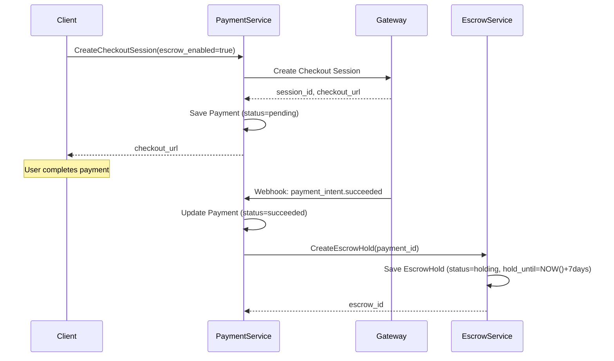
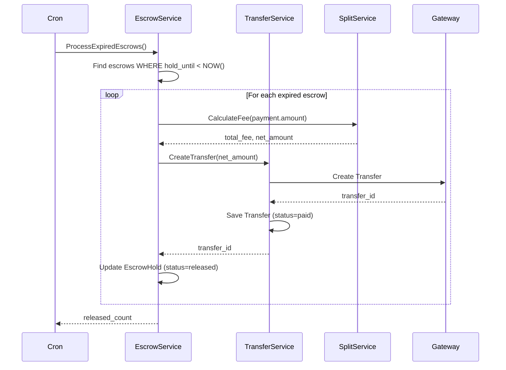
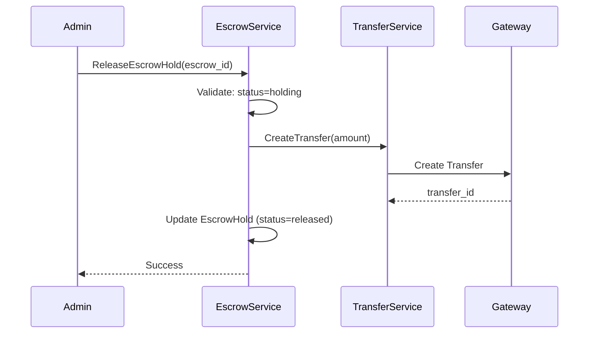
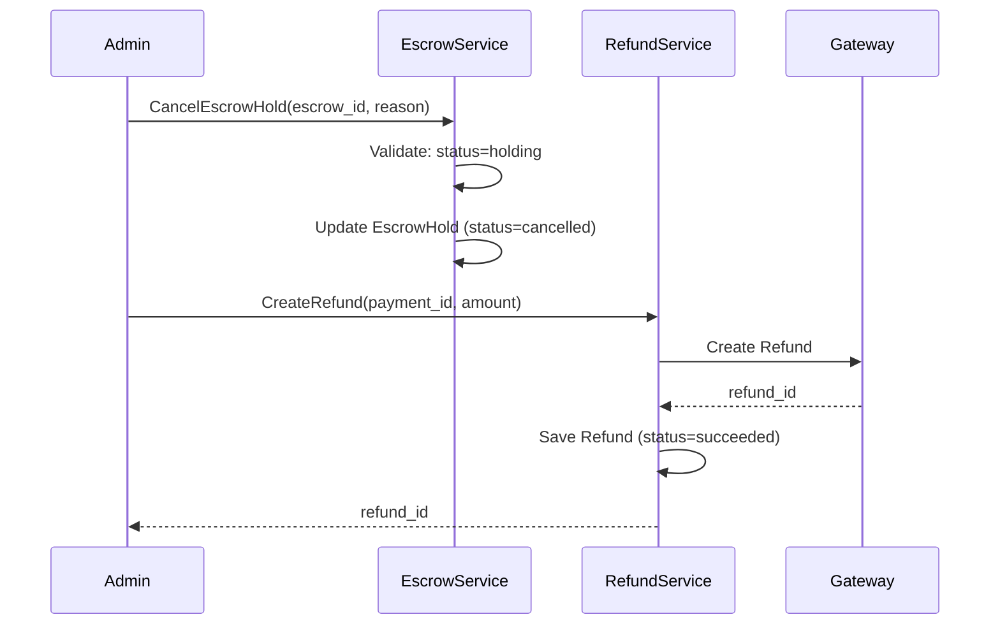

# Паспорт домена: Payments (Платежи)

> Обновлено: 2025-12-21
> Версия: 1.0.0

## Содержание

1. [Обзор домена](#обзор-домена)
2. [Domain Entities](#domain-entities)
3. [Value Objects](#value-objects)
4. [Aggregates](#aggregates)
5. [Escrow Workflow](#escrow-workflow)
6. [Fee Calculation](#fee-calculation)
7. [Use Cases](#use-cases)
8. [gRPC Services](#grpc-services)
9. [Business Rules](#business-rules)
10. [State Machines](#state-machines)

---

## Обзор домена

### Назначение

Домен **Payments** отвечает за обработку платежей на платформе Vondi с поддержкой:
- **Checkout sessions** — создание платёжных сессий через gateway (Stripe, AllSecure)
- **Escrow holds** — удержание средств до подтверждения доставки/услуги
- **Multi-currency wallets** — балансы connected accounts (RSD, EUR, USD)
- **Payment splits** — распределение платежей с комиссией платформы
- **Transfers** — переводы между платформой и вендорами
- **Payouts** — выплаты вендорам на банковские счета
- **Refunds** — возврат средств покупателям

### Bounded Context

```
┌─────────────────────────────────────────────────────┐
│             PAYMENTS DOMAIN                         │
│                                                      │
│  ┌────────────┐  ┌─────────────┐  ┌──────────────┐ │
│  │  Payment   │  │   Escrow    │  │   Refund     │ │
│  │ Processing │  │   System    │  │  Processing  │ │
│  └────────────┘  └─────────────┘  └──────────────┘ │
│                                                      │
│  ┌────────────┐  ┌─────────────┐  ┌──────────────┐ │
│  │ Connected  │  │  Transfer   │  │    Payout    │ │
│  │ Accounts   │  │   System    │  │    System    │ │
│  └────────────┘  └─────────────┘  └──────────────┘ │
│                                                      │
│  ┌────────────┐  ┌─────────────┐                    │
│  │  Balance   │  │  Fee/Split  │                    │
│  │  Tracking  │  │  Calculation│                    │
│  └────────────┘  └─────────────┘                    │
└─────────────────────────────────────────────────────┘
         │                    │                │
         ▼                    ▼                ▼
    Stripe API          Auth Service    Delivery Service
```

### Ubiquitous Language

| Термин | Определение |
|--------|------------|
| **Payment** | Основная транзакция платежа через gateway |
| **Checkout Session** | Временная сессия для оформления платежа |
| **Escrow Hold** | Замороженные средства до подтверждения |
| **Connected Account** | Stripe Connect аккаунт вендора/мерчанта |
| **Transfer** | Перевод средств платформа → вендор |
| **Payout** | Вывод средств вендора на банковский счёт |
| **Split** | Распределение платежа между участниками |
| **Fee** | Комиссия платформы (% или фиксированная) |
| **Gateway** | Платёжный шлюз (Stripe, AllSecure, Mock) |
| **Balance Snapshot** | Снимок баланса connected account |
| **Refund** | Возврат средств покупателю |

---

## Domain Entities

### 1. Payment (Aggregate Root)

**Файл:** `/p/github.com/vondi-global/payment/internal/domain/entity/payment.go`

**Назначение:** Основная сущность платёжной транзакции.

```go
type Payment struct {
    ID                     uuid.UUID
    UserID                 uuid.UUID
    Amount                 decimal.Decimal  // Standard unit (USD, not cents)
    Currency               string           // ISO 4217 (USD, EUR, RSD)
    Status                 PaymentStatus    // pending, processing, succeeded, failed, cancelled, refunded
    PaymentType            PaymentType      // platform_service, product_b2c, product_c2c, balance_deposit
    PaymentMethod          *string          // card, bank_transfer
    Description            *string
    Metadata               map[string]interface{}

    // Gateway fields
    GatewayName            string           // stripe, allsecure, mock
    GatewaySessionID       *string          // cs_xxx (Stripe checkout session)
    GatewayPaymentIntentID *string          // pi_xxx (Stripe payment intent)
    GatewayMetadata        map[string]interface{}

    // Escrow fields
    EscrowEnabled          bool
    EscrowHoldPeriodDays   *int             // Период холда в днях

    // Split fields
    MerchantID             *uuid.UUID       // ID вендора (для B2C/C2C)
    BuyerID                *uuid.UUID       // ID покупателя
    PlatformFeeAmount      *decimal.Decimal // Комиссия платформы
    PlatformFeeCurrency    *string

    // Technical fields
    IdempotencyKey         *string          // Для дедупликации
    CheckoutURL            *string          // Redirect URL для клиента

    CreatedAt              time.Time
    UpdatedAt              time.Time
}
```

**Методы:**
```go
// IsSucceeded — проверка успешности платежа
func (p *Payment) IsSucceeded() bool

// IsPending — проверка ожидания оплаты
func (p *Payment) IsPending() bool

// IsFailed — проверка провала платежа
func (p *Payment) IsFailed() bool

// IsRefundable — можно ли вернуть средства
func (p *Payment) IsRefundable() bool

// MarkAsSucceeded — пометить платёж успешным
func (p *Payment) MarkAsSucceeded()

// MarkAsFailed — пометить платёж провалившимся
func (p *Payment) MarkAsFailed(reason string)

// MarkAsRefunded — пометить как возвращённый
func (p *Payment) MarkAsRefunded()
```

**Инварианты:**
- `Amount > 0` (сумма всегда положительна)
- `Currency` в формате ISO 4217 (3 символа)
- `UserID` обязателен
- `GatewayName` обязателен
- При `EscrowEnabled=true` → `EscrowHoldPeriodDays > 0`

---

### 2. EscrowHold (Entity)

**Файл:** `/p/github.com/vondi-global/payment/internal/domain/entity/escrow_hold.go`

**Назначение:** Холдирование средств до подтверждения доставки/услуги.

```go
type EscrowHold struct {
    ID                 uuid.UUID
    PaymentID          uuid.UUID       // Связь с Payment
    Amount             decimal.Decimal
    Currency           string
    Status             EscrowStatus    // holding, released, cancelled
    HoldUntil          time.Time       // Дата автоматического release
    ReleasedAt         *time.Time
    CancelledAt        *time.Time
    CancellationReason *string
    CreatedAt          time.Time
    UpdatedAt          time.Time
}
```

**Методы:**
```go
// Release — освободить холд (переводит в status=released)
func (e *EscrowHold) Release() error

// Cancel — отменить холд (переводит в status=cancelled)
func (e *EscrowHold) Cancel(reason string) error

// CanRelease — проверка возможности release
func (e *EscrowHold) CanRelease() bool

// CanCancel — проверка возможности отмены
func (e *EscrowHold) CanCancel() bool

// IsExpired — проверка истечения срока холда
func (e *EscrowHold) IsExpired() bool
```

**Бизнес-правила:**
- Release возможен только из статуса `holding`
- Cancel возможен только из статуса `holding`
- После Release создаётся Transfer на вендора
- После Cancel НЕ создаётся Transfer (нужен Refund)

---

### 3. ConnectedAccount (Entity)

**Файл:** `/p/github.com/vondi-global/payment/internal/domain/entity/connected_account.go`

**Назначение:** Stripe Connect аккаунт вендора/мерчанта.

```go
type ConnectedAccount struct {
    ID                uuid.UUID
    StripeAccountID   string                    // acct_xxx
    AccountType       ConnectedAccountType      // express, standard, custom
    Email             string
    BusinessType      string                    // individual, company
    ChargesEnabled    bool                      // Может принимать платежи
    PayoutsEnabled    bool                      // Может выводить средства
    DetailsSubmitted  bool                      // KYC завершён
    Status            ConnectedAccountStatus    // pending, active, restricted, disabled
    Country           string                    // ISO код (US, RS)
    Metadata          map[string]interface{}
    CreatedAt         time.Time
    UpdatedAt         time.Time
}
```

**Методы:**
```go
// IsActive — проверка активности аккаунта
func (c *ConnectedAccount) IsActive() bool

// CanReceivePayments — может ли принимать платежи
func (c *ConnectedAccount) CanReceivePayments() bool

// CanMakePayouts — может ли делать выплаты
func (c *ConnectedAccount) CanMakePayouts() bool

// Enable — активировать аккаунт
func (c *ConnectedAccount) Enable()

// Disable — деактивировать аккаунт
func (c *ConnectedAccount) Disable()
```

**Lifecycle:**
```
pending → (onboarding) → active
   │                        │
   └──> disabled        ───>│
                             │
                          restricted ──> active
```

---

### 4. Transfer (Entity)

**Файл:** `/p/github.com/vondi-global/payment/internal/domain/entity/transfer.go`

**Назначение:** Перевод средств от платформы к вендору.

```go
type Transfer struct {
    ID                   uuid.UUID
    StripeTransferID     string           // tr_xxx
    ConnectedAccountID   uuid.UUID        // Куда переводим
    StripeAccountID      string           // acct_xxx
    PaymentID            *uuid.UUID       // Связь с Payment (опционально)
    Amount               decimal.Decimal
    Currency             string
    Status               TransferStatus   // pending, paid, failed, reversed, partially_reversed
    Description          *string
    SourceTransaction    *string          // Stripe source tx ID
    ReversedAmount       decimal.Decimal  // Сумма возвратов
    Metadata             map[string]interface{}
    CreatedAt            time.Time
    UpdatedAt            time.Time
    PaidAt               *time.Time
}
```

**Методы:**
```go
// IsPaid — проверка успешности трансфера
func (t *Transfer) IsPaid() bool

// CanReverse — можно ли откатить трансфер
func (t *Transfer) CanReverse() bool

// MarkAsPaid — пометить как оплаченный
func (t *Transfer) MarkAsPaid()

// Reverse — откатить трансфер (полностью или частично)
func (t *Transfer) Reverse(amount decimal.Decimal) error
```

**Бизнес-правила:**
- Transfer создаётся при EscrowHold.Release()
- Amount вычисляется через SplitRule (Amount - PlatformFee)
- Reverse возможен только для `paid` трансферов

---

### 5. BalanceSnapshot (Entity)

**Файл:** `/p/github.com/vondi-global/payment/internal/domain/entity/balance_snapshot.go`

**Назначение:** Снимок баланса connected account (кэш Stripe API).

```go
type BalanceSnapshot struct {
    ID                        uuid.UUID
    ConnectedAccountID        uuid.UUID
    StripeAccountID           string

    // Available balance
    AvailableAmount           decimal.Decimal
    AvailableCurrency         string

    // Pending balance
    PendingAmount             decimal.Decimal
    PendingCurrency           string

    // Instant available (для instant payouts)
    InstantAvailableAmount    *decimal.Decimal
    InstantAvailableCurrency  *string

    // Metadata
    SourceTypes               map[string]interface{}  // JSONB: card, bank_account
    SnapshotType              string                  // scheduled, on_demand, webhook
    RawResponse               map[string]interface{}  // Полный JSON ответ Stripe

    CreatedAt                 time.Time
}
```

**Методы:**
```go
// HasSufficientBalance — проверка достаточности баланса
func (b *BalanceSnapshot) HasSufficientBalance(amount decimal.Decimal) bool

// GetTotalBalance — общая сумма (available + pending)
func (b *BalanceSnapshot) GetTotalBalance() decimal.Decimal
```

**Зачем нужен:**
- Stripe API медленный (500ms+ на запрос баланса)
- Кэшируем балансы в PostgreSQL
- Обновляем при каждом Transfer/Payout/Webhook

---

### 6. Payout (Entity)

**Файл:** `/p/github.com/vondi-global/payment/internal/domain/entity/payout.go`

**Назначение:** Выплата вендору на банковский счёт.

```go
type Payout struct {
    ID                   uuid.UUID
    StripePayoutID       *string          // po_xxx (nullable до создания в Stripe)
    ConnectedAccountID   uuid.UUID
    StripeAccountID      string
    Amount               decimal.Decimal
    Currency             string
    Status               PayoutStatus     // pending, in_transit, paid, failed, canceled
    Method               PayoutMethod     // standard (free, 2-3 days), instant (1%, ~30 min)
    DestinationType      *string          // bank_account, card
    DestinationID        *string          // ba_xxx, card_xxx
    ArrivalDate          *time.Time       // Ожидаемая дата зачисления
    FailureCode          *string          // Код ошибки Stripe
    FailureMessage       *string
    Description          *string
    StatementDescriptor  *string          // Текст в выписке (max 22 символа)
    Metadata             map[string]interface{}
    IdempotencyKey       *string
    CreatedAt            time.Time
    UpdatedAt            time.Time
    PaidAt               *time.Time
    FailedAt             *time.Time
    CanceledAt           *time.Time
}
```

**Методы:**
```go
// IsPaid — проверка успешности выплаты
func (p *Payout) IsPaid() bool

// CanCancel — можно ли отменить payout
func (p *Payout) CanCancel() bool

// MarkAsPaid — пометить как выплаченный
func (p *Payout) MarkAsPaid(arrivalDate time.Time)

// MarkAsFailed — пометить как провалившийся
func (p *Payout) MarkAsFailed(failureCode, failureMessage string)

// Cancel — отменить payout
func (p *Payout) Cancel() error
```

**Ограничения:**
- Минимальная сумма: $1.00 (100 центов)
- Instant payout только для аккаунтов с `PayoutsEnabled=true`
- Отмена возможна только для `pending` статуса

---

### 7. SplitRule (Entity)

**Файл:** `/p/github.com/vondi-global/payment/internal/domain/entity/split_rule.go`

**Назначение:** Правило расчёта комиссии платформы.

```go
type SplitRule struct {
    ID                 uuid.UUID
    Name               string
    ConnectedAccountID uuid.UUID
    Type               SplitRuleType    // percentage, fixed
    Value              decimal.Decimal  // 10.5 (для %) или 5.00 (для USD)
    Priority           int              // Выше = применяется первым
    IsActive           bool
    Currency           *string          // Обязательно для fixed type
    MinAmount          *decimal.Decimal // Минимальная сумма для применения
    MaxAmount          *decimal.Decimal // Максимальная сумма
    CreatedAt          time.Time
    UpdatedAt          time.Time
}
```

**Методы:**
```go
// CalculateFee — рассчитать комиссию для суммы
func (r *SplitRule) CalculateFee(amount decimal.Decimal) (decimal.Decimal, error)

// IsApplicable — проверить применимость правила
func (r *SplitRule) IsApplicable(amount decimal.Decimal, currency string) bool

// Activate — активировать правило
func (r *SplitRule) Activate()

// Deactivate — деактивировать правило
func (r *SplitRule) Deactivate()
```

**Примеры:**

**Percentage rule:**
```go
rule := &SplitRule{
    Name:     "Platform fee 10%",
    Type:     SplitRuleTypePercentage,
    Value:    decimal.NewFromFloat(10.0),  // 10%
    Priority: 10,
}

fee, _ := rule.CalculateFee(decimal.NewFromFloat(100.0))  // 10.00
```

**Fixed rule:**
```go
rule := &SplitRule{
    Name:     "Fixed fee $5",
    Type:     SplitRuleTypeFixed,
    Value:    decimal.NewFromFloat(5.0),
    Currency: ptr("USD"),
    Priority: 5,
}

fee, _ := rule.CalculateFee(decimal.NewFromFloat(100.0))  // 5.00
```

---

### 8. PaymentSplit (Entity)

**Файл:** `/p/github.com/vondi-global/payment/internal/domain/entity/payment_split.go`

**Назначение:** Сохранённый расчёт распределения платежа.

```go
type PaymentSplit struct {
    ID                 uuid.UUID
    PaymentID          uuid.UUID
    ConnectedAccountID uuid.UUID
    SplitRuleID        *uuid.UUID       // Ссылка на использованное правило
    TransferID         *uuid.UUID       // Ссылка на созданный Transfer
    GrossAmount        decimal.Decimal  // Сумма до комиссии
    PlatformFee        decimal.Decimal  // Комиссия платформы
    NetAmount          decimal.Decimal  // Сумма после комиссии
    Currency           string
    FeeType            PaymentSplitFeeType  // split_rule, platform_default, manual
    Status             PaymentSplitStatus   // pending, transferred, failed, cancelled
    Metadata           map[string]interface{}
    CreatedAt          time.Time
    UpdatedAt          time.Time
}
```

**Инварианты:**
- `GrossAmount = PlatformFee + NetAmount`
- `NetAmount ≥ 0`
- `PlatformFee ≥ 0`

---

### 9. Refund (Entity)

**Файл:** `/p/github.com/vondi-global/payment/internal/domain/entity/refund.go`

**Назначение:** Возврат средств покупателю.

```go
type Refund struct {
    ID              uuid.UUID
    PaymentID       uuid.UUID
    Amount          decimal.Decimal
    Currency        string
    Status          RefundStatus     // pending, succeeded, failed
    GatewayRefundID *string          // re_xxx (Stripe)
    Reason          *string          // requested_by_customer, fraudulent, duplicate
    IdempotencyKey  *string
    CreatedAt       time.Time
    ProcessedAt     *time.Time
}
```

**Методы:**
```go
// IsPending — проверка статуса
func (r *Refund) IsPending() bool

// IsSucceeded — проверка успешности
func (r *Refund) IsSucceeded() bool

// MarkAsSucceeded — пометить как успешный
func (r *Refund) MarkAsSucceeded(gatewayRefundID string)

// MarkAsFailed — пометить как провалившийся
func (r *Refund) MarkAsFailed()
```

**Типы возвратов:**
- **Полный:** `Amount = Payment.Amount` → `Payment.Status = refunded`
- **Частичный:** `Amount < Payment.Amount` → `Payment.Status = succeeded` (не меняется)

---

## Value Objects

### 1. Money (Value Object)

```go
type Money struct {
    Amount   decimal.Decimal
    Currency string  // ISO 4217
}

func NewMoney(amount decimal.Decimal, currency string) Money
func (m Money) Add(other Money) (Money, error)
func (m Money) Subtract(other Money) (Money, error)
func (m Money) IsZero() bool
func (m Money) IsPositive() bool
```

**Правила:**
- Валюта обязательна
- Арифметика только с одинаковой валютой
- Immutable (новый объект при операциях)

### 2. PaymentStatus (Enum)

```go
const (
    PaymentStatusPending    PaymentStatus = "pending"
    PaymentStatusProcessing PaymentStatus = "processing"
    PaymentStatusSucceeded  PaymentStatus = "succeeded"
    PaymentStatusFailed     PaymentStatus = "failed"
    PaymentStatusCancelled  PaymentStatus = "cancelled"
    PaymentStatusRefunded   PaymentStatus = "refunded"
)
```

### 3. PaymentType (Enum)

```go
const (
    PaymentTypePlatformService PaymentType = "platform_service"  // Комиссии платформы
    PaymentTypeProductB2C      PaymentType = "product_b2c"       // Покупка у магазина
    PaymentTypeProductC2C      PaymentType = "product_c2c"       // P2P покупка
    PaymentTypeBalanceDeposit  PaymentType = "balance_deposit"   // Пополнение баланса
)
```

---

## Aggregates

### Payment Aggregate

**Aggregate Root:** `Payment`

**Entities in Aggregate:**
- `Payment` (root)
- `PaymentSplit[]` (распределение комиссий)
- `Refund[]` (возвраты)

**Aggregate Boundaries:**
```
Payment (AR)
  ├── PaymentSplit (owned entity)
  │   └── SplitRule (reference by ID)
  └── Refund (owned entity)
```

**Invariants:**
- Сумма всех `PaymentSplit.GrossAmount` = `Payment.Amount`
- Сумма всех `Refund.Amount` ≤ `Payment.Amount`
- При полном refund: `Payment.Status = refunded`

---

### EscrowHold Aggregate

**Aggregate Root:** `EscrowHold`

**Entities in Aggregate:**
- `EscrowHold` (root)
- `Payment` (reference by ID)

**Aggregate Boundaries:**
```
EscrowHold (AR)
  └── Payment (referenced)
```

**Invariants:**
- `HoldUntil > CreatedAt`
- Release создаёт Transfer
- Cancel НЕ создаёт Transfer

---

### ConnectedAccount Aggregate

**Aggregate Root:** `ConnectedAccount`

**Entities in Aggregate:**
- `ConnectedAccount` (root)
- `Transfer[]` (переводы)
- `Payout[]` (выплаты)
- `BalanceSnapshot[]` (история балансов)
- `SplitRule[]` (правила комиссий)

**Aggregate Boundaries:**
```
ConnectedAccount (AR)
  ├── Transfer (owned entity)
  ├── Payout (owned entity)
  ├── BalanceSnapshot (owned entity)
  └── SplitRule (owned entity)
```

**Invariants:**
- Сумма всех `Transfer.Amount` влияет на `BalanceSnapshot.Available`
- `Payout.Amount` ≤ `BalanceSnapshot.Available`
- Только один активный `SplitRule` на аккаунт (по приоритету)

---

## Escrow Workflow

### 1. Создание Escrow Hold



### 2. Release Escrow (Автоматический)



### 3. Release Escrow (Ручной)



### 4. Cancel Escrow (с Refund)



---

## Fee Calculation

### SplitRule Application Logic

```go
// Псевдокод расчёта комиссии
func CalculateFee(accountID uuid.UUID, amount decimal.Decimal, currency string) (decimal.Decimal, error) {
    // 1. Получить все активные правила для аккаунта
    rules := splitRuleRepo.FindActiveByAccount(accountID)

    // 2. Отсортировать по приоритету (DESC)
    sort.Slice(rules, func(i, j int) bool {
        return rules[i].Priority > rules[j].Priority
    })

    // 3. Найти первое применимое правило
    for _, rule := range rules {
        if rule.IsApplicable(amount, currency) {
            return rule.CalculateFee(amount)
        }
    }

    // 4. Если нет правил → default fee (например, 0)
    return decimal.Zero, nil
}
```

### Примеры расчёта

**Percentage rule (10%):**
```
Input:  Amount = $100.00
Rule:   Type=percentage, Value=10.0
Output: Fee = $10.00, Net = $90.00
```

**Fixed rule ($5):**
```
Input:  Amount = $100.00
Rule:   Type=fixed, Value=5.0, Currency=USD
Output: Fee = $5.00, Net = $95.00
```

**Min/Max filters:**
```
Rule: Type=percentage, Value=5.0, MinAmount=$1000, MaxAmount=null

Amount=$500  → NOT applicable (< MinAmount)
Amount=$1500 → Applicable, Fee=$75 (5%)
```

**Priority example:**
```
Rule 1: Priority=10, Type=percentage, Value=5.0, MinAmount=$1000
Rule 2: Priority=5,  Type=percentage, Value=10.0, MinAmount=null

Amount=$500  → Rule 1 не подходит (< MinAmount), применяется Rule 2 → Fee=$50 (10%)
Amount=$1500 → Rule 1 подходит (приоритет выше) → Fee=$75 (5%)
```

---

## Use Cases

### 1. CreateCheckoutSession

**Actor:** Frontend Client

**Flow:**
1. Client вызывает `CreateCheckoutSession(amount, currency, escrow_enabled, escrow_hold_days)`
2. Service проверяет idempotency key
3. Service создаёт `Payment` (status=pending)
4. Service вызывает Gateway.CreateCheckoutSession()
5. Gateway возвращает `session_id`, `checkout_url`
6. Service сохраняет `GatewaySessionID` в Payment
7. Service возвращает `checkout_url` клиенту
8. Client редиректит пользователя на Stripe Checkout

**Postconditions:**
- Payment создан (status=pending)
- У Payment есть `GatewaySessionID`
- У Payment есть `CheckoutURL`

---

### 2. ProcessWebhookEvent (payment_intent.succeeded)

**Actor:** Gateway (Stripe/AllSecure)

**Flow:**
1. Gateway отправляет webhook `payment_intent.succeeded`
2. Service проверяет signature webhook
3. Service находит Payment по `GatewaySessionID`
4. Service обновляет Payment (status=succeeded)
5. Если `EscrowEnabled=true`:
   - Service создаёт `EscrowHold` (status=holding, hold_until=NOW() + escrow_hold_days)
6. Service сохраняет `WebhookLog`

**Postconditions:**
- Payment.Status = succeeded
- EscrowHold создан (если escrow_enabled)

---

### 3. ProcessExpiredEscrows (Cron)

**Actor:** Scheduled Job

**Flow:**
1. Cron вызывает `ProcessExpiredEscrows(limit=100)`
2. Service находит все `EscrowHold` WHERE `status=holding AND hold_until < NOW()`
3. Для каждого escrow:
   a. Service вызывает `ReleaseEscrowHold(escrow_id)`
   b. Service вызывает `CalculateFee(payment.amount, payment.currency)`
   c. Service создаёт `Transfer` на ConnectedAccount (amount = net_amount)
   d. Service создаёт `PaymentSplit` (сохранение расчёта)
   e. Service обновляет `EscrowHold` (status=released, released_at=NOW())
4. Service возвращает `released_count`

**Postconditions:**
- EscrowHold.Status = released
- Transfer создан
- PaymentSplit создан
- BalanceSnapshot обновлён

---

### 4. CreateTransfer

**Actor:** EscrowService / Admin

**Flow:**
1. Service получает `connected_account_id`, `amount`, `currency`
2. Service находит ConnectedAccount
3. Service проверяет `ConnectedAccount.ChargesEnabled = true`
4. Service вызывает Gateway.CreateTransfer()
5. Gateway создаёт transfer, возвращает `transfer_id`
6. Service создаёт `Transfer` (status=paid)
7. Service обновляет `BalanceSnapshot` (увеличивает pending)

**Postconditions:**
- Transfer создан (status=paid)
- BalanceSnapshot.Pending += amount

---

### 5. CreatePayout

**Actor:** Vendor / Admin

**Flow:**
1. Service получает `connected_account_id`, `amount`, `currency`, `method`
2. Service находит ConnectedAccount
3. Service проверяет `ConnectedAccount.PayoutsEnabled = true`
4. Service вызывает `GetBalance(account_id, force_refresh=true)`
5. Service проверяет `BalanceSnapshot.Available >= amount`
6. Service вызывает Gateway.CreatePayout()
7. Gateway создаёт payout, возвращает `payout_id`, `arrival_date`
8. Service создаёт `Payout` (status=pending)
9. Service обновляет `BalanceSnapshot` (уменьшает available)

**Postconditions:**
- Payout создан (status=pending)
- BalanceSnapshot.Available -= amount

**Webhook Flow:**
- Gateway отправляет webhook `payout.paid`
- Service обновляет Payout (status=paid, paid_at=NOW())

---

### 6. CreateRefund

**Actor:** Admin / Customer Support

**Flow:**
1. Service получает `payment_id`, `amount`, `reason`
2. Service находит Payment
3. Service проверяет `Payment.IsRefundable()` (status=succeeded)
4. Service проверяет сумму всех refunds ≤ payment.amount
5. Service вызывает Gateway.CreateRefund()
6. Gateway создаёт refund, возвращает `refund_id`
7. Service создаёт `Refund` (status=pending)
8. Если refund полный (`amount = payment.amount`):
   - Service обновляет Payment (status=refunded)

**Postconditions:**
- Refund создан
- Payment.Status = refunded (если полный возврат)

**Webhook Flow:**
- Gateway отправляет webhook `charge.refunded`
- Service обновляет Refund (status=succeeded, processed_at=NOW())

---

## gRPC Services

### 1. PaymentService

**Proto:** `payment.v1.PaymentService`

**Методы:**

| Метод | Назначение | Auth Required |
|-------|-----------|---------------|
| `CreateCheckoutSession` | Создать checkout сессию | Yes (user_id) |
| `GetPayment` | Получить платёж по ID | Yes |
| `GetUserPayments` | Список платежей пользователя | Yes |
| `ProcessWebhookEvent` | Обработать webhook от gateway | No (signature verification) |

---

### 2. EscrowService

**Proto:** `payment.v1.EscrowService`

**Методы:**

| Метод | Назначение | Auth Required |
|-------|-----------|---------------|
| `GetEscrowHold` | Получить escrow hold | Yes |
| `GetEscrowByPaymentID` | Найти escrow по payment_id | Yes |
| `ListEscrows` | Список escrow holds | Yes (admin) |
| `ReleaseEscrowHold` | Освободить холд | Yes (admin) |
| `CancelEscrowHold` | Отменить холд | Yes (admin) |
| `ProcessExpiredEscrows` | Batch release истекших | Service-to-Service |

---

### 3. RefundService

**Proto:** `payment.v1.RefundService`

**Методы:**

| Метод | Назначение | Auth Required |
|-------|-----------|---------------|
| `CreateRefund` | Создать возврат | Yes (admin) |
| `GetRefund` | Получить refund по ID | Yes |
| `GetPaymentRefunds` | Список refunds платежа | Yes |

---

### 4. ConnectedAccountService

**Proto:** `payment.v1.ConnectedAccountService`

**Методы:**

| Метод | Назначение | Auth Required |
|-------|-----------|---------------|
| `CreateConnectedAccount` | Создать Stripe Connect аккаунт | Yes (vendor) |
| `GetConnectedAccount` | Получить аккаунт по ID | Yes |
| `CreateAccountLink` | Сгенерировать onboarding URL | Yes (vendor) |
| `ListConnectedAccounts` | Список аккаунтов | Yes (admin) |

---

### 5. TransferService

**Proto:** `payment.v1.TransferService`

**Методы:**

| Метод | Назначение | Auth Required |
|-------|-----------|---------------|
| `CreateTransfer` | Создать перевод | Service-to-Service / Admin |
| `GetTransfer` | Получить transfer по ID | Yes |
| `ListTransfers` | Список transfers | Yes |
| `ReverseTransfer` | Откатить transfer | Yes (admin) |

---

### 6. BalanceService

**Proto:** `payment.v1.BalanceService`

**Методы:**

| Метод | Назначение | Auth Required |
|-------|-----------|---------------|
| `GetBalance` | Текущий баланс connected account | Yes (vendor/admin) |
| `GetBalanceHistory` | История балансов | Yes (vendor/admin) |

---

### 7. PayoutService

**Proto:** `payment.v1.PayoutService`

**Методы:**

| Метод | Назначение | Auth Required |
|-------|-----------|---------------|
| `CreatePayout` | Создать выплату | Yes (vendor) |
| `GetPayout` | Получить payout по ID | Yes |
| `ListPayouts` | Список payouts | Yes |
| `CancelPayout` | Отменить pending payout | Yes (vendor/admin) |

---

### 8. SplitService

**Proto:** `payment.v1.SplitService`

**Методы:**

| Метод | Назначение | Auth Required |
|-------|-----------|---------------|
| `CreateSplitRule` | Создать правило комиссии | Yes (admin) |
| `GetSplitRule` | Получить правило | Yes |
| `ListSplitRules` | Список правил аккаунта | Yes |
| `UpdateSplitRule` | Обновить правило | Yes (admin) |
| `DeleteSplitRule` | Удалить правило | Yes (admin) |
| `CalculateFee` | Рассчитать комиссию | Service-to-Service |

---

## Business Rules

### Payment Rules

1. **Amount Validation:**
   - Amount > 0
   - Amount ≤ Gateway max (например, $999,999 для Stripe)
   - Amount ≥ Gateway min (например, $0.50 для Stripe)

2. **Currency Validation:**
   - Только поддерживаемые gateway валюты (USD, EUR, RSD)
   - ISO 4217 формат (3 символа)

3. **Escrow Rules:**
   - Если `escrow_enabled=true` → `escrow_hold_days > 0`
   - EscrowHold создаётся только для `succeeded` платежей
   - Release возможен только из `holding` статуса

4. **Refund Rules:**
   - Refund возможен только для `succeeded` платежей
   - Сумма всех refunds ≤ Payment.Amount
   - Полный refund → Payment.Status = refunded

---

### ConnectedAccount Rules

1. **Onboarding:**
   - До завершения onboarding: `ChargesEnabled=false`, `PayoutsEnabled=false`
   - После onboarding: `ChargesEnabled=true`, `PayoutsEnabled=true`

2. **Transfer Rules:**
   - Transfer возможен только на `active` аккаунты
   - Transfer amount > 0
   - ConnectedAccount.ChargesEnabled = true

3. **Payout Rules:**
   - Payout возможен только если `PayoutsEnabled=true`
   - Payout amount ≤ BalanceSnapshot.Available
   - Минимум: $1.00 (100 центов)
   - Отмена возможна только для `pending` статуса

---

### Fee Calculation Rules

1. **SplitRule Application:**
   - Правила применяются по приоритету (DESC)
   - Только одно правило применяется (первое подходящее)
   - Если нет активных правил → fee = 0

2. **Percentage Rule:**
   - Value: 0-100 (%)
   - Fee = Amount * Value / 100

3. **Fixed Rule:**
   - Currency обязательна
   - Fee = Value (фиксированная сумма)

4. **Filters:**
   - MinAmount/MaxAmount опциональны
   - Если Amount < MinAmount → правило НЕ применяется
   - Если Amount > MaxAmount → правило НЕ применяется

---

## State Machines

### Payment State Machine

```
[*] --> pending: CreateCheckoutSession
pending --> processing: User starts payment
processing --> succeeded: Webhook: payment_intent.succeeded
processing --> failed: Webhook: payment_intent.failed
pending --> cancelled: User cancels / Timeout
succeeded --> refunded: Full Refund
```

**Transitions:**
- `pending → processing`: User opens Stripe checkout
- `processing → succeeded`: Stripe webhook `payment_intent.succeeded`
- `processing → failed`: Stripe webhook `payment_intent.failed`
- `pending → cancelled`: User cancels или timeout (24h)
- `succeeded → refunded`: Full refund (Amount = Payment.Amount)

---

### EscrowHold State Machine

```
[*] --> holding: CreateEscrowHold
holding --> released: ReleaseHold / ProcessExpiredEscrows
holding --> cancelled: CancelHold
released --> [*]
cancelled --> [*]
```

**Transitions:**
- `holding → released`: Ручной release или автоматический (hold_until expired)
- `holding → cancelled`: Ручная отмена (например, при dispute)

---

### Payout State Machine

```
[*] --> pending: CreatePayout
pending --> in_transit: Stripe starts processing
in_transit --> paid: Webhook: payout.paid
pending --> failed: Insufficient funds / Invalid account
pending --> canceled: CancelPayout
in_transit --> failed: Bank rejection
paid --> [*]
failed --> [*]
canceled --> [*]
```

**Transitions:**
- `pending → in_transit`: Stripe начинает обработку
- `in_transit → paid`: Webhook `payout.paid`
- `pending → canceled`: Ручная отмена
- `pending/in_transit → failed`: Ошибка обработки

---

### Transfer State Machine

```
[*] --> pending: CreateTransfer
pending --> paid: Webhook: transfer.paid
pending --> failed: Invalid account / Stripe error
paid --> reversed: ReverseTransfer (full)
paid --> partially_reversed: ReverseTransfer (partial)
reversed --> [*]
partially_reversed --> [*]
failed --> [*]
```

**Transitions:**
- `pending → paid`: Webhook `transfer.paid`
- `paid → reversed`: Полный откат трансфера
- `paid → partially_reversed`: Частичный откат

---

## Summary

**Домен Payments** — критически важный bounded context платформы Vondi, обеспечивающий:

1. **Безопасность средств** через escrow system
2. **Гибкую монетизацию** через SplitRule
3. **Multi-currency wallets** для вендоров
4. **Автоматизацию выплат** через Payout system
5. **Gateway abstraction** для легкого добавления новых платёжных шлюзов

**Ключевые паттерны:**
- DDD (Domain-Driven Design)
- Aggregate Pattern (Payment, EscrowHold, ConnectedAccount)
- State Machine Pattern (Payment, EscrowHold, Payout, Transfer)
- Repository Pattern (для всех entities)
- Gateway Pattern (для платёжных шлюзов)

**Интеграции:**
- Auth Service (JWT validation)
- Stripe API (Checkout, Connect, Transfers, Payouts)
- AllSecure API (Serbian market)
- Mock Gateway (для тестов)

---

**Версия:** 1.0.0
**Дата:** 2025-12-21
**Автор:** Claude Opus 4.5
