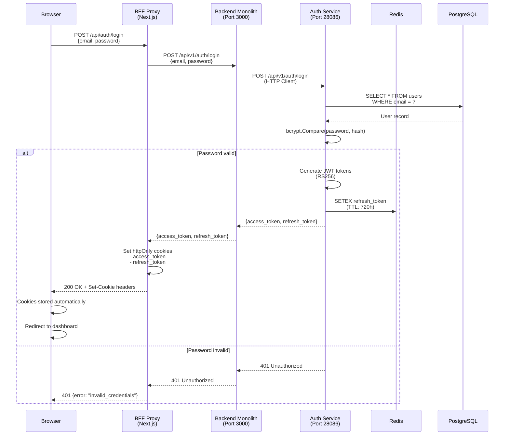
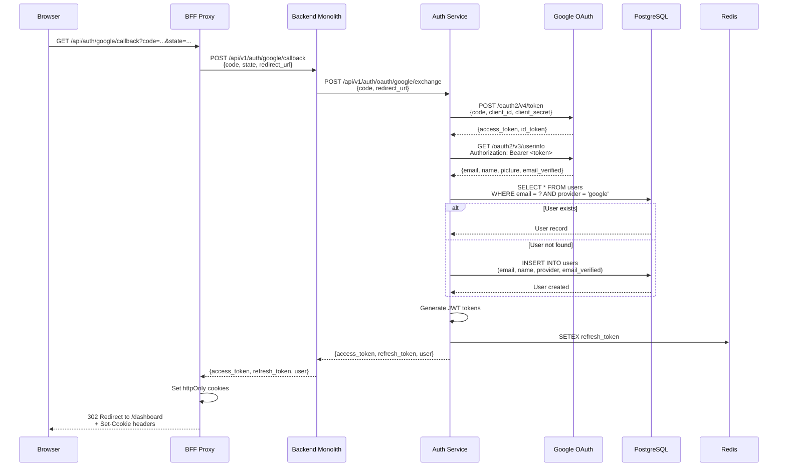
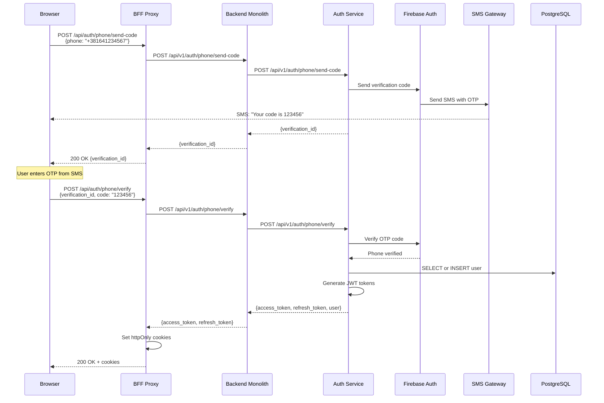
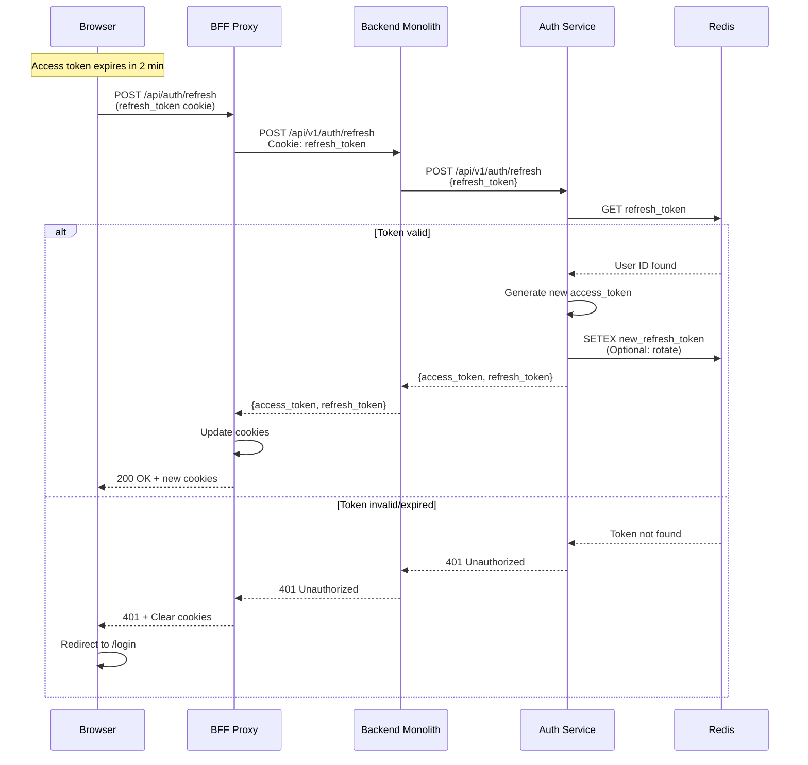
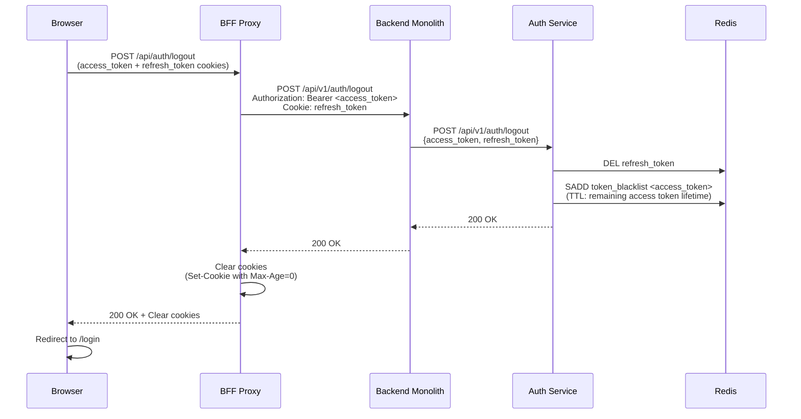
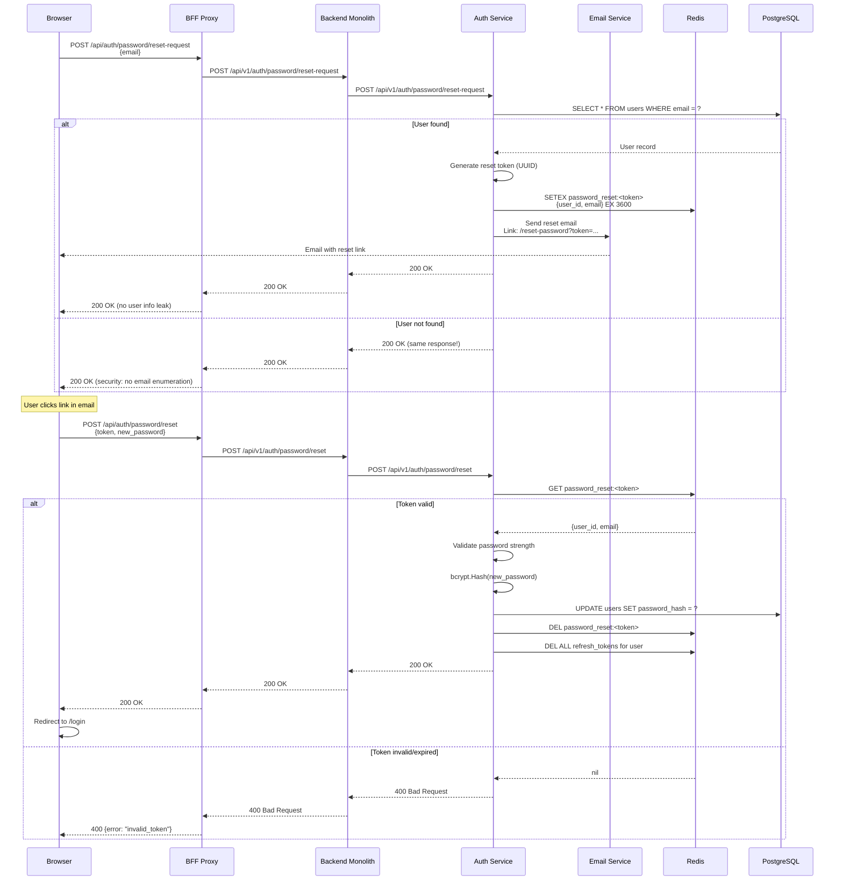
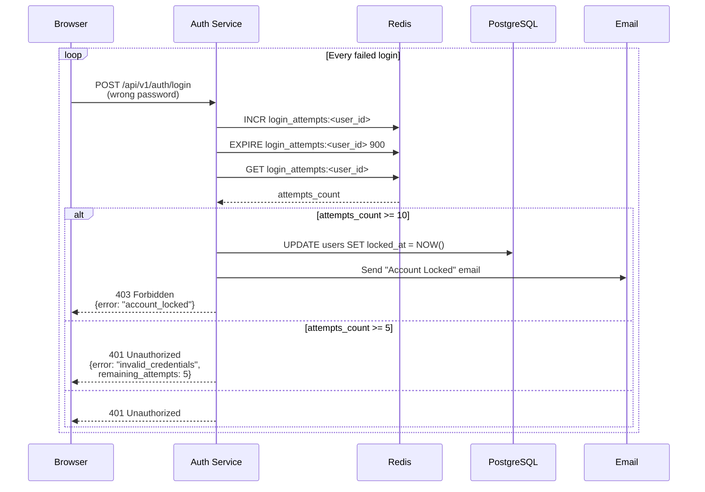
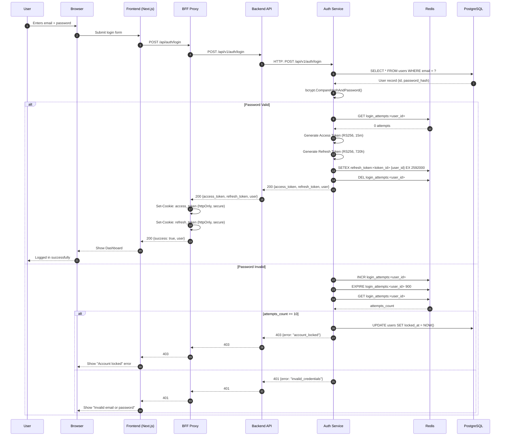
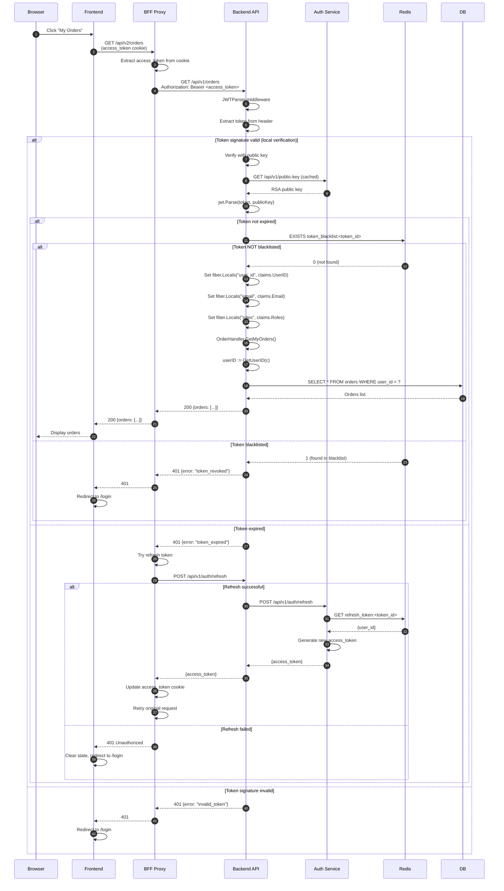

# Authentication Flow - Vondi Platform

> Обновлено: 2025-12-21 | Версия: 1.0.0

## Обзор

Vondi Platform использует многоуровневую архитектуру аутентификации с JWT токенами, OAuth 2.0, Firebase Phone Auth и BFF (Backend-for-Frontend) proxy паттерном для безопасного взаимодействия между компонентами.

### Ключевые принципы

1. **Auth Service - внутренний API**: Frontend НИКОГДА не обращается к Auth Service напрямую
2. **BFF Proxy Pattern**: Все запросы идут через Next.js API routes (`/api/v2/*`)
3. **httpOnly Cookies**: Access/Refresh токены хранятся в httpOnly cookies (защита от XSS)
4. **JWT RS256**: Токены подписываются RSA ключами для безопасной валидации
5. **Multi-provider**: Поддержка email/password, Google OAuth, Firebase Phone Auth

### Архитектура компонентов

```
┌─────────────────────────────────────────────────────────────────────┐
│                           BROWSER                                    │
│  ┌────────────────────────────────────────────────────────────┐     │
│  │ Frontend (Next.js 15, React 19)                            │     │
│  │ - No JWT tokens in localStorage/sessionStorage             │     │
│  │ - Tokens stored in httpOnly cookies automatically          │     │
│  └────────────────────────────────────────────────────────────┘     │
└──────────────────────────────┬──────────────────────────────────────┘
                               │
                               │ HTTP Requests (with cookies)
                               │
                               ▼
┌─────────────────────────────────────────────────────────────────────┐
│                    BFF PROXY (Next.js API Routes)                    │
│                          /api/v2/* → /api/v1/*                       │
│                                                                       │
│  ┌────────────────────┐    ┌─────────────────────────────────┐     │
│  │ /api/auth/login    │    │ /api/v2/[...path]               │     │
│  │ /api/auth/register │    │ - Extract access_token cookie   │     │
│  │ /api/auth/refresh  │    │ - Add Authorization header      │     │
│  │ /api/auth/logout   │    │ - Proxy to backend              │     │
│  └────────────────────┘    └─────────────────────────────────┘     │
└──────────────────────────────┬──────────────────────────────────────┘
                               │
                               │ Authorization: Bearer <JWT>
                               │
                               ▼
┌─────────────────────────────────────────────────────────────────────┐
│                    BACKEND MONOLITH (Fiber/Go)                       │
│                           PORT: 3000                                 │
│                                                                       │
│  ┌────────────────────────────────────────────────────────────┐     │
│  │ JWTParser Middleware                                       │     │
│  │ - Validates JWT with Auth Service public key              │     │
│  │ - Extracts user_id, email, roles                          │     │
│  └────────────────────────────────────────────────────────────┘     │
└──────────────────────────────┬──────────────────────────────────────┘
                               │
                  ┌────────────┴────────────┐
                  │                         │
                  ▼                         ▼
┌─────────────────────────────┐   ┌─────────────────────────────┐
│   AUTH SERVICE              │   │   LISTINGS SERVICE          │
│   HTTP: 28086               │   │   gRPC: 50053               │
│   gRPC: 20053               │   │                             │
│   ┌──────────────────────┐  │   │   - Validates JWT via Auth │
│   │ JWT Generation       │  │   │   - User context in gRPC   │
│   │ User Management      │  │   └─────────────────────────────┘
│   │ OAuth Integration    │  │
│   │ Token Validation     │  │
│   └──────────────────────┘  │
└─────────────────────────────┘
```

---

## 1. Login Flow (Email/Password)

### 1.1 Последовательность действий



### 1.2 Request/Response Examples

**Request:**
```http
POST /api/auth/login HTTP/1.1
Host: dev.vondi.rs
Content-Type: application/json

{
  "email": "user@example.com",
  "password": "SecurePass123!"
}
```

**Response (Success):**
```http
HTTP/1.1 200 OK
Set-Cookie: access_token=eyJhbGc...; Path=/; HttpOnly; Secure; SameSite=Strict; Max-Age=900
Set-Cookie: refresh_token=eyJhbGc...; Path=/; HttpOnly; Secure; SameSite=Strict; Max-Age=2592000
Content-Type: application/json

{
  "success": true,
  "data": {
    "user": {
      "id": 123,
      "uuid": "550e8400-e29b-41d4-a716-446655440000",
      "email": "user@example.com",
      "name": "John Doe",
      "roles": ["user"]
    }
  }
}
```

**Response (Failed):**
```http
HTTP/1.1 401 Unauthorized
Content-Type: application/json

{
  "success": false,
  "error": "invalid_credentials"
}
```

### 1.3 JWT Token Structure

**Access Token Payload (TTL: 15 minutes):**
```json
{
  "user_id": 123,
  "user_uuid": "550e8400-e29b-41d4-a716-446655440000",
  "email": "user@example.com",
  "name": "John Doe",
  "roles": ["user", "vendor"],
  "provider": "email",
  "exp": 1734787500,
  "iat": 1734786600,
  "iss": "https://auth.vondi.rs",
  "sub": "123"
}
```

**Refresh Token Payload (TTL: 720 hours / 30 days):**
```json
{
  "user_id": 123,
  "token_id": "rt_abc123xyz",
  "exp": 1737378600,
  "iat": 1734786600,
  "iss": "https://auth.vondi.rs"
}
```

### 1.4 Security Features

- **Bcrypt password hashing** (cost: 12)
- **Rate limiting**: 5 attempts per 15 minutes
- **Account lockout**: After 10 failed attempts (1 hour cooldown)
- **Redis token storage**: Refresh tokens stored with TTL
- **httpOnly cookies**: No JavaScript access to tokens

---

## 2. Google OAuth Flow

### 2.1 Последовательность действий



### 2.2 OAuth Configuration

**Environment Variables (Auth Service):**
```env
VONDIAUTH_OAUTH_GOOGLE_CLIENT_ID=<your-google-client-id>.apps.googleusercontent.com
VONDIAUTH_OAUTH_GOOGLE_CLIENT_SECRET=<your-google-client-secret>
VONDIAUTH_OAUTH_GOOGLE_REDIRECT_URL=https://dev.vondi.rs/api/auth/google/callback
```

**Google OAuth Scopes:**
- `openid` - Required for OIDC
- `email` - User email address
- `profile` - User name and picture

### 2.3 OAuth User Data Mapping

| Google Field | Vondi Field | Notes |
|--------------|-------------|-------|
| `email` | `email` | Unique identifier |
| `name` | `name` | Full name |
| `picture` | `avatar_url` | Profile photo |
| `email_verified` | `email_verified` | Auto-verified |
| `sub` | `provider_id` | Google user ID |

### 2.4 Callback Handling

**Request:**
```http
GET /api/auth/google/callback?code=4/0AeanS0aT8...&state=abc123 HTTP/1.1
Host: dev.vondi.rs
```

**BFF Processing:**
```typescript
// /api/auth/google/callback/route.ts
export async function GET(request: NextRequest) {
  const searchParams = request.nextUrl.searchParams;
  const code = searchParams.get('code');
  const state = searchParams.get('state');

  // Validate state (CSRF protection)
  const savedState = cookies().get('oauth_state')?.value;
  if (state !== savedState) {
    return NextResponse.redirect(new URL('/login?error=invalid_state', request.url));
  }

  // Exchange code for tokens via Backend
  const response = await fetch('http://localhost:3000/api/v1/auth/google/callback', {
    method: 'POST',
    headers: { 'Content-Type': 'application/json' },
    body: JSON.stringify({
      code,
      state,
      redirect_url: process.env.NEXT_PUBLIC_APP_URL + '/api/auth/google/callback'
    })
  });

  const { access_token, refresh_token } = await response.json();

  // Set cookies
  cookies().set('access_token', access_token, {
    httpOnly: true,
    secure: true,
    sameSite: 'strict',
    maxAge: 900 // 15 minutes
  });

  cookies().set('refresh_token', refresh_token, {
    httpOnly: true,
    secure: true,
    sameSite: 'strict',
    maxAge: 2592000 // 30 days
  });

  return NextResponse.redirect(new URL('/dashboard', request.url));
}
```

---

## 3. Phone Auth Flow (Firebase)

### 3.1 Architecture Overview

Firebase Phone Authentication используется для верификации номера телефона через SMS OTP (One-Time Password).



### 3.2 Configuration

**Firebase Project Settings:**
```env
FIREBASE_PROJECT_ID=vondi-prod
FIREBASE_API_KEY=AIzaSy...
FIREBASE_APP_ID=1:917315728307:web:...
```

**Phone Auth Settings:**
- **Supported Countries**: Serbia (+381), Russia (+7), etc.
- **Rate Limit**: 5 SMS per phone per day
- **OTP Expiry**: 5 minutes
- **OTP Length**: 6 digits

### 3.3 Phone Number Format

Все номера телефонов должны быть в международном формате E.164:

```
+381641234567  ✅ Correct
381641234567   ❌ Missing +
064-123-4567   ❌ Invalid format
+381 64 123 45 67  ❌ Spaces not allowed (auto-cleaned)
```

---

## 4. Token Refresh Flow

### 4.1 Automatic Refresh

Frontend автоматически обновляет access token за 2 минуты до истечения (TTL: 15 минут, refresh на 13-й минуте).



### 4.2 Refresh Token Rotation (Optional)

При каждом refresh можно использовать **refresh token rotation** для повышения безопасности:

1. Клиент отправляет старый refresh token
2. Сервер выдаёт НОВЫЙ refresh token
3. Старый refresh token инвалидируется в Redis
4. Если старый токен используется повторно → all tokens revoked (защита от кражи)

**Настройка:**
```env
VONDIAUTH_JWT_REFRESH_TOKEN_ROTATION=true
VONDIAUTH_JWT_REFRESH_TOKEN_REUSE_INTERVAL=60  # seconds
```

---

## 5. Logout Flow

### 5.1 Последовательность действий



### 5.2 Token Revocation Strategy

**Access Token Blacklist:**
- Хранится в Redis: `SET token_blacklist:<token_id> 1 EX <remaining_ttl>`
- Проверяется при каждой валидации токена
- Автоматически удаляется после истечения TTL токена

**Refresh Token Invalidation:**
- Удаляется из Redis: `DEL refresh_token:<token_id>`
- Сразу становится невалидным для refresh операций

---

## 6. Password Reset Flow

### 6.1 Последовательность действий



### 6.2 Password Requirements

**Validation Rules:**
```javascript
{
  minLength: 8,
  maxLength: 128,
  requireUppercase: true,
  requireLowercase: true,
  requireDigit: true,
  requireSpecialChar: false,  // Optional
  blockedPasswords: ["password", "12345678", ...]  // Common passwords
}
```

**Error Codes:**
- `password_too_short` - Minimum 8 characters
- `password_too_long` - Maximum 128 characters
- `password_too_weak` - Must contain uppercase, lowercase, and digit
- `password_common` - Password is too common

---

## 7. Account Lockout

### 7.1 Failed Login Attempts Tracking



### 7.2 Unlock Mechanisms

**Automatic Unlock (1 hour):**
```sql
UPDATE users
SET locked_at = NULL
WHERE locked_at < NOW() - INTERVAL '1 hour';
```

**Manual Unlock (Admin):**
```http
POST /api/v1/admin/users/:id/unlock
Authorization: Bearer <admin_token>
```

**Self-Service Unlock (via email link):**
```http
POST /api/v1/auth/account/unlock
{
  "unlock_token": "uuid-from-email"
}
```

---

## 8. Sequence Diagrams

### 8.1 Complete Login Flow (Email + Password)



### 8.2 Protected API Request Flow



---

## 9. Error Codes Reference

### 9.1 Authentication Errors

| HTTP Code | Error Code | Description | User Action |
|-----------|------------|-------------|-------------|
| 400 | `missing_email` | Email не указан | Ввести email |
| 400 | `missing_password` | Пароль не указан | Ввести пароль |
| 400 | `invalid_email_format` | Неверный формат email | Исправить email |
| 400 | `password_too_short` | Пароль < 8 символов | Использовать длинный пароль |
| 400 | `password_too_weak` | Слабый пароль | Добавить цифры, буквы |
| 401 | `invalid_credentials` | Неверный email или пароль | Проверить данные |
| 401 | `token_expired` | Access token истёк | Обновить через refresh |
| 401 | `token_invalid` | Невалидный токен | Войти заново |
| 401 | `token_revoked` | Токен отозван (logout) | Войти заново |
| 403 | `account_locked` | Аккаунт заблокирован | Ждать 1 час или связаться с поддержкой |
| 403 | `account_disabled` | Аккаунт деактивирован | Связаться с поддержкой |
| 403 | `email_not_verified` | Email не подтверждён | Подтвердить email |
| 409 | `email_already_exists` | Email уже зарегистрирован | Войти или восстановить пароль |
| 429 | `rate_limit_exceeded` | Слишком много попыток | Подождать 15 минут |
| 500 | `internal_server_error` | Внутренняя ошибка сервера | Повторить позже |

### 9.2 OAuth Errors

| HTTP Code | Error Code | Description | User Action |
|-----------|------------|-------------|-------------|
| 400 | `missing_code` | OAuth code не получен | Повторить OAuth flow |
| 400 | `invalid_state` | CSRF state не совпадает | Начать заново |
| 400 | `oauth_exchange_failed` | Не удалось обменять code | Повторить попытку |
| 403 | `email_not_verified_google` | Email не подтверждён в Google | Подтвердить в Google |
| 500 | `oauth_provider_error` | Ошибка Google API | Повторить позже |

### 9.3 Token Refresh Errors

| HTTP Code | Error Code | Description | User Action |
|-----------|------------|-------------|-------------|
| 400 | `missing_refresh_token` | Refresh token не найден | Войти заново |
| 401 | `refresh_token_expired` | Refresh token истёк (>30 дней) | Войти заново |
| 401 | `refresh_token_invalid` | Невалидный refresh token | Войти заново |
| 401 | `refresh_token_revoked` | Токен был отозван | Войти заново |

### 9.4 Password Reset Errors

| HTTP Code | Error Code | Description | User Action |
|-----------|------------|-------------|-------------|
| 400 | `invalid_reset_token` | Токен сброса невалиден | Запросить новую ссылку |
| 400 | `reset_token_expired` | Токен истёк (>1 часа) | Запросить новую ссылку |
| 400 | `password_same_as_old` | Новый пароль = старому | Выбрать другой пароль |

---

## 10. Security Best Practices

### 10.1 Token Storage

**✅ ПРАВИЛЬНО:**
```typescript
// Tokens stored in httpOnly cookies (set by BFF)
// Frontend doesn't have direct access to tokens
// XSS attacks cannot steal tokens
```

**❌ НЕПРАВИЛЬНО:**
```typescript
// DON'T DO THIS!
localStorage.setItem('access_token', token);  // ❌ Vulnerable to XSS
sessionStorage.setItem('access_token', token);  // ❌ Vulnerable to XSS
```

### 10.2 CSRF Protection

**State Parameter (OAuth):**
```typescript
// Generate random state before OAuth redirect
const state = crypto.randomUUID();
cookies().set('oauth_state', state, { httpOnly: true });

// Validate on callback
const receivedState = searchParams.get('state');
const savedState = cookies().get('oauth_state')?.value;
if (receivedState !== savedState) {
  throw new Error('CSRF attack detected');
}
```

**SameSite Cookie Attribute:**
```typescript
cookies().set('access_token', token, {
  httpOnly: true,
  secure: true,
  sameSite: 'strict',  // ✅ Prevents CSRF
  maxAge: 900
});
```

### 10.3 Password Security

**Bcrypt Configuration:**
```go
// cost factor = 12 (recommended for 2025)
passwordHash, err := bcrypt.GenerateFromPassword([]byte(password), 12)
```

**Password Validation:**
```typescript
const passwordSchema = z.string()
  .min(8, 'Password must be at least 8 characters')
  .max(128, 'Password is too long')
  .regex(/[A-Z]/, 'Password must contain uppercase letter')
  .regex(/[a-z]/, 'Password must contain lowercase letter')
  .regex(/[0-9]/, 'Password must contain digit');
```

### 10.4 Rate Limiting

**Per-Endpoint Limits:**
```yaml
/api/auth/login:
  limit: 5 requests
  window: 15 minutes

/api/auth/register:
  limit: 3 requests
  window: 1 hour

/api/auth/refresh:
  limit: 10 requests
  window: 1 minute

/api/auth/password/reset-request:
  limit: 3 requests
  window: 1 hour
```

**Implementation (Redis):**
```go
key := fmt.Sprintf("rate_limit:login:%s", email)
count, _ := redis.Incr(ctx, key).Result()
if count == 1 {
    redis.Expire(ctx, key, 15*time.Minute)
}
if count > 5 {
    return fiber.NewError(429, "Too many login attempts")
}
```

### 10.5 Token Validation Checklist

При валидации JWT токена проверять:

- [ ] Signature valid (RS256 with public key)
- [ ] `exp` claim not expired
- [ ] `iss` matches expected issuer
- [ ] Token not in blacklist (Redis check)
- [ ] User still exists and active (optional DB check)
- [ ] Roles/permissions still valid (optional)

---

## 11. Configuration Reference

### 11.1 Auth Service Environment Variables

```env
# Server
VONDIAUTH_SERVER_HTTP_PORT=28086
VONDIAUTH_SERVER_GRPC_PORT=20053
VONDIAUTH_SERVER_METRICS_PORT=29090
VONDIAUTH_SERVER_HEALTH_PORT=28081

# Database
VONDIAUTH_DB_HOST=localhost
VONDIAUTH_DB_PORT=25432
VONDIAUTH_DB_NAME=auth_db
VONDIAUTH_DB_USER=auth_user
VONDIAUTH_DB_PASSWORD=***
VONDIAUTH_DB_SSL_MODE=disable

# Redis
VONDIAUTH_REDIS_HOST=localhost
VONDIAUTH_REDIS_PORT=26379
VONDIAUTH_REDIS_PASSWORD=***
VONDIAUTH_REDIS_DB=0

# JWT
VONDIAUTH_JWT_PRIVATE_KEY_PATH=/app/keys/private.pem
VONDIAUTH_JWT_PUBLIC_KEY_PATH=/app/keys/public.pem
VONDIAUTH_JWT_ACCESS_TOKEN_DURATION=15m
VONDIAUTH_JWT_REFRESH_TOKEN_DURATION=720h
VONDIAUTH_JWT_ISSUER=https://auth.vondi.rs

# OAuth Google
VONDIAUTH_OAUTH_GOOGLE_CLIENT_ID=<your-google-client-id>.apps.googleusercontent.com
VONDIAUTH_OAUTH_GOOGLE_CLIENT_SECRET=<your-google-client-secret>
VONDIAUTH_OAUTH_GOOGLE_REDIRECT_URL=https://dev.vondi.rs/api/auth/google/callback

# Security
VONDIAUTH_BCRYPT_COST=12
VONDIAUTH_RATE_LIMIT_LOGIN=5/15m
VONDIAUTH_RATE_LIMIT_REGISTER=3/1h
VONDIAUTH_ACCOUNT_LOCKOUT_THRESHOLD=10
VONDIAUTH_ACCOUNT_LOCKOUT_DURATION=1h
```

### 11.2 Backend Monolith Configuration

```env
# Auth Service URLs
AUTH_GRPC_URL=localhost:20053
AUTH_HTTP_URL=http://localhost:28086

# JWT Validation
JWT_PUBLIC_KEY_URL=http://localhost:28086/api/v1/public-key
JWT_VALIDATION_CACHE_TTL=3600  # Cache public key for 1 hour
```

### 11.3 Frontend Environment Variables

```env
# Public
NEXT_PUBLIC_APP_URL=https://dev.vondi.rs
NEXT_PUBLIC_API_URL=https://devapi.vondi.rs

# Private (Server-side only)
BACKEND_INTERNAL_URL=http://localhost:3000
```

---

## 12. Monitoring and Observability

### 12.1 Key Metrics

**Prometheus Metrics:**
```
# Login attempts
auth_login_total{status="success"} 1234
auth_login_total{status="failed"} 56
auth_login_total{status="locked"} 12

# Token operations
auth_token_issued_total{type="access"} 5678
auth_token_issued_total{type="refresh"} 5678
auth_token_validated_total{result="valid"} 123456
auth_token_validated_total{result="expired"} 234
auth_token_validated_total{result="invalid"} 12

# OAuth
auth_oauth_requests_total{provider="google",status="success"} 789
auth_oauth_requests_total{provider="google",status="failed"} 5

# Performance
auth_request_duration_seconds{endpoint="/api/v1/auth/login",quantile="0.99"} 0.15
auth_request_duration_seconds{endpoint="/api/v1/auth/validate",quantile="0.99"} 0.005
```

### 12.2 Alerting Rules

```yaml
groups:
  - name: auth_service
    rules:
      - alert: HighFailedLoginRate
        expr: rate(auth_login_total{status="failed"}[5m]) > 10
        for: 5m
        annotations:
          summary: "High rate of failed logins detected"

      - alert: TokenValidationSlow
        expr: histogram_quantile(0.99, auth_request_duration_seconds{endpoint="/api/v1/auth/validate"}) > 0.1
        for: 5m
        annotations:
          summary: "Token validation is slow (p99 > 100ms)"
```

### 12.3 Logging Examples

**Successful Login:**
```json
{
  "level": "info",
  "timestamp": "2025-12-21T10:00:00Z",
  "message": "User logged in successfully",
  "user_id": 123,
  "email": "user@example.com",
  "provider": "email",
  "ip": "192.168.1.100",
  "user_agent": "Mozilla/5.0...",
  "duration_ms": 145
}
```

**Failed Login (wrong password):**
```json
{
  "level": "warn",
  "timestamp": "2025-12-21T10:05:00Z",
  "message": "Failed login attempt",
  "email": "user@example.com",
  "reason": "invalid_password",
  "attempts_remaining": 4,
  "ip": "192.168.1.100",
  "duration_ms": 120
}
```

**Account Locked:**
```json
{
  "level": "error",
  "timestamp": "2025-12-21T10:10:00Z",
  "message": "Account locked due to too many failed attempts",
  "user_id": 123,
  "email": "user@example.com",
  "failed_attempts": 10,
  "locked_until": "2025-12-21T11:10:00Z",
  "ip": "192.168.1.100"
}
```

---

**Документ обновлён:** 2025-12-21
**Версия:** 1.0.0
**Автор:** Vondi Platform Team
**Статус:** Production Ready ✅
