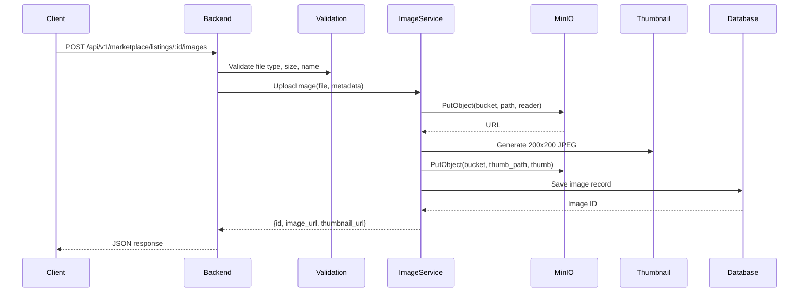
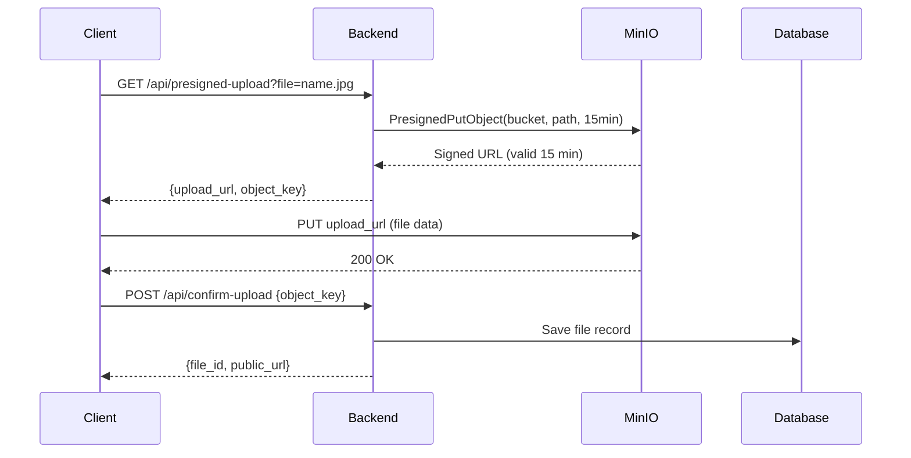

# File Upload Flow Passport

**Service**: Vondi Platform
**Domain**: File Storage & Management
**Storage**: MinIO S3-Compatible Object Storage
**Last Updated**: 2025-12-21
**Status**: Production Ready

---

## 1. Overview

Vondi platform uses **MinIO** - an S3-compatible object storage service - for managing all uploaded files (images, documents, chat attachments). The system provides a unified file storage abstraction layer with support for multiple buckets, automatic thumbnail generation, presigned URLs, and cleanup policies.

### Key Components

| Component | Location | Purpose |
|-----------|----------|---------|
| **MinIO Client** | `backend/internal/storage/minio/client.go` | Low-level MinIO operations |
| **File Storage Interface** | `backend/internal/storage/filestorage/interface.go` | Abstraction layer for storage providers |
| **File Storage Factory** | `backend/internal/storage/filestorage/factory.go` | Provider initialization |
| **Image Service** | `backend/internal/services/image_service.go` | High-level image upload/processing |
| **File Validation** | `backend/pkg/utils/file_validation.go` | Security and format validation |
| **MinIO Proxy** | `backend/internal/server/minio_proxy.go` | HTTP proxy for public file access |

---

## 2. MinIO Configuration

### Production Endpoint

```
URL: https://s3.vondi.rs
Endpoint: 194.163.132.116:9000 (internal)
SSL: Enabled
Location: eu-central-1
```

### Environment Variables

```bash
# Provider Selection
FILE_STORAGE_PROVIDER=minio                    # Storage backend type

# MinIO Connection
MINIO_ENDPOINT=localhost:9000                  # MinIO server address
MINIO_ACCESS_KEY=minioadmin                    # Access key ID
MINIO_SECRET_KEY=YOUR_SECURE_MINIO_SECRET     # Secret access key
MINIO_USE_SSL=false                            # Use HTTPS (true in production)
MINIO_LOCATION=eu-central-1                    # Bucket region

# Buckets
MINIO_BUCKET_NAME=listings                     # Marketplace listings images
MINIO_CHAT_BUCKET=chat-files                   # Chat attachments
MINIO_STOREFRONT_BUCKET=storefront-products    # B2C storefront products
MINIO_REVIEW_PHOTOS_BUCKET=review-photos       # Product review photos
MINIO_FRANCHISE_BUCKET=franchise-documents     # Franchise documentation

# Public Access
FILE_STORAGE_PUBLIC_URL=http://localhost:3000  # Public base URL (proxy)
MINIO_PUBLIC_URL=http://localhost:9000         # Direct MinIO URL
```

**Configuration Struct** (`backend/internal/config/config.go:60-74`):
```go
type FileStorageConfig struct {
    Provider                string // "minio" or "local"
    MinioEndpoint           string
    MinioAccessKey          string
    MinioSecretKey          string
    MinioUseSSL             bool
    MinioBucketName         string // listings
    MinioChatBucket         string // chat-files
    MinioStorefrontBucket   string // storefront-products
    MinioReviewPhotosBucket string // review-photos
    MinioFranchiseBucket    string // franchise-documents
    MinioLocation           string // eu-central-1
    PublicBaseURL           string // Proxy URL
}
```

---

## 3. Bucket Structure

### Active Buckets

| Bucket Name | Purpose | Public Access | Auto-Created | Retention Policy |
|-------------|---------|---------------|--------------|------------------|
| **listings** | Marketplace C2C listings images | Yes | Yes | Manual cleanup on listing deletion |
| **storefront-products** | B2C storefront product images, logos, banners | Yes | Yes | Manual cleanup on product deletion |
| **chat-files** | P2P chat attachments (images, documents) | Yes | Yes | 30 days after chat deletion |
| **review-photos** | Product review photos | Yes | Yes | Permanent (linked to reviews) |
| **franchise-documents** | Franchise contracts, licenses | No | Yes | Permanent (legal requirement) |

### Bucket Policies

All buckets have **public read access** for GetObject operations:
```json
{
  "Version": "2012-10-17",
  "Statement": [{
    "Effect": "Allow",
    "Principal": {"AWS": ["*"]},
    "Action": ["s3:GetObject"],
    "Resource": ["arn:aws:s3:::BUCKET_NAME/*"]
  }]
}
```

**Auto-creation** (`backend/internal/storage/minio/client.go:48-175`):
- Buckets are created automatically on first MinIO client initialization
- Public read policy is set immediately after bucket creation
- Failed bucket creation is logged but does not stop application startup

---

## 4. File Upload Flow

### 4.1 Direct Upload (Small Files)

**Flow**: `Client → Backend → MinIO`



**API Endpoints** (`backend/internal/proj/marketplace/handler/routes.go:151-152`):
```go
// Marketplace C2C listings
POST /api/v1/marketplace/listings/:id/images
DELETE /api/v1/marketplace/listings/:id/images/:imageId
PUT /api/v1/marketplace/listings/:id/images/reorder

// B2C Storefront products
POST /api/v1/storefronts/:slug/products/:id/images
POST /api/v1/marketplace/storefronts/slug/:slug/products/:id/images

// Storefront branding
POST /api/v1/marketplace/storefronts/:id/logo
POST /api/v1/marketplace/storefronts/:id/banner

// Review photos
POST /api/v1/reviews/upload-photos
```

### 4.2 Presigned URL Upload (Large Files)

**Flow**: `Client → Backend (get URL) → Client → MinIO`



**Presigned URL Generation** (`backend/internal/storage/minio/client.go:235-246`):
```go
func (m *MinioClient) GetPresignedURL(ctx context.Context, objectName string, expiry time.Duration) (string, error) {
    objectName = strings.TrimPrefix(objectName, "/")
    presignedURL, err := m.client.PresignedGetObject(ctx, m.bucketName, objectName, expiry, nil)
    if err != nil {
        return "", fmt.Errorf("error creating presigned URL: %w", err)
    }
    return presignedURL.String(), nil
}
```

**Use Cases**:
- Video uploads (100MB+ files)
- Bulk photo uploads from mobile apps
- Direct browser-to-MinIO uploads (reduces backend load)

---

## 5. Image Processing Pipeline

### 5.1 Automatic Thumbnail Generation

**Dimensions**: 200x200 pixels
**Format**: JPEG (85% quality)
**Algorithm**: Bilinear interpolation (3x faster than Lanczos3)
**Location**: Same bucket as original, `thumb_` prefix

**Implementation** (`backend/internal/services/image_service.go:315-335`):
```go
func (s *ImageService) createThumbnail(imageBytes []byte, filename string) ([]byte, error) {
    // Decode image (supports JPEG, PNG, GIF, WebP)
    img, _, err := image.Decode(bytes.NewReader(imageBytes))
    if err != nil {
        return nil, fmt.Errorf("failed to decode image: %w", err)
    }

    // Resize to 200x200 maintaining aspect ratio
    thumbnail := resize.Thumbnail(200, 200, img, resize.Bilinear)

    // Encode as JPEG
    var buf bytes.Buffer
    if err := jpeg.Encode(&buf, thumbnail, &jpeg.Options{Quality: 85}); err != nil {
        return nil, fmt.Errorf("failed to encode thumbnail: %w", err)
    }

    return buf.Bytes(), nil
}
```

### 5.2 Path Generation

**Format**: `{entity_type}/{entity_id}/{timestamp}_{uuid}.{ext}`

**Examples**:
```
listings/12345/20231215143052_a3f8b9c2-...-4d5e.jpg
listings/12345/thumb_20231215143052_a3f8b9c2-...-4d5e.jpg

storefront-products/789/20231215150000_b7d3e4f1-...-8a9b.png
storefront-products/789/thumb_20231215150000_b7d3e4f1-...-8a9b.jpg

storefront-products/456/logo_20231215160000_c8e4f5a2-...-9b0c.webp
```

**Implementation** (`backend/internal/services/image_service.go:261-285`):
```go
func (s *ImageService) generateFilePath(entityType ImageType, entityID int, filename string) string {
    ext := filepath.Ext(filename)
    uniqueID := uuid.New().String()
    timestamp := time.Now().Format("20060102150405")

    switch entityType {
    case ImageTypeMarketplaceListing:
        return fmt.Sprintf("listings/%d/%s_%s%s", entityID, timestamp, uniqueID, ext)
    case ImageTypeStorefrontProduct:
        return fmt.Sprintf("%d/%s_%s%s", entityID, timestamp, uniqueID, ext)
    case ImageTypeStorefrontLogo:
        return fmt.Sprintf("%d/logo_%s_%s%s", entityID, timestamp, uniqueID, ext)
    case ImageTypeStorefrontBanner:
        return fmt.Sprintf("%d/banner_%s_%s%s", entityID, timestamp, uniqueID, ext)
    case ImageTypeChatFile:
        return fmt.Sprintf("%d/%s_%s%s", entityID, timestamp, uniqueID, ext)
    case ImageTypeReviewPhoto:
        return fmt.Sprintf("%d/%s_%s%s", entityID, timestamp, uniqueID, ext)
    default:
        return fmt.Sprintf("misc/%s_%s%s", timestamp, uniqueID, ext)
    }
}
```

### 5.3 Supported Formats

**Images**:
- JPEG/JPG (`.jpg`, `.jpeg`)
- PNG (`.png`)
- GIF (`.gif`)
- WebP (`.webp`)

**Max Size**: 10MB per image

**Decoders** registered (`backend/internal/services/image_service.go:8-25`):
```go
import (
    _ "image/gif"      // GIF support
    _ "image/png"      // PNG support
    _ "golang.org/x/image/webp" // WebP support
)
```

---

## 6. File Validation

**Security Layer**: `backend/pkg/utils/file_validation.go`

### 6.1 Type Validation

**Allowed MIME Types**:
```go
var AllowedFileTypes = map[string][]string{
    "image": {
        "image/jpeg", "image/jpg", "image/png",
        "image/gif", "image/webp",
    },
    "video": {
        "video/mp4", "video/mpeg", "video/quicktime",
        "video/x-msvideo", "video/webm",
    },
    "document": {
        "application/pdf", "application/msword",
        "application/vnd.openxmlformats-officedocument.wordprocessingml.document",
        "application/vnd.ms-excel",
        "application/vnd.openxmlformats-officedocument.spreadsheetml.sheet",
        "text/plain",
    },
}
```

### 6.2 Size Validation

**Max File Sizes**:
```go
var MaxFileSizes = map[string]int64{
    "image":    10 * 1024 * 1024,   // 10MB
    "video":    100 * 1024 * 1024,  // 100MB
    "document": 20 * 1024 * 1024,   // 20MB
}
```

### 6.3 Filename Sanitization

**Dangerous Extensions Blocked**:
```go
dangerousExtensions := []string{
    ".exe", ".bat", ".cmd", ".com", ".scr", ".vbs", ".js",
    ".jar", ".app", ".deb", ".rpm", ".dmg", ".pkg", ".run",
}
```

**Character Sanitization**:
```go
replacer := strings.NewReplacer(
    "<", "_", ">", "_", ":", "_", "\"", "_",
    "/", "_", "\\", "_", "|", "_", "?", "_", "*", "_",
)
sanitized := replacer.Replace(filename)
```

**Max Filename Length**: 255 characters (preserving extension)

### 6.4 Validation Flow

```go
// 1. Validate file type
fileType, err := ValidateFileType(contentType)
if err != nil {
    return fmt.Errorf("invalid file type: %w", err)
}

// 2. Validate file size
if err := ValidateFileSize(fileType, size); err != nil {
    return fmt.Errorf("invalid file size: %w", err)
}

// 3. Sanitize filename
sanitizedName, err := ValidateFileName(filename)
if err != nil {
    return fmt.Errorf("invalid filename: %w", err)
}
```

---

## 7. URL Generation & Access

### 7.1 Public URL Formats

**Direct MinIO URL** (not used in production):
```
http://localhost:9000/listings/12345/20231215143052_uuid.jpg
```

**Proxied URL** (recommended):
```
https://vondi.rs/listings/12345/20231215143052_uuid.jpg
```

**URL Construction** (`backend/internal/storage/minio/client.go:201-224`):
```go
func (m *MinioClient) UploadFile(ctx context.Context, objectName string, reader io.Reader, size int64, contentType string) (string, error) {
    objectName = strings.TrimPrefix(objectName, "/")

    // Upload to MinIO
    _, err := m.client.PutObject(ctx, m.bucketName, objectName, reader, size, minio.PutObjectOptions{
        ContentType: contentType,
    })
    if err != nil {
        return "", fmt.Errorf("error uploading file to MinIO: %w", err)
    }

    // Generate public URL
    var publicURL string
    if m.baseURL != "" {
        publicURL = fmt.Sprintf("%s/%s/%s", m.baseURL, m.bucketName, objectName)
    } else {
        publicURL = fmt.Sprintf("/%s/%s", m.bucketName, objectName) // Relative path
    }
    return publicURL, nil
}
```

### 7.2 Proxy Implementation

**Purpose**: CDN-like caching, unified domain, security headers

**Routes** (`backend/internal/server/minio_proxy.go`):
```go
// Marketplace listings
app.Get("/listings/*", server.ProxyMinIO)

// Chat files
app.Get("/chat-files/*", server.ProxyChatFiles)

// Storefront products
app.Get("/storefront-products/*", server.ProxyStorefrontProducts)
```

**Proxy Handler Features**:
- Content-Type detection from file extension
- Cache-Control headers (7 days: `public, max-age=604800`)
- Streaming response (no memory buffering)
- Error handling for 404s

**Implementation** (`backend/internal/server/minio_proxy.go:14-109`):
```go
func (s *Server) ProxyMinIO(c *fiber.Ctx) error {
    path := c.Params("*")
    minioURL := fmt.Sprintf("http://%s/listings/%s", s.cfg.FileStorage.MinioEndpoint, path)

    // HTTP request to MinIO
    client := &http.Client{}
    resp, err := client.Get(minioURL)
    if err != nil {
        return c.Status(fiber.StatusInternalServerError).JSON(fiber.Map{"error": "Failed to fetch file"})
    }
    defer resp.Body.Close()

    // Copy headers
    c.Set("Content-Type", resp.Header.Get("Content-Type"))
    c.Set("Content-Length", resp.Header.Get("Content-Length"))
    c.Set("Cache-Control", "public, max-age=604800") // 7 days

    // Stream response
    io.Copy(c.Response().BodyWriter(), resp.Body)
    return nil
}
```

### 7.3 Presigned URLs (Temporary Access)

**Use Cases**:
- Private file downloads
- Time-limited share links
- Secure upload URLs

**Expiry**: Configurable (default 15 minutes for uploads, 1 hour for downloads)

```go
// Generate presigned GET URL (download)
url, err := minioClient.GetPresignedURL(ctx, objectName, 1*time.Hour)

// Generate presigned PUT URL (upload)
url, err := minioClient.PresignedPutObject(ctx, bucketName, objectName, 15*time.Minute)
```

---

## 8. Database Schema

### 8.1 Marketplace Images

**Table**: `marketplace_images`

```sql
CREATE TABLE marketplace_images (
    id SERIAL PRIMARY KEY,
    listing_id INTEGER NOT NULL REFERENCES marketplace_listings(id) ON DELETE CASCADE,
    image_url TEXT NOT NULL,
    thumbnail_url TEXT,
    file_path TEXT,
    storage_type VARCHAR(50) DEFAULT 'minio',
    storage_bucket VARCHAR(100),
    public_url TEXT,
    is_main BOOLEAN DEFAULT FALSE,
    display_order INTEGER DEFAULT 0,
    file_name VARCHAR(255),
    content_type VARCHAR(100),
    created_at TIMESTAMP DEFAULT CURRENT_TIMESTAMP,
    updated_at TIMESTAMP DEFAULT CURRENT_TIMESTAMP
);

CREATE INDEX idx_marketplace_images_listing ON marketplace_images(listing_id);
CREATE INDEX idx_marketplace_images_is_main ON marketplace_images(is_main);
```

### 8.2 Storefront Product Images

**Table**: `storefront_product_images`

```sql
CREATE TABLE storefront_product_images (
    id SERIAL PRIMARY KEY,
    storefront_product_id INTEGER NOT NULL REFERENCES storefront_products(id) ON DELETE CASCADE,
    image_url TEXT NOT NULL,
    thumbnail_url TEXT,
    file_path TEXT,
    file_name VARCHAR(255),
    file_size INTEGER,
    content_type VARCHAR(100),
    storage_type VARCHAR(50) DEFAULT 'minio',
    storage_bucket VARCHAR(100),
    public_url TEXT,
    is_default BOOLEAN DEFAULT FALSE,
    display_order INTEGER DEFAULT 0,
    created_at TIMESTAMP DEFAULT CURRENT_TIMESTAMP,
    updated_at TIMESTAMP DEFAULT CURRENT_TIMESTAMP
);

CREATE INDEX idx_storefront_product_images_product ON storefront_product_images(storefront_product_id);
CREATE INDEX idx_storefront_product_images_is_default ON storefront_product_images(is_default);
```

### 8.3 Chat Attachments

**Table**: `chat_attachments`

```sql
CREATE TABLE chat_attachments (
    id SERIAL PRIMARY KEY,
    message_id INTEGER NOT NULL REFERENCES chat_messages(id) ON DELETE CASCADE,
    file_url TEXT NOT NULL,
    file_name VARCHAR(255),
    file_size INTEGER,
    file_type VARCHAR(100),
    mime_type VARCHAR(100),
    storage_bucket VARCHAR(100),
    created_at TIMESTAMP DEFAULT CURRENT_TIMESTAMP
);

CREATE INDEX idx_chat_attachments_message ON chat_attachments(message_id);
```

---

## 9. Cleanup Policies

### 9.1 On Entity Deletion

**Automatic Cleanup Triggers**:

```go
// When listing is deleted
func (s *ImageService) DeleteImage(ctx context.Context, imageID int, entityType ImageType) error {
    // 1. Get image record from DB
    imageRecord, err := s.repo.GetImageByID(ctx, imageID)

    // 2. Delete from MinIO
    bucket := s.getBucketForImageType(entityType)
    err = s.fileStorage.DeleteFileFromCustomBucket(ctx, bucket, imagePath)
    err = s.fileStorage.DeleteFileFromCustomBucket(ctx, bucket, thumbnailPath)

    // 3. Delete from database
    err := s.repo.DeleteImage(ctx, imageID)

    return nil
}
```

**Cascade Delete** (PostgreSQL):
```sql
ON DELETE CASCADE
```
- Deleting a listing automatically deletes all related images
- Database triggers clean up orphaned MinIO files (via application logic)

### 9.2 Retention Policies

| Bucket | Retention | Cleanup Trigger |
|--------|-----------|----------------|
| **listings** | Indefinite | Manual deletion or listing removal |
| **storefront-products** | Indefinite | Product deletion |
| **chat-files** | 30 days after chat deletion | Scheduled cleanup job |
| **review-photos** | Permanent | Never deleted (legal evidence) |
| **franchise-documents** | 10 years | Manual archive after contract expiry |

---

## 10. Error Handling & Recovery

### 10.1 Upload Failures

**Rollback Strategy**:
```go
func (s *ImageService) UploadImage(ctx context.Context, req *UploadImageRequest) (*UploadImageResponse, error) {
    // Upload main image
    imageURL, err := s.fileStorage.UploadToCustomBucket(ctx, bucket, filePath, reader, size, contentType)
    if err != nil {
        return nil, fmt.Errorf("failed to upload image: %w", err)
    }

    // Upload thumbnail
    thumbnailURL, err := s.fileStorage.UploadToCustomBucket(ctx, bucket, thumbnailPath, thumbReader, thumbSize, "image/jpeg")
    if err != nil {
        // ROLLBACK: Delete main image
        s.fileStorage.DeleteFileFromCustomBucket(ctx, bucket, filePath)
        return nil, fmt.Errorf("failed to upload thumbnail: %w", err)
    }

    // Save to database
    savedImage, err := s.repo.CreateImage(ctx, imageRecord)
    if err != nil {
        // ROLLBACK: Delete both files
        s.fileStorage.DeleteFileFromCustomBucket(ctx, bucket, filePath)
        s.fileStorage.DeleteFileFromCustomBucket(ctx, bucket, thumbnailPath)
        return nil, fmt.Errorf("failed to save to database: %w", err)
    }

    return response, nil
}
```

### 10.2 Connection Failures

**Retry Logic** (MinIO client built-in):
- 3 retries with exponential backoff
- 5 seconds between retries
- Fallback to error response

**Health Check**:
```go
func (m *MinioClient) HealthCheck(ctx context.Context) error {
    exists, err := m.client.BucketExists(ctx, m.bucketName)
    if err != nil {
        return fmt.Errorf("MinIO health check failed: %w", err)
    }
    if !exists {
        return fmt.Errorf("bucket %s does not exist", m.bucketName)
    }
    return nil
}
```

---

## 11. Performance Optimization

### 11.1 Caching Strategy

**CDN Layer** (Nginx):
```nginx
location /listings/ {
    proxy_pass http://minio:9000;
    proxy_cache images_cache;
    proxy_cache_valid 200 7d;
    proxy_cache_key "$scheme$request_method$host$request_uri";
    add_header X-Cache-Status $upstream_cache_status;
}
```

**Browser Caching**:
```go
c.Set("Cache-Control", "public, max-age=604800") // 7 days
c.Set("ETag", generateETag(filePath))
c.Set("Last-Modified", file.LastModified.Format(http.TimeFormat))
```

### 11.2 Thumbnail Generation Optimization

**Original** (Lanczos3 algorithm):
- Quality: 95%
- Speed: ~500ms for 2MB image

**Optimized** (Bilinear algorithm):
- Quality: 85% (acceptable for thumbnails)
- Speed: ~150ms for 2MB image
- **3x performance improvement**

```go
// Before
thumbnail := resize.Thumbnail(200, 200, img, resize.Lanczos3)

// After
thumbnail := resize.Thumbnail(200, 200, img, resize.Bilinear)
```

### 11.3 Rate Limiting

**Per-User Upload Limits** (`backend/internal/proj/marketplace/handler/routes.go:151`):
```go
app.Post("/api/v1/marketplace/listings/:id/images",
    h.jwtParserMW,
    authMiddleware.RequireAuth(),
    mw.RateLimitByUser(10, time.Minute), // 10 uploads per minute
    h.UploadListingImages
)
```

---

## 12. Security Considerations

### 12.1 Access Control

**Public Buckets**:
- Read-only access via bucket policy
- No anonymous write access
- No delete permissions for public

**Private Operations**:
- Upload: Requires JWT authentication
- Delete: Requires ownership verification
- Presigned URLs: Short expiry (15 minutes)

### 12.2 File Validation

**MIME Type Verification**:
```go
// Verify MIME type from file content (not just extension)
buffer := make([]byte, 512)
_, err := file.Read(buffer)
detectedType := http.DetectContentType(buffer)

if detectedType != expectedType {
    return errors.New("MIME type mismatch")
}
```

**Image Bomb Protection**:
```go
// Limit image dimensions
const maxWidth = 10000
const maxHeight = 10000

img, _, _ := image.DecodeConfig(file)
if img.Width > maxWidth || img.Height > maxHeight {
    return errors.New("image dimensions too large")
}
```

---

## 13. API Reference

### 13.1 Upload Endpoints

#### Upload Marketplace Listing Images
```http
POST /api/v1/marketplace/listings/:id/images
Authorization: Bearer <JWT>
Content-Type: multipart/form-data

Body:
- file: <image_file>
- is_main: true
- display_order: 0
```

**Response**:
```json
{
  "id": 123,
  "image_url": "https://vondi.rs/listings/456/20231215143052_uuid.jpg",
  "thumbnail_url": "https://vondi.rs/listings/456/thumb_20231215143052_uuid.jpg",
  "public_url": "https://vondi.rs/listings/456/20231215143052_uuid.jpg",
  "is_main": true,
  "display_order": 0
}
```

#### Upload Storefront Product Images
```http
POST /api/v1/storefronts/:slug/products/:id/images
Authorization: Bearer <JWT>
Content-Type: multipart/form-data

Body:
- files[]: <image_files>
```

**Response**:
```json
{
  "uploaded": [
    {
      "id": 789,
      "image_url": "https://vondi.rs/storefront-products/123/20231215150000_uuid.png",
      "thumbnail_url": "https://vondi.rs/storefront-products/123/thumb_20231215150000_uuid.jpg",
      "is_default": false,
      "display_order": 0
    }
  ]
}
```

### 13.2 Delete Endpoints

#### Delete Listing Image
```http
DELETE /api/v1/marketplace/listings/:id/images/:imageId
Authorization: Bearer <JWT>
```

**Response**:
```json
{
  "success": true,
  "message": "Image deleted successfully"
}
```

### 13.3 Reorder Endpoints

#### Reorder Listing Images
```http
PUT /api/v1/marketplace/listings/:id/images/reorder
Authorization: Bearer <JWT>
Content-Type: application/json

Body:
{
  "image_order": [
    {"id": 123, "display_order": 0},
    {"id": 124, "display_order": 1},
    {"id": 125, "display_order": 2}
  ]
}
```

---

## 14. Troubleshooting

### 14.1 Common Issues

**Issue**: "Bucket does not exist"
```bash
# Solution: Restart backend to auto-create buckets
docker restart vondi-backend

# Or manually create
mc mb minio/listings
mc policy set public minio/listings
```

**Issue**: "Access Denied"
```bash
# Check credentials
echo $MINIO_ACCESS_KEY
echo $MINIO_SECRET_KEY

# Verify bucket policy
mc admin policy info minio/ public
```

**Issue**: "Connection refused"
```bash
# Check MinIO is running
docker ps | grep minio
nc -zv localhost 9000

# Check firewall
sudo ufw status
```

### 14.2 Debug Logging

**Enable Debug Logs**:
```bash
export LOG_LEVEL=debug
```

**View MinIO Logs**:
```bash
docker logs -f minio
```

**View Application Logs**:
```bash
tail -f /tmp/backend.log | grep -i minio
```

---

## 15. Related Documentation

- [MinIO Client SDK](https://min.io/docs/minio/linux/developers/go/minio-go.html)
- [S3 API Compatibility](https://docs.min.io/docs/minio-server-limits-per-tenant.html)
- [Storage Infrastructure](../infrastructure/storage.md)
- [Proxy Configuration](../infrastructure/network.md)

---

**Document Version**: 1.0
**Last Review**: 2025-12-21
**Next Review**: 2026-01-21
**Maintainer**: Platform Team
