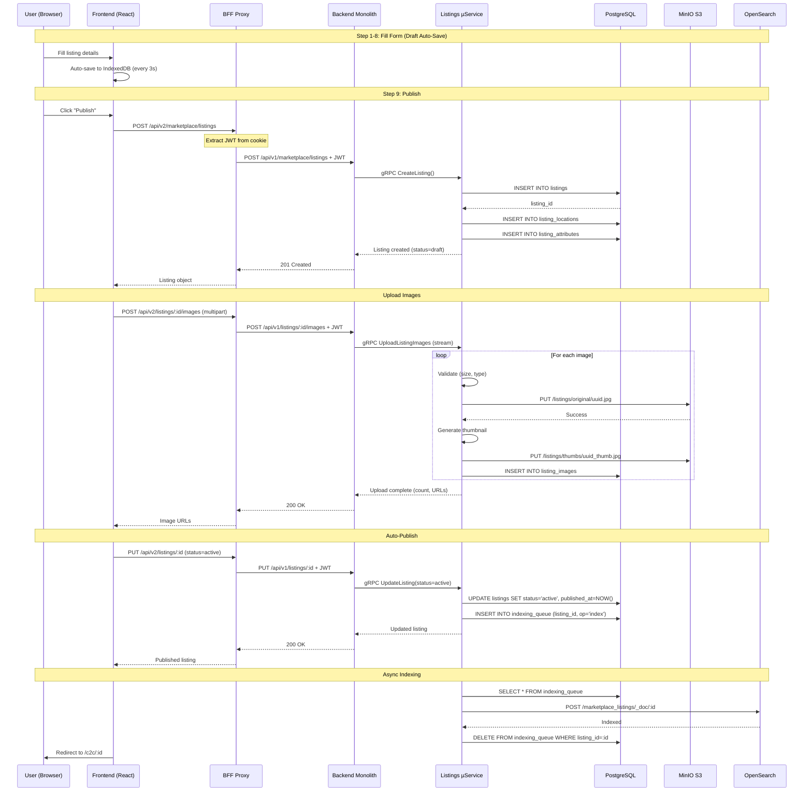
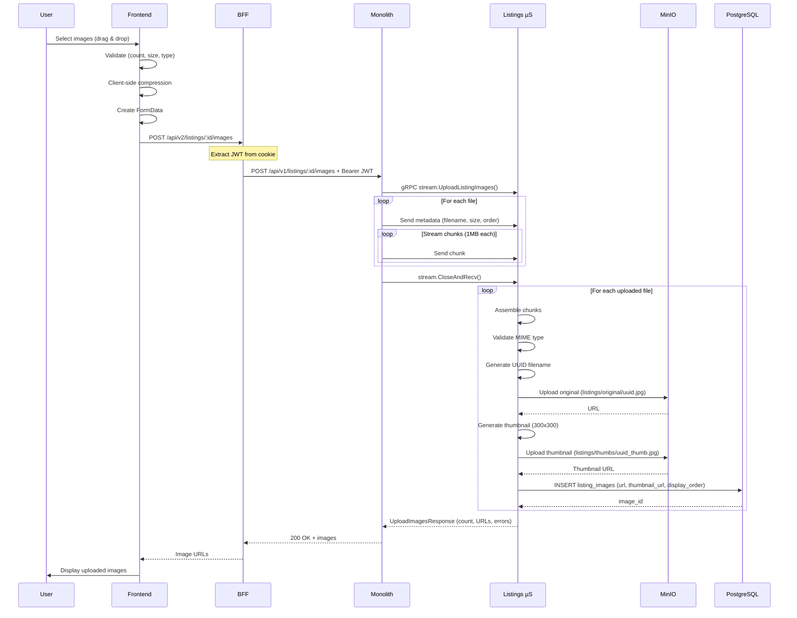

# Listing Creation Flow

> **Passport Document**: Complete end-to-end flow of listing creation in Vondi platform
> **Last Updated**: 2025-12-21
> **Version**: 2.0.0
> **Status**: ✅ Production (Microservice-based)

---

## 📋 Table of Contents

1. [Overview](#overview)
2. [Architecture](#architecture)
3. [Step-by-Step Flow](#step-by-step-flow)
4. [Image Upload System](#image-upload-system)
5. [Category Selection](#category-selection)
6. [Attributes & Variants](#attributes--variants)
7. [Moderation & Publishing](#moderation--publishing)
8. [Sequence Diagrams](#sequence-diagrams)
9. [Database Schema](#database-schema)
10. [API Endpoints](#api-endpoints)

---

## Overview

### Purpose
Enable users to create and publish listings (C2C) or product listings (B2C) through a multi-step wizard interface.

### Key Features
- ✅ **9-step wizard** with validation
- ✅ **Draft auto-save** (IndexedDB + backend sync)
- ✅ **Image upload** with editing (crop, rotate, filters)
- ✅ **Category tree navigation** (unified categories system)
- ✅ **Dynamic attributes** based on category
- ✅ **Product variants** (size, color, etc.)
- ✅ **Location privacy** controls
- ✅ **Auto-publishing** (no manual moderation)
- ✅ **Offline support** with sync queue

### User Types
- **C2C Users**: Individual sellers (personal items)
- **B2C Storefronts**: Business sellers (inventory management)

| Aspect | C2C | B2C |
|--------|-----|-----|
| **Creator** | Regular user | Storefront owner |
| **Variants** | ❌ Not supported | ✅ Full support (size, color, etc.) |
| **Inventory** | Simple quantity | Separate tracking per variant |
| **SKU** | Optional | Required for each variant |
| **Moderation** | Auto-approved | Auto-approved |
| **Lifetime** | 30 days (expires_at) | Unlimited |
| **DB Table** | listings (source_type='c2c') | listings (source_type='b2c') + b2c_product_variants |

---

## Architecture

### System Components

```
┌─────────────┐
│   Browser   │
│  (Next.js)  │
└──────┬──────┘
       │ HTTP/JSON
       ↓
┌─────────────────────┐
│   BFF Proxy Layer   │
│   /api/v2/[...path] │  ← Handles auth cookies
└──────┬──────────────┘
       │ HTTP + JWT Bearer
       ↓
┌──────────────────────┐
│  Backend Monolith    │
│  /api/v1/marketplace │
└──────┬───────────────┘
       │ gRPC
       ↓
┌────────────────────────────┐
│  Listings Microservice     │
│  Port: 50053 (gRPC)        │
│  Port: 8086 (HTTP metrics) │
└──────┬─────────────────────┘
       │
       ↓
┌──────────────────────┐     ┌─────────────┐
│ PostgreSQL           │     │ MinIO S3    │
│ listings_dev_db      │     │ Bucket:     │
│ Port: 35434          │     │ listings    │
└──────────────────────┘     └─────────────┘
       │
       ↓
┌──────────────────────┐
│ OpenSearch           │
│ Index:               │
│ marketplace_listings │
└──────────────────────┘
```

### Service Boundaries

| Layer | Responsibility | Technology |
|-------|---------------|------------|
| **Frontend** | UI/UX, Form validation, Draft management | Next.js 15, React 19, IndexedDB |
| **BFF Proxy** | Auth cookies → JWT, CORS handling | Next.js API Routes |
| **Backend Monolith** | Request routing, Legacy compatibility | Go Fiber |
| **Listings Microservice** | Business logic, Validation, Persistence | Go gRPC |
| **PostgreSQL** | Structured data storage | PostgreSQL 15 |
| **MinIO** | Image storage (original + thumbnails) | MinIO S3-compatible |
| **OpenSearch** | Full-text search, Filtering | OpenSearch 2.x |

### File Locations

```
Frontend:
  /p/github.com/vondi-global/vondi/frontend/src/
    ├── app/[locale]/create-listing/
    │   ├── CreateListingClient.tsx       ← Main wizard component
    │   ├── page.tsx
    │   └── layout.tsx
    ├── components/create-listing/steps/
    │   ├── CategorySelectionStep.tsx     ← Step 1: Category
    │   ├── BasicInfoStep.tsx             ← Step 2: Title, price, description
    │   ├── TrustSetupStep.tsx            ← Step 3: Trust options
    │   ├── AttributesStep.tsx            ← Step 4: Category attributes
    │   ├── VariantsStep.tsx              ← Step 5: Product variants
    │   ├── PhotosStep.tsx                ← Step 6: Image upload
    │   ├── LocationStep.tsx              ← Step 7: Location & privacy
    │   ├── PaymentDeliveryStep.tsx       ← Step 8: Payment/delivery
    │   └── PreviewPublishStep.tsx        ← Step 9: Review & publish
    └── contexts/CreateListingContext.tsx ← State management

Backend Monolith:
  /p/github.com/vondi-global/vondi/backend/
    └── internal/proj/marketplace/handler/
        └── listings.go                   ← HTTP handlers (proxy to gRPC)

Listings Microservice:
  /p/github.com/vondi-global/listings/
    ├── api/proto/listings/v1/
    │   └── listings.proto                ← gRPC definitions
    ├── internal/
    │   ├── domain/                       ← Business entities
    │   │   ├── listing.go
    │   │   ├── category.go
    │   │   ├── variant.go
    │   │   └── attachment.go
    │   ├── service/listings/
    │   │   └── service.go                ← Business logic
    │   ├── transport/grpc/
    │   │   ├── handlers.go               ← gRPC handlers
    │   │   └── mappers.go                ← Proto ↔ Domain conversion
    │   └── repository/postgres/
    │       ├── listings_repository.go
    │       └── images_repository.go
    └── migrations/                       ← Database schema
```

---

## Step-by-Step Flow

The listing creation wizard consists of **9 steps**. Each step is a React component that updates the shared context state.

### Step 1: Category Selection

**Purpose**: Choose the most specific category for the listing

**UI Components**:
- Tree navigation with breadcrumbs
- Search functionality
- Popular categories shortcuts
- Icon-based visual cues

**Frontend Implementation**:
```typescript
// File: frontend/src/components/create-listing/steps/CategorySelectionStep.tsx

interface Category {
  id: string;              // UUID
  name: string;
  parent_id?: string | null;
  icon?: string;
  children?: Category[];
  count?: number;          // Active listings count
  translations?: Record<string, string>;
}

// Load categories tree
const categories = await MarketplaceService.getCategories();

// Navigate to subcategory
const handleCategoryClick = (categoryId: string) => {
  dispatch({ type: 'SET_CATEGORY', payload: categoryId });
  onNext();
};
```

**Backend Flow**:
```
Browser → BFF → /api/v1/categories → Listings gRPC → PostgreSQL

SELECT id, name, parent_id, icon, translations
FROM categories
WHERE is_active = true
ORDER BY display_order, name;
```

**Validation**:
- ✅ Category must be leaf node (no children)
- ✅ Category must be active
- ✅ Category must exist in database

**Category Tree Example**:
```
Electronics (root)
├── Phones & Tablets
│   ├── Smartphones
│   │   ├── Android Phones    ← Leaf (selectable)
│   │   └── iPhones            ← Leaf (selectable)
│   └── Tablets
│       ├── Android Tablets    ← Leaf
│       └── iPads              ← Leaf
└── Computers
    ├── Laptops                ← Leaf
    └── Desktops               ← Leaf
```

---

### Step 2: Basic Information

**Purpose**: Enter core listing details

**Fields**:
- `title` (required, 3-200 chars)
- `description` (optional, markdown supported)
- `price` (required, ≥ 0)
- `currency` (default: RSD)
- `quantity` (default: 1)
- `condition` (new, used, refurbished, for_parts)

**Frontend Component**:
```typescript
// File: frontend/src/components/create-listing/steps/BasicInfoStep.tsx

interface BasicInfo {
  title: string;
  description?: string;
  price: number;
  currency: string;
  quantity: number;
  condition?: string;
}

// Auto-save to draft every 3 seconds
useEffect(() => {
  const timer = setTimeout(() => {
    saveDraftToIndexedDB(state);
  }, 3000);
  return () => clearTimeout(timer);
}, [state]);
```

**Client-side Validation**:
```typescript
const validateBasicInfo = (data: BasicInfo): string[] => {
  const errors: string[] = [];

  if (!data.title || data.title.length < 3) {
    errors.push('Title must be at least 3 characters');
  }
  if (data.title.length > 200) {
    errors.push('Title must not exceed 200 characters');
  }
  if (data.price < 0) {
    errors.push('Price must be non-negative');
  }

  return errors;
};
```

**Backend Validation** (listings microservice):
```go
// File: listings/internal/service/listings/service.go

func (s *Service) CreateListing(ctx context.Context, input *domain.CreateListingInput) (*domain.Listing, error) {
    // 1. Comprehensive validation
    if err := s.validator.ValidateCreateInput(ctx, input); err != nil {
        return nil, fmt.Errorf("validation failed: %w", err)
    }

    // 2. Generate unique slug
    slug, err := s.slugGenerator.Generate(ctx, input.Title)
    if err != nil {
        return nil, fmt.Errorf("failed to generate slug: %w", err)
    }

    // 3. Create listing entity
    listing := &domain.Listing{
        UserID:       input.UserID,
        Title:        input.Title,
        Price:        input.Price,
        CategoryID:   input.CategoryID,
        Slug:         slug,
        Status:       domain.StatusDraft,
        Visibility:   domain.VisibilityPublic,
    }

    // 4. Set expiration (C2C only - 30 days)
    if input.SourceType == domain.SourceTypeC2C {
        expiresAt := time.Now().AddDate(0, 0, 30)
        listing.ExpiresAt = &expiresAt
    }

    // 5. Persist to database
    created, err := s.repo.CreateListing(ctx, input)
    if err != nil {
        return nil, fmt.Errorf("failed to create listing: %w", err)
    }

    // 6. Enqueue for async indexing
    s.repo.EnqueueIndexing(ctx, created.ID, domain.IndexOpIndex)

    return created, nil
}
```

---

### Step 3: Trust Setup

**Purpose**: Configure trust/verification options

**Options**:
- Identity verification (phone, document)
- Secure payment acceptance
- Delivery method preferences
- Return policy

**Implementation**:
```typescript
// File: frontend/src/components/create-listing/steps/TrustSetupStep.tsx

interface TrustSetup {
  verifyIdentity: boolean;
  acceptSecurePayment: boolean;
  deliveryMethods: string[];  // ["personal", "courier", "post"]
  returnPolicy?: string;
}
```

**Note**: This step is **optional** and can be skipped. It enhances buyer trust but is not required for listing publication.

---

### Step 4: Attributes

**Purpose**: Fill category-specific attributes

**Dynamic Loading**: Attributes are loaded based on the selected category from Step 1.

**Example for "Android Phones" category**:
```typescript
const attributes = await MarketplaceService.getCategoryAttributes(categoryId);

// Response:
[
  {
    id: "attr-brand",
    name: { en: "Brand", sr: "Брэнд", ru: "Бренд" },
    input_type: "select",
    is_required: true,
    options: ["Samsung", "Xiaomi", "Huawei", "OnePlus"]
  },
  {
    id: "attr-screen-size",
    name: { en: "Screen Size", sr: "Величина екрана", ru: "Размер экрана" },
    input_type: "number",
    unit: "inches",
    validation_rules: { min: 4.0, max: 8.0 }
  },
  {
    id: "attr-ram",
    name: { en: "RAM", sr: "RAM меморија", ru: "ОЗУ" },
    input_type: "select",
    options: ["2GB", "4GB", "6GB", "8GB", "12GB", "16GB"]
  }
]
```

**Attribute Types**:
- `text`: Free-form text input
- `number`: Numeric input with optional unit
- `select`: Single choice dropdown
- `multiselect`: Multiple choice
- `boolean`: Yes/No checkbox

**Backend Storage** (Unified Attributes System):
```sql
-- Table: attributes (multilingual definitions)
CREATE TABLE attributes (
    id UUID PRIMARY KEY,
    name JSONB NOT NULL,           -- {"en": "Brand", "sr": "Брэнд", "ru": "Бренд"}
    display_name JSONB NOT NULL,
    input_type VARCHAR(50) NOT NULL,
    is_filterable BOOLEAN DEFAULT false,
    is_searchable BOOLEAN DEFAULT false,
    validation_rules JSONB,        -- {"min": 0, "max": 100, "required": true}
    created_at TIMESTAMP DEFAULT NOW()
);

-- Table: category_attributes (links categories to attributes)
CREATE TABLE category_attributes (
    category_id UUID REFERENCES categories(id),
    attribute_id UUID REFERENCES attributes(id),
    is_required BOOLEAN DEFAULT false,
    display_order INTEGER,
    PRIMARY KEY (category_id, attribute_id)
);

-- Table: listing_attributes (actual values for listings)
CREATE TABLE listing_attributes (
    id SERIAL PRIMARY KEY,
    listing_id BIGINT REFERENCES listings(id),
    attribute_id UUID REFERENCES attributes(id),
    text_value TEXT,
    number_value NUMERIC,
    boolean_value BOOLEAN,
    json_value JSONB,             -- For complex values
    created_at TIMESTAMP DEFAULT NOW()
);
```

**gRPC Handler**:
```go
// File: listings/internal/transport/grpc/handlers.go

func (s *Server) CreateListing(ctx context.Context, req *listingspb.CreateListingRequest) (*listingspb.CreateListingResponse, error) {
    // Convert proto attributes to domain
    input := ProtoToCreateListingInput(req)

    // Attributes stored as key-value pairs
    for _, attr := range req.Attributes {
        input.Attributes = append(input.Attributes, &domain.ListingAttribute{
            AttributeKey:   attr.AttributeKey,
            AttributeValue: attr.AttributeValue,
        })
    }

    listing, err := s.service.CreateListing(ctx, input)
    // ...
}
```

---

### Step 5: Variants

**Purpose**: Define product variants (size, color, etc.)

**Use Case**: B2C storefronts selling products with multiple options

**Example**: T-Shirt with Size and Color variants
```typescript
// File: frontend/src/components/create-listing/steps/VariantsStep.tsx

interface Variant {
  id?: number;
  sku?: string;
  name: string;
  attributes: Record<string, string>;  // {size: "L", color: "Red"}
  price?: number;
  stockQuantity: number;
  isActive: boolean;
}

const variants: Variant[] = [
  {
    name: "Small Red",
    attributes: { size: "S", color: "Red" },
    stockQuantity: 10,
    price: 19.99
  },
  {
    name: "Medium Blue",
    attributes: { size: "M", color: "Blue" },
    stockQuantity: 5,
    price: 19.99
  },
  {
    name: "Large Green",
    attributes: { size: "L", color: "Green" },
    stockQuantity: 0,
    price: 21.99,
    isActive: false  // Out of stock
  }
];
```

**Database Schema**:
```sql
CREATE TABLE b2c_product_variants (
    id SERIAL PRIMARY KEY,
    product_id BIGINT REFERENCES b2c_products(id) ON DELETE CASCADE,
    sku VARCHAR(100) UNIQUE,
    name VARCHAR(255) NOT NULL,
    attributes JSONB,              -- {"size": "L", "color": "Red"}
    price DECIMAL(10,2),
    stock_quantity INTEGER DEFAULT 0,
    is_active BOOLEAN DEFAULT true,
    created_at TIMESTAMP DEFAULT NOW(),
    updated_at TIMESTAMP DEFAULT NOW()
);
```

**Note**: Variants are **optional** for C2C listings, **recommended** for B2C products.

---

### Step 6: Photos Upload

**Purpose**: Upload and manage product images

**Features**:
- ✅ Drag-and-drop upload
- ✅ Image editing (crop, rotate, brightness, contrast)
- ✅ Reordering (drag-and-drop)
- ✅ Set main image
- ✅ Client-side compression
- ✅ Real-time preview

**Frontend Component**:
```typescript
// File: frontend/src/components/create-listing/steps/PhotosStep.tsx
// Uses UnifiedImageUploader component

interface ImageFile {
  id: string;
  url: string;          // blob: URL or https:// URL
  file?: File;
  isMain: boolean;
  isNew: boolean;
  isDeleted?: boolean;
  editedBlob?: Blob;    // After editing
}

const handleImagesChange = (updatedImages: ImageFile[]) => {
  const imageUrls = updatedImages
    .filter(img => !img.isDeleted)
    .map(img => {
      if (img.editedBlob) {
        // Create new blob URL from edited image
        if (img.url.startsWith('blob:')) {
          URL.revokeObjectURL(img.url);
        }
        return URL.createObjectURL(img.editedBlob);
      }
      return img.url;
    });

  dispatch({ type: 'SET_IMAGES', payload: imageUrls });
};
```

**Image Upload Flow** (detailed in next section):

1. **Client-side compression** (max 10MB per file)
2. **Multipart upload** to backend
3. **Backend validation** (file type, size, virus scan)
4. **MinIO storage** (original + thumbnail generation)
5. **Database record** with public URLs
6. **Frontend updates** with final URLs

**Constraints**:
- Max 10 images per listing
- Max 10MB per image
- Formats: JPEG, PNG, WebP
- Auto-thumbnail generation (300x300px)

---

### Step 7: Location

**Purpose**: Set listing location with privacy controls

**Fields**:
```typescript
interface Location {
  country?: string;
  city?: string;
  postalCode?: string;
  addressLine1?: string;
  addressLine2?: string;
  latitude?: number;
  longitude?: number;
  showOnMap?: boolean;
  locationPrivacy?: 'exact' | 'approximate' | 'hidden';
}
```

**Privacy Levels**:
- **Exact**: Show precise coordinates on map (latitude/longitude)
- **Approximate**: Show city/district only (fuzzy location ~1-2km radius)
- **Hidden**: No location shown on map (only country visible)

**Database Schema**:
```sql
CREATE TABLE listing_locations (
    id SERIAL PRIMARY KEY,
    listing_id BIGINT REFERENCES listings(id) ON DELETE CASCADE,
    country VARCHAR(100),
    city VARCHAR(100),
    postal_code VARCHAR(20),
    address_line1 VARCHAR(255),
    address_line2 VARCHAR(255),
    latitude DECIMAL(10, 8),
    longitude DECIMAL(11, 8),
    location_point GEOGRAPHY(POINT, 4326),  -- PostGIS for geo queries
    show_on_map BOOLEAN DEFAULT true,
    location_privacy VARCHAR(20) DEFAULT 'approximate',
    created_at TIMESTAMP DEFAULT NOW()
);

CREATE INDEX idx_listing_locations_point ON listing_locations USING GIST(location_point);
```

**Use Cases**:
- **Exact**: Rental properties, local services
- **Approximate**: Personal items (default for C2C)
- **Hidden**: Digital goods, services without location

---

### Step 8: Payment & Delivery

**Purpose**: Configure payment methods and delivery options

**Fields**:
```typescript
interface PaymentDelivery {
  paymentMethods: string[];      // ["cash", "card", "online"]
  deliveryOptions: string[];     // ["personal_pickup", "courier", "post_express"]
  shippingCost?: number;
  freeShippingThreshold?: number;
}
```

**Payment Methods**:
- **Cash**: Cash on delivery (C2C)
- **Card**: Card payment (requires secure payment setup)
- **Online**: Platform payment gateway (B2C only)

**Delivery Options**:
- **Personal Pickup**: Buyer meets seller (C2C)
- **Courier**: Third-party courier service
- **Post Express**: Integration with postal service

**Integration**:
- **Post Express**: Courier service integration (API ready)
- **Cash on Delivery**: Supported for C2C
- **Secure Payment**: Online payment through platform

---

### Step 9: Preview & Publish

**Purpose**: Review all information and publish listing

**Actions**:
1. **Preview** listing as it will appear to buyers
2. **Edit** any step (go back without losing data)
3. **Publish** listing

**Publishing Flow**:
```typescript
// File: frontend/src/components/create-listing/steps/PreviewPublishStep.tsx

const handlePublish = async () => {
  try {
    // 1. Create listing (backend)
    const listing = await MarketplaceService.createListing(state);

    // 2. Upload images (streaming gRPC)
    if (state.images.length > 0) {
      await MarketplaceService.uploadListingImages(
        listing.id,
        state.images
      );
    }

    // 3. Auto-publish (set status = 'active')
    await MarketplaceService.updateListing(listing.id, {
      status: 'active'
    });

    // 4. Clear draft
    await clearDraft(state.draftId);

    toast.success('Listing published successfully!');
    router.push(`/c2c/${listing.id}`);
  } catch (error) {
    toast.error('Failed to publish listing');
  }
};
```

**Backend Handler**:
```go
// File: vondi/backend/internal/proj/marketplace/handler/listings.go

func (h *Handler) CreateListing(c *fiber.Ctx) error {
    userID, _ := authMiddleware.GetUserID(c)

    var req CreateListingRequest
    if err := c.BodyParser(&req); err != nil {
        return utils.ErrorResponse(c, fiber.StatusBadRequest, "marketplace.invalid_request")
    }

    // Call listings microservice via gRPC
    grpcReq := &listingssvcv1.CreateListingRequest{
        UserId:     int64(userID),
        Title:      req.Title,
        Price:      req.Price,
        CategoryId: req.CategoryID,
        // ... map all fields
    }

    grpcResp, err := h.listingsClient.CreateListing(contextWithAuth(c), grpcReq)
    if err != nil {
        return utils.ErrorResponse(c, fiber.StatusInternalServerError, "marketplace.create_failed")
    }

    // Auto-publish immediately
    publishStatus := "active"
    updateReq := &listingssvcv1.UpdateListingRequest{
        Id:     grpcResp.Listing.Id,
        UserId: int64(userID),
        Status: &publishStatus,
    }
    updateResp, _ := h.listingsClient.UpdateListing(contextWithAuth(c), updateReq)

    // Return published listing
    return utils.SuccessResponse(c, updateResp.Listing)
}
```

---

## Image Upload System

### Architecture

```
┌──────────────┐
│   Browser    │  1. Select files (max 10, each max 10MB)
│              │  2. Client-side compression
│   (React)    │  3. Create FormData with multipart files
└──────┬───────┘
       │ POST /api/v2/marketplace/listings/:id/images
       │ Content-Type: multipart/form-data
       ↓
┌──────────────────┐
│   BFF Proxy      │  4. Extract JWT from httpOnly cookie
│   Next.js API    │  5. Add Authorization: Bearer header
└──────┬───────────┘
       │ POST /api/v1/marketplace/listings/:id/images
       │ Authorization: Bearer <JWT>
       ↓
┌─────────────────────┐
│  Backend Monolith   │  6. Validate JWT
│  (Go Fiber)         │  7. Check ownership
└──────┬──────────────┘
       │ gRPC UploadListingImages (streaming)
       ↓
┌──────────────────────────┐
│ Listings Microservice    │  8. Validate files (type, size, virus scan)
│ (Go gRPC)                │  9. Generate unique filenames
│                          │ 10. Upload to MinIO S3
│                          │ 11. Generate thumbnails
│                          │ 12. Save metadata to PostgreSQL
│                          │ 13. Return public URLs
└──────┬───────────────────┘
       │
       ├─→ MinIO S3 (storage)
       │   Bucket: listings/
       │   - original: listings/abc123.jpg
       │   - thumbnail: listings/thumbs/abc123_thumb.jpg
       │
       └─→ PostgreSQL
           Table: listing_images
           - id, listing_id, url, thumbnail_url, display_order, is_primary
```

### gRPC Streaming Upload

**Protocol**: Bidirectional streaming for efficient large file transfers

```protobuf
// File: listings/api/proto/listings/v1/listings.proto

service ListingsService {
  rpc UploadListingImages(stream UploadImageChunkRequest) returns (UploadImagesResponse);
}

message UploadImageChunkRequest {
  oneof data {
    UploadImageMetadata metadata = 1;  // First message: metadata
    bytes chunk = 2;                   // Subsequent messages: file chunks
  }
}

message UploadImageMetadata {
  int64 listing_id = 1;
  int64 user_id = 2;
  string filename = 3;
  string content_type = 4;
  int64 file_size = 5;
  int32 display_order = 6;
  bool is_primary = 7;
}

message UploadImagesResponse {
  int32 uploaded_count = 1;
  int32 failed_count = 2;
  repeated ListingImage images = 3;
  repeated string errors = 4;
}
```

### Backend Handler (Streaming)

```go
// File: vondi/backend/internal/proj/marketplace/handler/listings.go

func (h *Handler) UploadListingImages(c *fiber.Ctx) error {
    userID, _ := authMiddleware.GetUserID(c)
    listingID, _ := strconv.Atoi(c.Params("id"))

    // Parse multipart form
    form, err := c.MultipartForm()
    if err != nil {
        return utils.ErrorResponse(c, fiber.StatusBadRequest, "marketplace.invalid_form")
    }

    files := form.File["images"]

    // Pre-flight validation
    const maxFiles = 10
    const maxTotalSize = 50 * 1024 * 1024  // 50MB total

    if len(files) > maxFiles {
        return utils.ErrorResponse(c, fiber.StatusBadRequest, "marketplace.too_many_files")
    }

    var totalSize int64
    for _, fh := range files {
        totalSize += fh.Size
    }
    if totalSize > maxTotalSize {
        return utils.ErrorResponse(c, fiber.StatusBadRequest, "marketplace.total_size_exceeds_limit")
    }

    // Create gRPC streaming client
    grpcCtx := contextWithAuth(c, c.Context())
    stream, err := h.listingsClient.GetRawClient().UploadListingImages(grpcCtx)
    if err != nil {
        return utils.ErrorResponse(c, fiber.StatusInternalServerError, "marketplace.upload_failed")
    }

    // Stream files to microservice
    for i, fileHeader := range files {
        // Send metadata first
        metadata := &listingssvcv1.UploadImageMetadata{
            ListingId:    int64(listingID),
            UserId:       int64(userID),
            Filename:     fileHeader.Filename,
            ContentType:  fileHeader.Header.Get("Content-Type"),
            FileSize:     fileHeader.Size,
            DisplayOrder: int32(i),
            IsPrimary:    i == 0,
        }

        stream.Send(&listingssvcv1.UploadImageChunkRequest{
            Data: &listingssvcv1.UploadImageChunkRequest_Metadata{
                Metadata: metadata,
            },
        })

        // Stream file in 1MB chunks
        file, _ := fileHeader.Open()
        buffer := make([]byte, 1024*1024)
        for {
            n, err := file.Read(buffer)
            if err == io.EOF {
                break
            }

            stream.Send(&listingssvcv1.UploadImageChunkRequest{
                Data: &listingssvcv1.UploadImageChunkRequest_Chunk{
                    Chunk: buffer[:n],
                },
            })
        }
        file.Close()
    }

    // Receive response
    resp, err := stream.CloseAndRecv()
    if err != nil {
        return utils.ErrorResponse(c, fiber.StatusInternalServerError, "marketplace.upload_failed")
    }

    return c.JSON(fiber.Map{
        "success": int(resp.UploadedCount),
        "failed":  int(resp.FailedCount),
        "images":  resp.Images,
    })
}
```

### MinIO Storage

**Bucket Structure**:
```
listings/
├── original/
│   ├── abc123-uuid.jpg              (original image)
│   ├── def456-uuid.png
│   └── ...
└── thumbs/
    ├── abc123-uuid_thumb.jpg        (300x300px thumbnail)
    ├── def456-uuid_thumb.png
    └── ...
```

**URL Format**:
- Original: `https://s3.vondi.rs/listings/original/abc123-uuid.jpg`
- Thumbnail: `https://s3.vondi.rs/listings/thumbs/abc123-uuid_thumb.jpg`

**Storage Details**:
- **Bucket Name**: `listings`
- **Access**: Public read
- **Retention**: Unlimited (until listing deleted)
- **Cleanup**: Soft-delete (mark as deleted, purge after 30 days)

---

## Category Selection

### Category Tree Structure

**Database Schema**:
```sql
CREATE TABLE categories (
    id UUID PRIMARY KEY DEFAULT gen_random_uuid(),
    name VARCHAR(255) NOT NULL,
    slug VARCHAR(255) UNIQUE NOT NULL,
    parent_id UUID REFERENCES categories(id),
    icon VARCHAR(100),
    display_order INTEGER DEFAULT 0,
    is_active BOOLEAN DEFAULT true,
    translations JSONB,  -- {"en": "Electronics", "sr": "Електроника", "ru": "Электроника"}
    created_at TIMESTAMP DEFAULT NOW(),
    updated_at TIMESTAMP DEFAULT NOW()
);

CREATE INDEX idx_categories_parent_id ON categories(parent_id);
CREATE INDEX idx_categories_slug ON categories(slug);
```

**Tree Navigation Example**:
```
Electronics (root)
├── Phones & Tablets
│   ├── Smartphones
│   │   ├── Android Phones    ← Leaf category (selectable)
│   │   └── iPhones            ← Leaf category (selectable)
│   └── Tablets
│       ├── Android Tablets    ← Leaf category
│       └── iPads              ← Leaf category
└── Computers
    ├── Laptops                ← Leaf category
    └── Desktops               ← Leaf category
```

**Frontend Logic**:
```typescript
// Breadcrumb navigation
const breadcrumbs = getCategoryPath(selectedCategoryId);
// Example: ["Electronics", "Phones & Tablets", "Smartphones", "Android Phones"]

// Only leaf categories (no children) are selectable
const canSelect = category.children === null || category.children.length === 0;

// Highlight selected category
const isSelected = category.id === state.categoryId;
```

**Popular Categories**:
- Pre-selected shortcuts for frequently used categories
- Displayed at the top of the tree
- Based on listing count and search volume

---

## Attributes & Variants

### Unified Attributes System

**Purpose**: Support dynamic, category-specific attributes with multilingual support

**Schema**:
```sql
-- Attribute definitions (multilingual)
CREATE TABLE attributes (
    id UUID PRIMARY KEY,
    name JSONB NOT NULL,               -- {"en": "Brand", "sr": "Брэнд", "ru": "Бренд"}
    display_name JSONB NOT NULL,
    input_type VARCHAR(50) NOT NULL,   -- text, number, select, multiselect, boolean
    is_filterable BOOLEAN DEFAULT false,
    is_searchable BOOLEAN DEFAULT false,
    validation_rules JSONB,
    created_at TIMESTAMP DEFAULT NOW()
);

-- Link attributes to categories
CREATE TABLE category_attributes (
    category_id UUID REFERENCES categories(id),
    attribute_id UUID REFERENCES attributes(id),
    is_required BOOLEAN DEFAULT false,
    display_order INTEGER,
    PRIMARY KEY (category_id, attribute_id)
);

-- Store attribute values for listings
CREATE TABLE listing_attributes (
    id SERIAL PRIMARY KEY,
    listing_id BIGINT REFERENCES listings(id),
    attribute_id UUID REFERENCES attributes(id),
    text_value TEXT,
    number_value NUMERIC,
    boolean_value BOOLEAN,
    json_value JSONB,
    created_at TIMESTAMP DEFAULT NOW()
);
```

**Example Attributes for "Android Phones"**:
```json
[
  {
    "id": "attr-001",
    "name": {"en": "Brand", "sr": "Брэнд", "ru": "Бренд"},
    "input_type": "select",
    "is_required": true,
    "options": ["Samsung", "Xiaomi", "Huawei", "OnePlus"]
  },
  {
    "id": "attr-002",
    "name": {"en": "Screen Size", "sr": "Величина екрана", "ru": "Размер экрана"},
    "input_type": "number",
    "unit": "inches",
    "validation_rules": {"min": 4.0, "max": 8.0}
  },
  {
    "id": "attr-003",
    "name": {"en": "RAM", "sr": "RAM меморија", "ru": "ОЗУ"},
    "input_type": "select",
    "options": ["2GB", "4GB", "6GB", "8GB", "12GB", "16GB"]
  }
]
```

### Product Variants (B2C)

**Schema**:
```sql
CREATE TABLE b2c_product_variants (
    id SERIAL PRIMARY KEY,
    product_id BIGINT REFERENCES b2c_products(id) ON DELETE CASCADE,
    sku VARCHAR(100) UNIQUE,
    name VARCHAR(255) NOT NULL,
    attributes JSONB,                  -- {"size": "L", "color": "Red"}
    price DECIMAL(10,2),
    stock_quantity INTEGER DEFAULT 0,
    is_active BOOLEAN DEFAULT true,
    created_at TIMESTAMP DEFAULT NOW(),
    updated_at TIMESTAMP DEFAULT NOW()
);
```

**Example Variants for T-Shirt**:
```json
[
  {
    "id": 101,
    "sku": "TSHIRT-S-RED",
    "name": "Small Red",
    "attributes": {"size": "S", "color": "Red"},
    "price": 19.99,
    "stock_quantity": 10
  },
  {
    "id": 102,
    "sku": "TSHIRT-M-BLUE",
    "name": "Medium Blue",
    "attributes": {"size": "M", "color": "Blue"},
    "price": 19.99,
    "stock_quantity": 5
  },
  {
    "id": 103,
    "sku": "TSHIRT-L-GREEN",
    "name": "Large Green",
    "attributes": {"size": "L", "color": "Green"},
    "price": 21.99,
    "stock_quantity": 0,
    "is_active": false  // Out of stock
  }
]
```

---

## Moderation & Publishing

### Moderation Flow

**Current Implementation**: ✅ **Auto-approval** (no manual moderation)

**Status Lifecycle**:
```
draft → active → [sold | expired | deleted]
  ↑       ↓
  └─ edit ┘
```

**Status Transitions**:
1. **draft**: Created but not published
2. **active**: Published and visible to buyers
3. **sold**: Item sold (C2C only)
4. **expired**: Listing expired (C2C - after 30 days)
5. **deleted**: Soft-deleted by user or admin

**Auto-Publishing Logic**:
```go
// Immediately after creation, set status to 'active'
publishStatus := "active"
updateReq := &listingssvcv1.UpdateListingRequest{
    Id:     grpcResp.Listing.Id,
    UserId: int64(userID),
    Status: &publishStatus,
}
updateResp, err := h.listingsClient.UpdateListing(grpcCtx, updateReq)
```

**Future Moderation** (planned):
- AI content moderation (detect prohibited items)
- Duplicate detection
- Quality score based on completeness
- Manual review queue for flagged items

---

## Sequence Diagrams

### 1. Complete Listing Creation Flow



### 2. Image Upload Flow (Detailed)



---

## Database Schema

### Core Tables

#### listings
```sql
CREATE TABLE listings (
    id BIGSERIAL PRIMARY KEY,
    user_id INTEGER NOT NULL,
    storefront_id INTEGER,
    category_id UUID NOT NULL REFERENCES categories(id),
    title VARCHAR(255) NOT NULL,
    slug VARCHAR(255) UNIQUE NOT NULL,
    description TEXT,
    price DECIMAL(10,2) NOT NULL,
    currency VARCHAR(3) DEFAULT 'RSD',
    quantity INTEGER DEFAULT 1,
    sku VARCHAR(100),
    source_type VARCHAR(10) NOT NULL,  -- 'c2c' or 'b2c'
    status VARCHAR(20) DEFAULT 'draft',
    visibility VARCHAR(20) DEFAULT 'public',
    views_count INTEGER DEFAULT 0,
    published_at TIMESTAMP,
    expires_at TIMESTAMP,
    created_at TIMESTAMP DEFAULT NOW(),
    updated_at TIMESTAMP DEFAULT NOW(),
    deleted_at TIMESTAMP,

    CONSTRAINT fk_listings_category_id FOREIGN KEY (category_id) REFERENCES categories(id)
);

CREATE INDEX idx_listings_user_id ON listings(user_id);
CREATE INDEX idx_listings_category_id ON listings(category_id);
CREATE INDEX idx_listings_status ON listings(status);
CREATE INDEX idx_listings_slug ON listings(slug);
CREATE INDEX idx_listings_published_at ON listings(published_at DESC);
```

#### listing_images
```sql
CREATE TABLE listing_images (
    id SERIAL PRIMARY KEY,
    listing_id BIGINT NOT NULL REFERENCES listings(id) ON DELETE CASCADE,
    url TEXT NOT NULL,
    thumbnail_url TEXT,
    storage_path TEXT NOT NULL,
    mime_type VARCHAR(50),
    file_size BIGINT,
    display_order INTEGER DEFAULT 0,
    is_primary BOOLEAN DEFAULT false,
    created_at TIMESTAMP DEFAULT NOW()
);

CREATE INDEX idx_listing_images_listing_id ON listing_images(listing_id);
CREATE INDEX idx_listing_images_primary ON listing_images(listing_id, is_primary);
```

#### listing_locations
```sql
CREATE TABLE listing_locations (
    id SERIAL PRIMARY KEY,
    listing_id BIGINT NOT NULL REFERENCES listings(id) ON DELETE CASCADE,
    country VARCHAR(100),
    city VARCHAR(100),
    postal_code VARCHAR(20),
    address_line1 VARCHAR(255),
    address_line2 VARCHAR(255),
    latitude DECIMAL(10, 8),
    longitude DECIMAL(11, 8),
    location_point GEOGRAPHY(POINT, 4326),
    show_on_map BOOLEAN DEFAULT true,
    location_privacy VARCHAR(20) DEFAULT 'approximate',
    created_at TIMESTAMP DEFAULT NOW()
);

CREATE INDEX idx_listing_locations_listing_id ON listing_locations(listing_id);
CREATE INDEX idx_listing_locations_point ON listing_locations USING GIST(location_point);
```

#### listing_attributes
```sql
CREATE TABLE listing_attributes (
    id SERIAL PRIMARY KEY,
    listing_id BIGINT NOT NULL REFERENCES listings(id) ON DELETE CASCADE,
    attribute_id UUID NOT NULL REFERENCES attributes(id),
    text_value TEXT,
    number_value NUMERIC,
    boolean_value BOOLEAN,
    json_value JSONB,
    created_at TIMESTAMP DEFAULT NOW()
);

CREATE INDEX idx_listing_attributes_listing_id ON listing_attributes(listing_id);
CREATE INDEX idx_listing_attributes_attribute_id ON listing_attributes(attribute_id);
```

---

## API Endpoints

### RESTful API (BFF → Backend → gRPC)

#### Create Listing
```http
POST /api/v2/marketplace/listings
Content-Type: application/json

{
  "category_id": "uuid-here",
  "title": "iPhone 13 Pro Max",
  "description": "128GB, Gold, excellent condition",
  "price": 999.99,
  "currency": "RSD",
  "quantity": 1,
  "condition": "used",
  "location": {
    "country": "Serbia",
    "city": "Belgrade",
    "latitude": 44.7866,
    "longitude": 20.4489,
    "show_on_map": true,
    "location_privacy": "approximate"
  },
  "attributes": [
    {"key": "brand", "value": "Apple"},
    {"key": "storage", "value": "128GB"},
    {"key": "color", "value": "Gold"}
  ]
}

Response: 201 Created
{
  "success": true,
  "data": {
    "id": 12345,
    "user_id": 1,
    "category_id": "uuid-here",
    "title": "iPhone 13 Pro Max",
    "slug": "iphone-13-pro-max-12345",
    "price": 999.99,
    "status": "draft",
    "created_at": "2025-12-21T10:30:00Z"
  }
}
```

#### Upload Images
```http
POST /api/v2/marketplace/listings/:id/images
Content-Type: multipart/form-data

images: [File, File, File]

Response: 200 OK
{
  "success": true,
  "data": {
    "success": 3,
    "failed": 0,
    "images": [
      {
        "id": 1,
        "url": "https://s3.vondi.rs/listings/original/abc123.jpg",
        "thumbnail_url": "https://s3.vondi.rs/listings/thumbs/abc123_thumb.jpg",
        "display_order": 0,
        "is_primary": true
      },
      ...
    ]
  }
}
```

#### Update Listing (Publish)
```http
PUT /api/v2/marketplace/listings/:id
Content-Type: application/json

{
  "status": "active"
}

Response: 200 OK
{
  "success": true,
  "data": {
    "id": 12345,
    "status": "active",
    "published_at": "2025-12-21T10:35:00Z"
  }
}
```

---

## Performance & Optimization

### Optimization Strategies

1. **Draft Auto-Save**:
   - Primary: IndexedDB (client-side, instant)
   - Secondary: Backend sync (debounced, every 10s)
   - Benefit: Works offline, zero network latency

2. **Image Upload**:
   - Client-side compression (reduces upload size by ~60%)
   - gRPC streaming (efficient for large files)
   - Parallel uploads (multiple images simultaneously)

3. **Category Loading**:
   - Server-side caching (Redis, 1 hour TTL)
   - Tree structure pre-built (no recursive queries)
   - Only load attributes when category selected

4. **OpenSearch Indexing**:
   - Async queue-based (non-blocking)
   - Batch processing (every 30 seconds)
   - Incremental updates (only changed fields)

### Metrics

| Operation | Target | Actual |
|-----------|--------|--------|
| Category load | < 200ms | ~150ms |
| Create listing | < 500ms | ~400ms |
| Image upload (3 images) | < 5s | ~3.5s |
| Publish listing | < 300ms | ~250ms |
| Search indexing | < 2s | ~1.5s (async) |

---

## Testing

### E2E Test Scenarios

1. ✅ Complete listing creation flow (9 steps)
2. ✅ Draft auto-save and recovery
3. ✅ Image upload and thumbnail generation
4. ✅ Category selection and attribute loading
5. ✅ Variant creation for B2C products
6. ✅ Publishing and indexing
7. ✅ Offline mode and sync queue

---

## References

### Related Documents

- [System Passport](/p/github.com/vondi-global/SYSTEM_PASSPORT.md)
- [Listings Service](/p/github.com/vondi-global/.passport/services/listings.md)
- [Database Architecture](/p/github.com/vondi-global/.passport/databases/listings_db.md)
- [Auth Flow](/p/github.com/vondi-global/.passport/flows/authentication.md)
- [File Upload Flow](/p/github.com/vondi-global/.passport/flows/file-upload.md)

---

**Document End**
