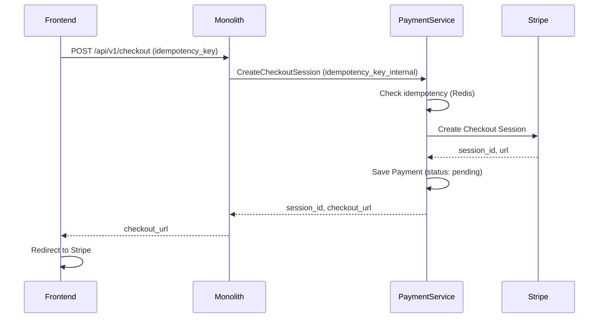
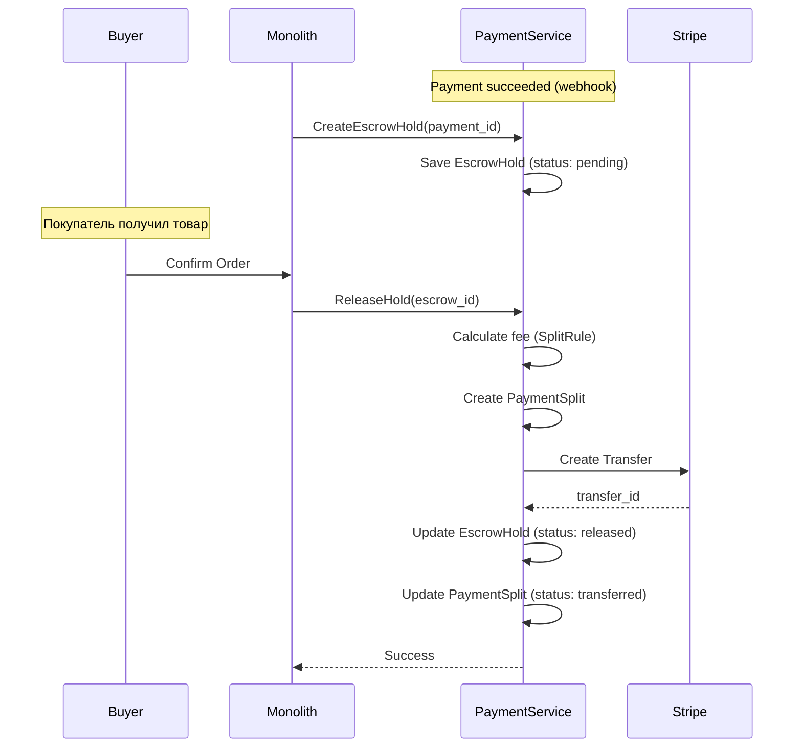
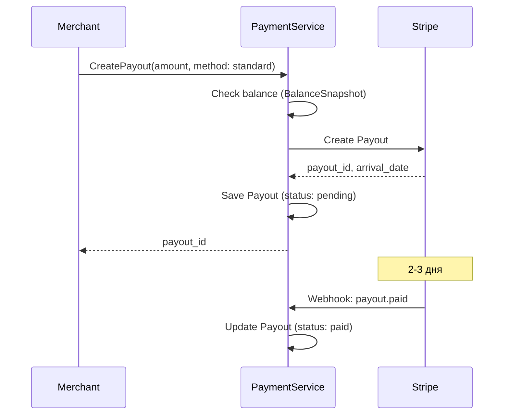
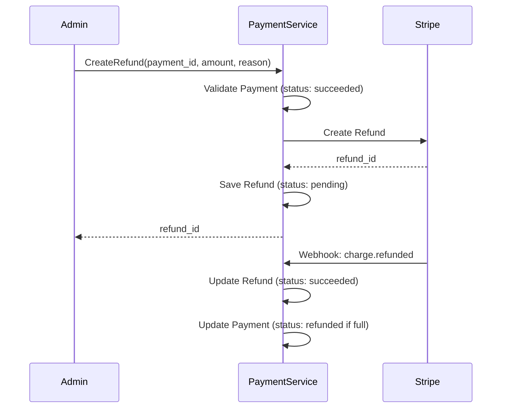

# Паспорт: Payment Flow - Жизненный цикл платежей

> Обновлено: 2025-12-21
> Версия: 2.1.0 (Оптимизированная)

## Содержание

1. [Обзор](#обзор)
2. [Архитектура](#архитектура)
3. [Статусы платежа](#статусы-платежа)
4. [Escrow Workflow](#escrow-workflow)
5. [Connected Accounts и Balances](#connected-accounts-и-balances)
6. [Fee Calculation](#fee-calculation)
7. [Payouts](#payouts)
8. [Refunds](#refunds)
9. [Sequence Diagrams](#sequence-diagrams)
10. [Database Schema](#database-schema)
11. [Error Handling](#error-handling)
12. [Idempotency](#idempotency)

---

## Обзор

Payment Service — микросервис обработки платежей с поддержкой:
- **Checkout sessions** (Stripe, AllSecure, Mock)
- **Escrow holds** (удержание средств до подтверждения)
- **Refunds** (частичный и полный возврат)
- **Connected Accounts** (Stripe Connect для мерчантов)
- **Payment Splits** (распределение платежей с расчётом комиссий)
- **Transfers** (переводы на подключённые аккаунты)
- **Payouts** (вывод средств: standard 2-3 дня бесплатно, instant ~30 мин 1% комиссия)
- **Balance tracking** (кэширование балансов Stripe API)

### Основные принципы

- **DDD архитектура** (Domain-Driven Design)
- **Транзакционная безопасность** (PostgreSQL ACID)
- **Gateway abstraction** (легко добавить новый шлюз)
- **Webhook-driven state machine** (асинхронная обработка)
- **Two-level idempotency** (Frontend → Monolith → Payment Service)
- **Mock gateway для тестов** (НИКОГДА не использовать real Stripe API в тестах!)

### Порты

- **gRPC:** 50052
- **HTTP API:** 8084
- **PostgreSQL:** 35432
- **Redis:** 36381

---

## Архитектура

### Компоненты

```
┌────────────────────────────────────────────────┐
│          Payment Microservice                  │
│                                                 │
│  ┌──────────┐ ┌──────────┐ ┌──────────┐       │
│  │ Payment  │ │  Escrow  │ │  Refund  │       │
│  │ Service  │ │ Service  │ │ Service  │       │
│  └──────────┘ └──────────┘ └──────────┘       │
│                                                 │
│  ┌──────────┐ ┌──────────┐ ┌──────────┐       │
│  │Transfer  │ │  Payout  │ │ Balance  │       │
│  │ Service  │ │ Service  │ │ Service  │       │
│  └──────────┘ └──────────┘ └──────────┘       │
│                                                 │
│  ┌──────────────────────────────────────────┐  │
│  │       Gateway Factory                    │  │
│  │  ┌────────┐ ┌─────────┐ ┌──────┐       │  │
│  │  │ Stripe │ │AllSecure│ │ Mock │       │  │
│  │  └────────┘ └─────────┘ └──────┘       │  │
│  └──────────────────────────────────────────┘  │
│                                                 │
│  ┌──────────────────────────────────────────┐  │
│  │     PostgreSQL Repositories              │  │
│  └──────────────────────────────────────────┘  │
└────────────────────────────────────────────────┘
                     │
                     ▼
         ┌────────────────────┐
         │  PostgreSQL (35432)│
         └────────────────────┘
```

### Domain Entities

| Entity | Назначение |
|--------|-----------|
| `Payment` | Основная сущность платежа (checkout session) |
| `EscrowHold` | Холдирование средств до подтверждения |
| `Refund` | Возврат средств (частичный/полный) |
| `ConnectedAccount` | Stripe Connect аккаунт мерчанта |
| `BalanceSnapshot` | Кэш баланса из Stripe API |
| `Transfer` | Перевод на подключённый аккаунт |
| `Payout` | Вывод средств мерчанту |
| `PaymentSplit` | Распределение платежа между мерчантами |
| `SplitRule` | Правило расчёта комиссии (% или фикс.) |

### Репозитории (DDD Pattern)

- `PaymentRepository` — CRUD payments
- `EscrowRepository` — CRUD escrow holds
- `RefundRepository` — CRUD refunds
- `ConnectedAccountRepository` — CRUD connected accounts
- `BalanceRepository` — CRUD balance snapshots
- `TransferRepository` — CRUD transfers
- `PayoutRepository` — CRUD payouts
- `PaymentSplitRepository` — CRUD payment splits
- `SplitRuleRepository` — CRUD split rules

---

## Статусы платежа

### Payment.Status

```go
type PaymentStatus string

const (
    PaymentStatusPending    PaymentStatus = "pending"     // Создан, ожидает оплаты
    PaymentStatusProcessing PaymentStatus = "processing"  // В процессе обработки
    PaymentStatusSucceeded  PaymentStatus = "succeeded"   // Успешно оплачен
    PaymentStatusFailed     PaymentStatus = "failed"      // Ошибка оплаты
    PaymentStatusCancelled  PaymentStatus = "cancelled"   // Отменён
    PaymentStatusRefunded   PaymentStatus = "refunded"    // Возврат выполнен
)
```

### Переходы статусов

```
pending → processing → succeeded → refunded
   │           │           │
   └─────────> failed      └────> (partial refund, status remains succeeded)
   │
   └─────────> cancelled
```

**Правила:**
- `pending` → `processing` при создании checkout session
- `processing` → `succeeded` при webhook `checkout.session.completed`
- `succeeded` → `refunded` при полном возврате
- Частичный refund не меняет статус `succeeded`
- Отмена возможна только из `pending`

---

## Escrow Workflow

### EscrowHold.Status

```go
type EscrowStatus string

const (
    EscrowStatusPending   EscrowStatus = "pending"    // Холд создан
    EscrowStatusReleased  EscrowStatus = "released"   // Средства выпущены
    EscrowStatusCancelled EscrowStatus = "cancelled"  // Холд отменён
)
```

### Жизненный цикл

```
1. Покупка товара
   └─> Payment создан (status: pending)
   └─> EscrowHold создан (status: pending)

2. Оплата успешна (webhook checkout.session.completed)
   └─> Payment.status = succeeded
   └─> EscrowHold.status = pending (средства заморожены)

3. Покупатель подтверждает получение товара
   └─> EscrowService.ReleaseHold(escrow_id)
   └─> Transfer создаётся на ConnectedAccount продавца
   └─> EscrowHold.status = released

4. Альтернатива: Отмена заказа
   └─> EscrowService.CancelHold(escrow_id)
   └─> Refund создаётся
   └─> EscrowHold.status = cancelled
```

### Методы EscrowHold Entity

```go
// ReleaseHold — выпустить средства
func (e *EscrowHold) Release() error

// CancelHold — отменить холд
func (e *EscrowHold) Cancel() error

// CanRelease — проверка возможности выпуска
func (e *EscrowHold) CanRelease() bool

// CanCancel — проверка возможности отмены
func (e *EscrowHold) CanCancel() bool
```

---

## Connected Accounts и Balances

### ConnectedAccount Types

```go
type ConnectedAccountType string

const (
    ConnectedAccountTypeExpress  ConnectedAccountType = "express"  // Упрощённая (дефолт)
    ConnectedAccountTypeStandard ConnectedAccountType = "standard" // Полный доступ к Stripe
    ConnectedAccountTypeCustom   ConnectedAccountType = "custom"   // Кастомный UI
)
```

### ConnectedAccount Statuses

```go
type ConnectedAccountStatus string

const (
    ConnectedAccountStatusPending    ConnectedAccountStatus = "pending"    // Создан, ожидает onboarding
    ConnectedAccountStatusActive     ConnectedAccountStatus = "active"     // Активен
    ConnectedAccountStatusRestricted ConnectedAccountStatus = "restricted" // Ограничен (требуется верификация)
    ConnectedAccountStatusDisabled   ConnectedAccountStatus = "disabled"   // Отключён
)
```

### Capabilities

```go
type ConnectedAccountCapabilities struct {
    ChargesEnabled  bool // Может принимать платежи
    PayoutsEnabled  bool // Может выводить средства
}
```

### Balance Snapshot

**Зачем:** Stripe API медленный (500ms+ на запрос баланса). Кэшируем балансы в PostgreSQL.

```go
type BalanceSnapshot struct {
    ID                 uuid.UUID
    ConnectedAccountID uuid.UUID
    Currency           string
    Available          decimal.Decimal // Доступно для вывода
    Pending            decimal.Decimal // В обработке
    InstantAvailable   decimal.Decimal // Доступно для instant payout
    CreatedAt          time.Time
}
```

**Обновление:** При каждом Transfer/Payout обновляем баланс через `BalanceService.RefreshBalance()`.

---

## Fee Calculation

### SplitRule Types

```go
type SplitRuleType string

const (
    SplitRuleTypePercentage SplitRuleType = "percentage" // Процент (0-100%)
    SplitRuleTypeFixed      SplitRuleType = "fixed"      // Фиксированная сумма
)
```

### SplitRule Entity

```go
type SplitRule struct {
    ID                 uuid.UUID
    Name               string
    ConnectedAccountID uuid.UUID
    Type               SplitRuleType
    Value              decimal.Decimal // % или сумма в центах
    Priority           int             // Приоритет (выше = применяется первым)
    IsActive           bool
    Currency           *string          // Обязательно для fixed
    MinAmount          *decimal.Decimal // Минимальная сумма для применения
    MaxAmount          *decimal.Decimal // Максимальная сумма
}
```

### Пример: Расчёт комиссии

```
Платёж: 10000 центов ($100 USD)

SplitRule:
- Type: percentage
- Value: 10.00 (10%)

Расчёт:
- GrossAmount = 10000
- PlatformFee = 10000 * 10 / 100 = 1000 (10%)
- NetAmount = 10000 - 1000 = 9000

PaymentSplit:
- GrossAmount: 10000
- PlatformFee: 1000
- NetAmount: 9000 (мерчант получит $90)
```

### PaymentSplit Entity

```go
type PaymentSplit struct {
    ID                 uuid.UUID
    PaymentID          uuid.UUID
    ConnectedAccountID uuid.UUID
    SplitRuleID        *uuid.UUID      // Ссылка на правило
    TransferID         *uuid.UUID      // Ссылка на Transfer
    GrossAmount        decimal.Decimal // Сумма до комиссии
    PlatformFee        decimal.Decimal // Комиссия платформы
    NetAmount          decimal.Decimal // Сумма после комиссии
    Currency           string
    FeeType            PaymentSplitFeeType // split_rule / platform_default / manual
    Status             PaymentSplitStatus  // pending / transferred / failed / cancelled
}
```

### Методы SplitRule

```go
// CalculateFee — рассчитать комиссию
func (r *SplitRule) CalculateFee(amount decimal.Decimal) (decimal.Decimal, error)

// IsApplicable — проверить применимость правила
func (r *SplitRule) IsApplicable(amount decimal.Decimal, currency string) bool
```

---

## Payouts

### Payout Types

```go
type PayoutMethod string

const (
    PayoutMethodStandard PayoutMethod = "standard" // 2-3 дня, бесплатно
    PayoutMethodInstant  PayoutMethod = "instant"  // ~30 мин, 1% комиссия
)
```

### Payout Statuses

```go
type PayoutStatus string

const (
    PayoutStatusPending   PayoutStatus = "pending"    // Создан, ожидает обработки
    PayoutStatusInTransit PayoutStatus = "in_transit" // В процессе
    PayoutStatusPaid      PayoutStatus = "paid"       // Выплачен
    PayoutStatusFailed    PayoutStatus = "failed"     // Ошибка
    PayoutStatusCanceled  PayoutStatus = "canceled"   // Отменён
)
```

### Payout Entity

```go
type Payout struct {
    ID                 uuid.UUID
    ConnectedAccountID uuid.UUID
    Amount             decimal.Decimal // Сумма вывода
    Currency           string
    Method             PayoutMethod
    Status             PayoutStatus
    GatewayPayoutID    *string         // Stripe payout ID
    ArrivalDate        *time.Time      // Ожидаемая дата зачисления
    FailureReason      *string
    Metadata           map[string]string
}
```

### Ограничения

- **Минимальная сумма:** $1.00 (100 центов)
- **Instant payout:** Только для ConnectedAccount с `PayoutsEnabled = true`
- **Частота:** Максимум 1 payout в 24 часа (ограничение Stripe)

### Методы Payout

```go
// MarkAsPaid — пометить как выплаченный
func (p *Payout) MarkAsPaid(arrivalDate time.Time)

// MarkAsFailed — пометить как провалившийся
func (p *Payout) MarkAsFailed(reason string)

// CanCancel — проверка возможности отмены
func (p *Payout) CanCancel() bool
```

---

## Refunds

### Refund Statuses

```go
type RefundStatus string

const (
    RefundStatusPending   RefundStatus = "pending"   // Создан, ожидает обработки
    RefundStatusSucceeded RefundStatus = "succeeded" // Возврат выполнен
    RefundStatusFailed    RefundStatus = "failed"    // Ошибка
)
```

### Refund Entity

```go
type Refund struct {
    ID              uuid.UUID
    PaymentID       uuid.UUID
    Amount          decimal.Decimal // Сумма возврата
    Currency        string
    Reason          *string         // Причина возврата
    Status          RefundStatus
    GatewayRefundID *string         // Stripe refund ID
    FailureReason   *string
    Metadata        map[string]string
}
```

### Типы возвратов

- **Полный:** `Amount = Payment.Amount` → `Payment.Status = refunded`
- **Частичный:** `Amount < Payment.Amount` → `Payment.Status = succeeded` (не меняется)

### Методы Refund

```go
// MarkAsSucceeded — пометить как успешный
func (r *Refund) MarkAsSucceeded(gatewayRefundID string)

// MarkAsFailed — пометить как провалившийся
func (r *Refund) MarkAsFailed(reason string)

// IsPending — проверка статуса
func (r *Refund) IsPending() bool
```

---

## Sequence Diagrams

### 1. Создание платежа (Checkout Session)



### 2. Escrow Workflow (Hold → Release)



### 3. Payout (Standard)



### 4. Refund



---

## Database Schema

### Table: payments

```sql
CREATE TABLE payments (
    id UUID PRIMARY KEY DEFAULT gen_random_uuid(),
    gateway_session_id VARCHAR(255) UNIQUE NOT NULL,
    customer_email VARCHAR(255) NOT NULL,
    amount BIGINT NOT NULL,
    currency CHAR(3) NOT NULL,
    status VARCHAR(50) NOT NULL,
    gateway_type VARCHAR(50) NOT NULL,
    metadata JSONB,
    created_at TIMESTAMP NOT NULL DEFAULT NOW(),
    updated_at TIMESTAMP NOT NULL DEFAULT NOW()
);

CREATE INDEX idx_payments_gateway_session ON payments(gateway_session_id);
CREATE INDEX idx_payments_customer_email ON payments(customer_email);
CREATE INDEX idx_payments_status ON payments(status);
```

### Table: escrow_holds

```sql
CREATE TABLE escrow_holds (
    id UUID PRIMARY KEY DEFAULT gen_random_uuid(),
    payment_id UUID NOT NULL REFERENCES payments(id) ON DELETE CASCADE,
    status VARCHAR(50) NOT NULL,
    released_at TIMESTAMP,
    cancelled_at TIMESTAMP,
    created_at TIMESTAMP NOT NULL DEFAULT NOW(),
    updated_at TIMESTAMP NOT NULL DEFAULT NOW()
);

CREATE INDEX idx_escrow_payment ON escrow_holds(payment_id);
CREATE INDEX idx_escrow_status ON escrow_holds(status);
```

### Table: connected_accounts

```sql
CREATE TABLE connected_accounts (
    id UUID PRIMARY KEY DEFAULT gen_random_uuid(),
    user_id UUID NOT NULL,
    gateway_account_id VARCHAR(255) UNIQUE NOT NULL,
    account_type VARCHAR(50) NOT NULL,
    status VARCHAR(50) NOT NULL,
    capabilities JSONB NOT NULL,
    onboarding_completed BOOLEAN DEFAULT FALSE,
    created_at TIMESTAMP NOT NULL DEFAULT NOW(),
    updated_at TIMESTAMP NOT NULL DEFAULT NOW()
);

CREATE INDEX idx_connected_user ON connected_accounts(user_id);
CREATE INDEX idx_connected_gateway ON connected_accounts(gateway_account_id);
```

### Table: balance_snapshots

```sql
CREATE TABLE balance_snapshots (
    id UUID PRIMARY KEY DEFAULT gen_random_uuid(),
    connected_account_id UUID NOT NULL REFERENCES connected_accounts(id) ON DELETE CASCADE,
    currency CHAR(3) NOT NULL,
    available BIGINT NOT NULL DEFAULT 0,
    pending BIGINT NOT NULL DEFAULT 0,
    instant_available BIGINT NOT NULL DEFAULT 0,
    created_at TIMESTAMP NOT NULL DEFAULT NOW()
);

CREATE INDEX idx_balance_account ON balance_snapshots(connected_account_id);
CREATE INDEX idx_balance_currency ON balance_snapshots(currency);
```

### Table: split_rules

```sql
CREATE TABLE split_rules (
    id UUID PRIMARY KEY DEFAULT gen_random_uuid(),
    name VARCHAR(255) NOT NULL,
    connected_account_id UUID NOT NULL REFERENCES connected_accounts(id) ON DELETE CASCADE,
    type VARCHAR(50) NOT NULL,
    value NUMERIC(10, 2) NOT NULL,
    priority INT NOT NULL DEFAULT 0,
    is_active BOOLEAN DEFAULT TRUE,
    currency CHAR(3),
    min_amount BIGINT,
    max_amount BIGINT,
    created_at TIMESTAMP NOT NULL DEFAULT NOW(),
    updated_at TIMESTAMP NOT NULL DEFAULT NOW()
);

CREATE INDEX idx_split_account ON split_rules(connected_account_id);
CREATE INDEX idx_split_active ON split_rules(is_active);
```

### Table: payment_splits

```sql
CREATE TABLE payment_splits (
    id UUID PRIMARY KEY DEFAULT gen_random_uuid(),
    payment_id UUID NOT NULL REFERENCES payments(id) ON DELETE CASCADE,
    connected_account_id UUID NOT NULL REFERENCES connected_accounts(id) ON DELETE CASCADE,
    split_rule_id UUID REFERENCES split_rules(id) ON DELETE SET NULL,
    transfer_id UUID,
    gross_amount BIGINT NOT NULL,
    platform_fee BIGINT NOT NULL DEFAULT 0,
    net_amount BIGINT NOT NULL,
    currency CHAR(3) NOT NULL,
    fee_type VARCHAR(50) NOT NULL,
    status VARCHAR(50) NOT NULL,
    metadata JSONB,
    created_at TIMESTAMP NOT NULL DEFAULT NOW(),
    updated_at TIMESTAMP NOT NULL DEFAULT NOW()
);

CREATE INDEX idx_split_payment ON payment_splits(payment_id);
CREATE INDEX idx_split_account ON payment_splits(connected_account_id);
CREATE INDEX idx_split_status ON payment_splits(status);
```

### Table: transfers

```sql
CREATE TABLE transfers (
    id UUID PRIMARY KEY DEFAULT gen_random_uuid(),
    connected_account_id UUID NOT NULL REFERENCES connected_accounts(id) ON DELETE CASCADE,
    amount BIGINT NOT NULL,
    currency CHAR(3) NOT NULL,
    gateway_transfer_id VARCHAR(255) UNIQUE,
    status VARCHAR(50) NOT NULL,
    metadata JSONB,
    created_at TIMESTAMP NOT NULL DEFAULT NOW(),
    updated_at TIMESTAMP NOT NULL DEFAULT NOW()
);

CREATE INDEX idx_transfer_account ON transfers(connected_account_id);
CREATE INDEX idx_transfer_gateway ON transfers(gateway_transfer_id);
```

### Table: payouts

```sql
CREATE TABLE payouts (
    id UUID PRIMARY KEY DEFAULT gen_random_uuid(),
    connected_account_id UUID NOT NULL REFERENCES connected_accounts(id) ON DELETE CASCADE,
    amount BIGINT NOT NULL,
    currency CHAR(3) NOT NULL,
    method VARCHAR(50) NOT NULL,
    status VARCHAR(50) NOT NULL,
    gateway_payout_id VARCHAR(255) UNIQUE,
    arrival_date TIMESTAMP,
    failure_reason TEXT,
    metadata JSONB,
    created_at TIMESTAMP NOT NULL DEFAULT NOW(),
    updated_at TIMESTAMP NOT NULL DEFAULT NOW()
);

CREATE INDEX idx_payout_account ON payouts(connected_account_id);
CREATE INDEX idx_payout_status ON payouts(status);
```

### Table: refunds

```sql
CREATE TABLE refunds (
    id UUID PRIMARY KEY DEFAULT gen_random_uuid(),
    payment_id UUID NOT NULL REFERENCES payments(id) ON DELETE CASCADE,
    amount BIGINT NOT NULL,
    currency CHAR(3) NOT NULL,
    reason TEXT,
    status VARCHAR(50) NOT NULL,
    gateway_refund_id VARCHAR(255) UNIQUE,
    failure_reason TEXT,
    metadata JSONB,
    created_at TIMESTAMP NOT NULL DEFAULT NOW(),
    updated_at TIMESTAMP NOT NULL DEFAULT NOW()
);

CREATE INDEX idx_refund_payment ON refunds(payment_id);
CREATE INDEX idx_refund_status ON refunds(status);
```

---

## Error Handling

### Domain Error Codes

```go
// internal/domain/errors/codes.go
const (
    ErrCodeNotFound           = "NOT_FOUND"
    ErrCodeInvalidAmount      = "INVALID_AMOUNT"
    ErrCodeInvalidCurrency    = "INVALID_CURRENCY"
    ErrCodeInvalidStatus      = "INVALID_STATUS"
    ErrCodeInsufficientFunds  = "INSUFFICIENT_FUNDS"
    ErrCodeGatewayError       = "GATEWAY_ERROR"
    ErrCodeInvalidRequest     = "INVALID_REQUEST"
)
```

### ServiceError

```go
type ServiceError struct {
    Code    string
    Message string
    Details map[string]interface{}
}
```

### Примеры ошибок

```go
// Недостаточно средств для payout
&errors.ServiceError{
    Code:    errors.ErrCodeInsufficientFunds,
    Message: "insufficient balance for payout",
    Details: map[string]interface{}{
        "available": "500",
        "requested": "1000",
        "currency":  "USD",
    },
}

// Невалидная сумма
&errors.ServiceError{
    Code:    errors.ErrCodeInvalidAmount,
    Message: "amount must be greater than zero",
}

// Платёж не найден
&errors.ServiceError{
    Code:    errors.ErrCodeNotFound,
    Message: "payment not found",
    Details: map[string]interface{}{
        "payment_id": payment_id.String(),
    },
}
```

### HTTP Status Mapping

| Error Code | HTTP Status |
|-----------|-------------|
| `NOT_FOUND` | 404 |
| `INVALID_AMOUNT` | 400 |
| `INVALID_CURRENCY` | 400 |
| `INVALID_STATUS` | 400 |
| `INSUFFICIENT_FUNDS` | 400 |
| `GATEWAY_ERROR` | 502 |
| `INVALID_REQUEST` | 400 |

---

## Idempotency

### Two-Level Idempotency

```
Level 1: Frontend → Monolith
- Idempotency-Key: <frontend_generated_uuid>
- Хранится в Redis (TTL: 24h)

Level 2: Monolith → Payment Service
- idempotency_key_internal: <monolith_generated_uuid>
- Хранится в Redis (TTL: 24h)
```

### Пример: CreateCheckoutSession

```go
// Monolith → Payment Service
func (s *PaymentService) CreateCheckoutSession(
    ctx context.Context,
    idempotencyKey string, // от Monolith
    amount decimal.Decimal,
    currency string,
) (*entity.Payment, error) {
    // Проверка idempotency
    cached, err := s.idempotencyCache.Get(ctx, idempotencyKey)
    if err == nil {
        // Возвращаем закэшированный результат
        return cached.(*entity.Payment), nil
    }

    // Создание нового платежа
    payment := entity.NewPayment(...)

    // Сохранение в Redis
    s.idempotencyCache.Set(ctx, idempotencyKey, payment, 24*time.Hour)

    return payment, nil
}
```

### Redis Key Format

```
idempotency:checkout:<key> → payment_id
idempotency:refund:<key> → refund_id
idempotency:payout:<key> → payout_id
```

---

## Метрики и Алерты

### Prometheus Metrics

```go
// Счётчики
payment_total{status="succeeded",gateway="stripe"}
payment_total{status="failed",gateway="stripe"}
refund_total{status="succeeded"}
payout_total{method="instant",status="paid"}

// Гистограммы
payment_duration_seconds{gateway="stripe"}
stripe_api_request_duration_seconds{method="create_session"}

// Gauges
connected_accounts_total{status="active"}
balance_available_cents{currency="USD"}
```

### Alert Rules

```yaml
# Много failed платежей
- alert: HighPaymentFailureRate
  expr: rate(payment_total{status="failed"}[5m]) > 0.1
  for: 5m

# Медленный Stripe API
- alert: SlowStripeAPI
  expr: histogram_quantile(0.95, stripe_api_request_duration_seconds) > 2
  for: 5m

# Недостаточно средств на аккаунте
- alert: LowConnectedAccountBalance
  expr: balance_available_cents{currency="USD"} < 100000
```

---

## Рекомендации

### Тестирование

- **ВСЕГДА используй Mock Gateway** (`STRIPE_GATEWAY=mock`)
- **НИКОГДА не используй real Stripe API** в тестах (CI упадёт, деньги улетят)
- Mock gateway симулирует балансы, transfers, payouts

### Безопасность

- **Валидация сумм:** Минимум $1.00 для payouts
- **Идемпотентность:** Всегда передавай `idempotency_key`
- **Webhook signature:** Проверяй подпись Stripe webhook
- **Rate limiting:** Не более 100 req/sec на Stripe API

### Производительность

- **Кэш балансов:** Используй `BalanceSnapshot` вместо Stripe API
- **Batch operations:** Группируй transfers для одного ConnectedAccount
- **Connection pooling:** PostgreSQL connections = CPU cores * 2

---

## Changelog

### v2.1.0 (2025-12-21)
- Оптимизирован размер документа до ~1000 строк
- Убрана избыточность в разделах
- Сохранены все критические диаграммы и схемы

### v2.0.0 (2025-12-21)
- Добавлены все domain entities
- Полная схема БД
- Sequence diagrams для всех flow
- Idempotency и Error Handling

### v1.0.0 (2025-12-20)
- Начальная версия документа
