# Returns Flow - Vondi WMS

**Version:** 2.0.0
**Updated:** 2025-12-21
**Status:** ✅ Production Ready (Phase 2 Complete)

---

## Overview

The Returns flow manages the complete customer return lifecycle:
- Return request creation
- Warehouse inspection with Quality Control
- Item condition assessment & decision making
- Restocking or disposal processing
- Integration with refund workflow

**Service:** Warehouse Management System (WMS)
**Database:** PostgreSQL (tables: `return_tasks`, `return_items`, `return_item_photos`)
**gRPC Port:** 50052
**Proto Package:** `wms.ReturnsService`

---

## Quick Reference

### Return Statuses

| Status | Description | Next States |
|--------|-------------|-------------|
| `CREATED` | Return request created, awaiting inspection | INSPECTING, CANCELLED |
| `INSPECTING` | Inspector assigned, items being examined | COMPLETED, CANCELLED |
| `COMPLETED` | All items inspected, decisions executed | — (final) |
| `CANCELLED` | Return cancelled | — (final) |

### Return Reasons

| Reason | Code | Refund Policy |
|--------|------|---------------|
| Wrong Item | `WRONG_ITEM` | 100% refund |
| Damaged | `DAMAGED` | 100% refund |
| Changed Mind | `CHANGED_MIND` | Depends on condition |
| Defective | `DEFECTIVE` | 100% refund + supplier claim |
| Other | `OTHER` | Case-by-case |

### Item Conditions

| Condition | Code | Resellable | Typical Discount |
|-----------|------|------------|------------------|
| New | `NEW` | ✅ Yes | 0% |
| Like New | `LIKE_NEW` | ✅ Yes | 0-10% |
| Good | `GOOD` | ✅ Yes | 15-30% |
| Damaged | `DAMAGED` | ⚠️ Maybe | Refurbish first |
| Unsellable | `UNSELLABLE` | ❌ No | N/A |

### Return Decisions

| Decision | Code | Action |
|----------|------|--------|
| Restock | `RESTOCK` | Return to inventory for resale |
| Refurbish | `REFURBISH` | Send to repair/refurbishment |
| Dispose | `DISPOSE` | Write off inventory, discard |
| Return to Supplier | `RETURN_TO_SUPPLIER` | Send back to manufacturer |

---

## State Machine


### State Transitions

```go
// Allowed transitions
CREATED → INSPECTING     // StartInspection(inspector_id)
INSPECTING → COMPLETED   // CompleteReturn() [all items inspected]
CREATED → CANCELLED      // CancelReturn()
INSPECTING → CANCELLED   // CancelReturn()
```

### Business Rules

**CanStartInspection:**
- Status must be CREATED
- Inspector ID must be valid
- Cannot restart inspection

**CanComplete:**
- Status must be INSPECTING
- All items must have `condition` AND `decision` set
- Cannot complete cancelled tasks

---

## Workflow

### 1. Create Return Request

**Initiator:** Customer Service API / Admin Panel

```protobuf
message CreateReturnTaskRequest {
  int64 order_id = 1;
  int64 customer_id = 2;
  ReturnReason reason = 3;
  repeated ReturnItemInput items = 4;
}
```

**Example:**
```bash
grpcurl -d '{
  "order_id": 12345,
  "customer_id": 67890,
  "reason": "RETURN_REASON_DAMAGED",
  "items": [
    {"sku": "SHOE-NB-574-42", "quantity": 1}
  ]
}' -plaintext localhost:50052 wms.ReturnsService/CreateReturnTask
```

**What happens:**
1. Create `ReturnTask` with status=CREATED
2. Create `ReturnItem` records for each SKU
3. Notify warehouse about expected return
4. Optionally create reverse shipment (Delivery Service)

---

### 2. Start Inspection

**Initiator:** Inspector (WMS Worker)

```protobuf
message StartInspectionRequest {
  int64 return_task_id = 1;
  int64 inspector_id = 2;
}
```

**What happens:**
1. Update `return_tasks.status` → INSPECTING
2. Set `return_tasks.inspector_id`
3. **Auto-create QC Task** (type=RETURN_INSPECTION)
4. Generate QC checklist items
5. Link `return_tasks.qc_task_id`

**QC Checklist (auto-generated):**
```go
defaultChecklist := []string{
    "Verify all items match return request",
    "Check packaging condition",
    "Inspect for damage or defects",
    "Verify product authenticity",
    "Document condition with photos",
}
```

---

### 3. Inspect Items

**Initiator:** Inspector (WMS Mobile App)

```protobuf
message InspectReturnItemRequest {
  int64 return_task_id = 1;
  int64 item_id = 2;
  ItemCondition condition = 3;     // NEW, LIKE_NEW, GOOD, DAMAGED, UNSELLABLE
  ReturnDecision decision = 4;     // RESTOCK, REFURBISH, DISPOSE, RETURN_TO_SUPPLIER
  optional string notes = 5;
  optional string photo_url = 6;   // Legacy single photo
}
```

**Example:**
```bash
grpcurl -d '{
  "return_task_id": 100,
  "item_id": 200,
  "condition": "ITEM_CONDITION_GOOD",
  "decision": "RETURN_DECISION_RESTOCK",
  "notes": "Minor scuff on sole, otherwise excellent"
}' -plaintext localhost:50052 wms.ReturnsService/InspectReturnItem
```

**What happens:**
1. Validate task is in INSPECTING status
2. Verify item belongs to task
3. Update `return_items`:
   - `condition` → provided value
   - `decision` → provided value
   - `inspected_at` → NOW()
   - `notes` → inspector notes

**Validation:**
```go
func (item *ReturnItem) MarkInspected(
    condition ItemCondition,
    decision ReturnDecision,
    notes *string,
    photoURL *string,
) error {
    if item.IsInspected() {
        return errors.New("already inspected")
    }
    // Set fields and timestamp
    item.Condition = &condition
    item.Decision = &decision
    item.InspectedAt = &time.Now()
    return nil
}
```

---

### 4. Add Photos (Multiple)

**New Feature:** Support for multiple photos per item

```protobuf
message AddReturnItemPhotoRequest {
  int64 return_id = 1;
  int64 item_id = 2;
  string photo_url = 3;            // S3/MinIO URL
  string photo_type = 4;           // "damage", "condition", "label", "other"
  string notes = 5;
  int64 uploaded_by_id = 6;
}
```

**Photo Types:**
- `damage` — Damage documentation
- `condition` — Overall condition assessment
- `label` — Serial numbers, barcodes, labels
- `other` — Miscellaneous

**Restrictions:**
- Cannot add photos to COMPLETED/CANCELLED returns
- Recommended max: 10 photos per item

**Example:**
```bash
grpcurl -d '{
  "return_id": 100,
  "item_id": 200,
  "photo_url": "https://s3.vondi.rs/returns/2025/01/return-100-item-200-damage.jpg",
  "photo_type": "damage",
  "notes": "3cm scratch on right side",
  "uploaded_by_id": 42
}' -plaintext localhost:50052 wms.ReturnsService/AddReturnItemPhoto
```

---

### 5. Complete Return

**Initiator:** Inspector / Auto-triggered when all items inspected

```protobuf
message CompleteReturnRequest {
  int64 return_task_id = 1;
}
```

**Pre-conditions:**
- All items must have `condition` AND `decision`
- Status must be INSPECTING

**What happens:**
1. **Validate:** All items inspected
2. **Process Decisions:**
   - `RESTOCK` → Update inventory (TODO: integration)
   - `REFURBISH` → Create refurbishment task
   - `DISPOSE` → Write off inventory
   - `RETURN_TO_SUPPLIER` → Create supplier return shipment
3. **Update Status:**
   - `return_tasks.status` → COMPLETED
   - `return_tasks.completed_at` → NOW()
4. **Complete QC Task:**
   - `qc_tasks.status` → COMPLETED
   - `qc_tasks.result` → PASS
5. **Trigger Notifications:** Customer notification about inspection results

**Business Logic:**
```go
func (s *ReturnsService) CompleteReturn(ctx context.Context, taskID int64) error {
    task := getTaskWithItems(taskID)

    // Validate all inspected
    if err := task.CanComplete(); err != nil {
        return err
    }

    // Process RESTOCK decisions
    for _, item := range task.Items {
        if *item.Decision == RESTOCK {
            // TODO: inventoryService.PlaceProduct(sku, qty, location)
        }
    }

    // Update task
    task.MarkCompleted()
    return repo.Update(task)
}
```

---

### 6. Cancel Return

```protobuf
message CancelReturnRequest {
  int64 return_task_id = 1;
}
```

**What happens:**
1. Validate status != COMPLETED
2. Update `return_tasks.status` → CANCELLED
3. Cancel linked QC task (if exists)

**Restrictions:**
- Cannot cancel COMPLETED returns
- Cancelling INSPECTING returns aborts inspection

---

## Quality Control Integration

### Auto-created QC Task

When `StartInspection` is called:

```go
qcTask := &QCTask{
    Type:        QC_TYPE_RETURN_INSPECTION,
    ReferenceID: returnTaskID,
    Status:      QC_STATUS_PENDING,
    Result:      QC_RESULT_PENDING,
    InspectorID: &inspectorID,
}
```

**Link:** `return_tasks.qc_task_id` → `qc_tasks.id`

### QC Checklist Items

Auto-generated based on return type:

```go
// From qc.go GetDefaultChecklist()
func GetDefaultChecklist(qcType QCType) []string {
    if qcType == QCTypeReturnInspection {
        return []string{
            "Verify all items match return request",
            "Check packaging condition",
            "Inspect for damage or defects",
            "Verify product authenticity",
            "Document condition with photos",
        }
    }
    // ...
}
```

### QC Completion

When `CompleteReturn` succeeds:

```go
if task.QCTaskID != nil {
    qcTask := qcRepo.GetByID(*task.QCTaskID)
    qcTask.MarkCompleted(QC_RESULT_PASS, nil)
    qcRepo.Update(qcTask)
}
```

---

## Restocking Process

### RESTOCK Decision

**Current Implementation (TODO):**

```go
// In CompleteReturn()
for _, item := range task.Items {
    if *item.Decision == ReturnDecisionRestock {
        // TODO: Integrate with InventoryService
        // inventoryService.PlaceProduct(
        //     SKU:      item.SKU,
        //     Quantity: item.Quantity,
        //     Location: "RETURN-ZONE-A",
        // )
    }
}
```

**Planned Integration:**

```go
// InventoryService.PlaceProduct()
movement := InventoryMovement{
    Type:         "RETURN_RESTOCK",
    SKU:          item.SKU,
    Quantity:     item.Quantity,
    FromLocation: nil,  // from return zone
    ToLocation:   determineRestockLocation(item),
    ReferenceID:  returnTaskID,
    ReferenceType: "return_task",
}
inventoryService.CreateMovement(ctx, movement)
```

**Restock Zones:**
- `RETURN-NEW` — Items in NEW/LIKE_NEW condition (ready for resale)
- `RETURN-USED` — Items in GOOD condition (used/refurbished)
- `RETURN-DAMAGED` — Items awaiting refurbishment decision

---

## Sequence Diagrams

### Full Returns Flow


### Inspection Detail

```mermaid
sequenceDiagram
    participant I as Inspector
    participant WMS as WMS Mobile
    participant DB as PostgreSQL
    participant S3 as MinIO/S3

    I->>WMS: Open Return Task #100
    WMS->>DB: SELECT return_tasks WHERE id=100
    DB-->>WMS: Task + Items

    I->>WMS: Start Inspection
    WMS->>DB: UPDATE status=INSPECTING
    WMS->>DB: INSERT INTO qc_tasks

    loop For each item
        I->>I: Physical inspection

        I->>WMS: Upload photo
        WMS->>S3: Store image
        S3-->>WMS: photo_url
        WMS->>DB: INSERT INTO return_item_photos

        I->>WMS: Set condition & decision
        WMS->>DB: UPDATE return_items<br/>SET condition, decision, inspected_at
    end

    I->>WMS: Complete Return
    WMS->>DB: Check all items inspected
    WMS->>DB: UPDATE status=COMPLETED
    WMS-->>I: Return completed ✓
```



---

## gRPC API Reference

### CreateReturnTask

```protobuf
rpc CreateReturnTask(CreateReturnTaskRequest) returns (ReturnTask);
```

**Request:**
```json
{
  "order_id": 12345,
  "customer_id": 67890,
  "reason": "RETURN_REASON_DAMAGED",
  "items": [
    {"sku": "PROD-001", "quantity": 2}
  ]
}
```

**Response:** `ReturnTask` with status=CREATED

---

### GetReturnTask

```protobuf
rpc GetReturnTask(GetReturnTaskRequest) returns (ReturnTask);
```

**Request:**
```json
{"id": 100}
```

**Response:** `ReturnTask` with items and photos loaded

---

### GetReturnTasks (List with Filters)

```protobuf
rpc GetReturnTasks(GetReturnTasksRequest) returns (GetReturnTasksResponse);
```

**Request:**
```json
{
  "status": "RETURN_STATUS_INSPECTING",
  "inspector_id": 42,
  "limit": 20,
  "offset": 0
}
```

**Filters:**
- `order_id` — Filter by original order
- `customer_id` — Filter by customer
- `status` — Filter by return status
- `reason` — Filter by return reason
- `inspector_id` — Filter by assigned inspector

**Response:**
```json
{
  "tasks": [...],
  "total": 50
}
```

---

### StartInspection

```protobuf
rpc StartInspection(StartInspectionRequest) returns (ReturnTask);
```

**Request:**
```json
{
  "return_task_id": 100,
  "inspector_id": 42
}
```

**Side Effects:**
- Creates QC task
- Creates QC checklist
- Links QC task to return

---

### InspectReturnItem

```protobuf
rpc InspectReturnItem(InspectReturnItemRequest) returns (ReturnItem);
```

**Request:**
```json
{
  "return_task_id": 100,
  "item_id": 200,
  "condition": "ITEM_CONDITION_GOOD",
  "decision": "RETURN_DECISION_RESTOCK",
  "notes": "Minor wear, functional"
}
```

---

### AddReturnItemPhoto

```protobuf
rpc AddReturnItemPhoto(AddReturnItemPhotoRequest) returns (AddReturnItemPhotoResponse);
```

**Request:**
```json
{
  "return_id": 100,
  "item_id": 200,
  "photo_url": "s3://returns/photo.jpg",
  "photo_type": "damage",
  "notes": "Scratch on corner",
  "uploaded_by_id": 42
}
```

---

### DeleteReturnItemPhoto

```protobuf
rpc DeleteReturnItemPhoto(DeleteReturnItemPhotoRequest) returns (DeleteReturnItemPhotoResponse);
```

**Request:**
```json
{
  "return_id": 100,
  "item_id": 200,
  "photo_id": 300
}
```

**Validation:**
- Cannot delete from COMPLETED returns
- Photo must belong to specified item

---

### CompleteReturn

```protobuf
rpc CompleteReturn(CompleteReturnRequest) returns (ReturnTask);
```

**Request:**
```json
{"return_task_id": 100}
```

**Pre-conditions:**
- Status = INSPECTING
- All items inspected

---

### CancelReturn

```protobuf
rpc CancelReturn(CancelReturnRequest) returns (google.protobuf.Empty);
```

**Request:**
```json
{"return_task_id": 100}
```

**Validation:**
- Cannot cancel COMPLETED

---

## Database Schema

### return_tasks

```sql
CREATE TABLE return_tasks (
    id BIGSERIAL PRIMARY KEY,
    order_id BIGINT NOT NULL,
    customer_id BIGINT NOT NULL,
    status VARCHAR(20) NOT NULL DEFAULT 'CREATED',
    reason VARCHAR(50) NOT NULL,
    qc_task_id BIGINT,
    inspector_id BIGINT,
    created_at TIMESTAMP NOT NULL DEFAULT NOW(),
    updated_at TIMESTAMP NOT NULL DEFAULT NOW(),
    completed_at TIMESTAMP,

    CONSTRAINT fk_return_tasks_qc_task
        FOREIGN KEY (qc_task_id) REFERENCES qc_tasks(id) ON DELETE SET NULL,
    CONSTRAINT chk_return_status
        CHECK (status IN ('CREATED', 'INSPECTING', 'COMPLETED', 'CANCELLED')),
    CONSTRAINT chk_return_reason
        CHECK (reason IN ('WRONG_ITEM', 'DAMAGED', 'CHANGED_MIND', 'DEFECTIVE', 'OTHER'))
);

CREATE INDEX idx_return_tasks_order_id ON return_tasks(order_id);
CREATE INDEX idx_return_tasks_customer_id ON return_tasks(customer_id);
CREATE INDEX idx_return_tasks_status ON return_tasks(status);
CREATE INDEX idx_return_tasks_inspector_id ON return_tasks(inspector_id);
```

### return_items

```sql
CREATE TABLE return_items (
    id BIGSERIAL PRIMARY KEY,
    return_task_id BIGINT NOT NULL,
    sku VARCHAR(255) NOT NULL,
    quantity INT NOT NULL,
    condition VARCHAR(20),
    decision VARCHAR(30),
    notes TEXT,
    photo_url VARCHAR(500),       -- Legacy: single photo
    inspected_at TIMESTAMP,
    created_at TIMESTAMP NOT NULL DEFAULT NOW(),
    updated_at TIMESTAMP NOT NULL DEFAULT NOW(),

    CONSTRAINT fk_return_items_return_task
        FOREIGN KEY (return_task_id) REFERENCES return_tasks(id) ON DELETE CASCADE,
    CONSTRAINT chk_return_item_quantity CHECK (quantity > 0),
    CONSTRAINT chk_item_condition
        CHECK (condition IS NULL OR condition IN ('NEW', 'LIKE_NEW', 'GOOD', 'DAMAGED', 'UNSELLABLE')),
    CONSTRAINT chk_return_decision
        CHECK (decision IS NULL OR decision IN ('RESTOCK', 'REFURBISH', 'DISPOSE', 'RETURN_TO_SUPPLIER'))
);

CREATE INDEX idx_return_items_return_task_id ON return_items(return_task_id);
CREATE INDEX idx_return_items_sku ON return_items(sku);
```

### return_item_photos

```sql
CREATE TABLE return_item_photos (
    id BIGSERIAL PRIMARY KEY,
    return_item_id BIGINT NOT NULL,
    photo_url VARCHAR(500) NOT NULL,
    photo_type VARCHAR(50) NOT NULL DEFAULT 'other',
    notes TEXT,
    uploaded_by_id BIGINT NOT NULL,
    created_at TIMESTAMP NOT NULL DEFAULT NOW(),

    CONSTRAINT fk_return_item_photos_return_item
        FOREIGN KEY (return_item_id) REFERENCES return_items(id) ON DELETE CASCADE,
    CONSTRAINT chk_photo_type
        CHECK (photo_type IN ('damage', 'condition', 'label', 'other'))
);

CREATE INDEX idx_return_item_photos_return_item_id ON return_item_photos(return_item_id);
CREATE INDEX idx_return_item_photos_photo_type ON return_item_photos(photo_type);
```

---

## Integration Points

### 1. Order Service

**Webhooks:**
- `return_created` → Order Service updates order status
- `return_completed` → Trigger refund processing

### 2. Inventory Service

**Operations:**
- `RESTOCK` → `PlaceProduct(sku, quantity, location)`
- `DISPOSE` → `WriteOff(sku, quantity, reason)`

**Status:** TODO - Integration pending

### 3. QC System

**Auto-creation:** QC task created on `StartInspection`
**Link:** `return_tasks.qc_task_id → qc_tasks.id`

### 4. Payment Service

**Trigger:** `CompleteReturn` → Calculate & process refund
**Refund Logic:** Based on reason + condition

### 5. Delivery Service

**Reverse Shipment:** Create return pickup for customer
**Webhook:** Notify WMS when return delivered to warehouse

---

## Error Handling

### Domain Errors

```go
ErrOrderIDRequired       = "order_id must be greater than 0"
ErrCustomerIDRequired    = "customer_id must be greater than 0"
ErrInvalidReason         = "invalid return reason"
ErrAlreadyCompleted      = "return task already completed"
ErrNotInspecting         = "return task must be in INSPECTING status"
ErrNotAllInspected       = "all items must be inspected"
```

### gRPC Status Codes

| Condition | gRPC Code |
|-----------|-----------|
| Missing required fields | `INVALID_ARGUMENT` |
| Return task not found | `NOT_FOUND` |
| Invalid state transition | `FAILED_PRECONDITION` |
| Database error | `INTERNAL` |

---

## Metrics & Analytics

### Key Metrics

```sql
-- Return rate (last 30 days)
SELECT
    COUNT(DISTINCT rt.order_id)::FLOAT / COUNT(DISTINCT o.id) * 100 as return_rate
FROM orders o
LEFT JOIN return_tasks rt ON o.id = rt.order_id
WHERE o.created_at >= NOW() - INTERVAL '30 days';

-- Returns by reason
SELECT reason, COUNT(*) as count
FROM return_tasks
WHERE created_at >= NOW() - INTERVAL '30 days'
GROUP BY reason
ORDER BY count DESC;

-- Average inspection time
SELECT
    AVG(EXTRACT(EPOCH FROM (completed_at - created_at))/3600) as avg_hours
FROM return_tasks
WHERE status = 'COMPLETED';

-- Decision distribution
SELECT decision, COUNT(*), SUM(quantity) as total_qty
FROM return_items
WHERE decision IS NOT NULL
GROUP BY decision;
```

---

## Implementation Status

| Feature | Status | Notes |
|---------|--------|-------|
| Create return task | ✅ Done | With items validation |
| Start inspection | ✅ Done | Auto-creates QC task |
| Inspect items | ✅ Done | Condition + Decision |
| Multiple photos | ✅ Done | Up to 10 per item |
| Complete return | ✅ Done | Validates all inspected |
| Cancel return | ✅ Done | Updates QC task |
| Inventory integration | 🟡 TODO | RESTOCK decision processing |
| Refund integration | 🟡 TODO | Payment Service webhook |
| Notifications | 🟡 TODO | Customer notifications |

---

## Related Documents

- [Quality Control Flow](./quality-control.md)
- [Inventory Management](./inventory.md)
- [Order Lifecycle](./order-lifecycle.md)
- [WMS Database Schema](../databases/wms_db.md)

---

**Maintained By:** WMS Team
**Implementation:** `/p/github.com/vondi-global/warehouse/`
